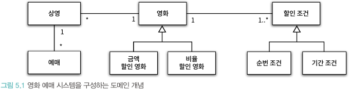
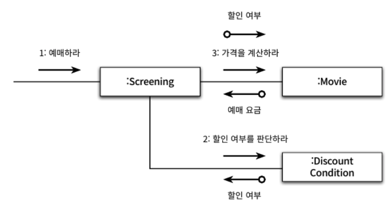

# CHAPTER 05. 책임주도 설계를 향해

</br>

## 책임 주도 설계를 향해

- 데이터 중심 설계에서 책임 중심의 설계로 전환하기
  - 데이터보다 행동을 먼저 결정
  - 협력이라는 문맥 안에서 책임을 결정

> 객체에게 중요한 것은 데이터가 아니라 외부에 제공하는 행동  
> 클라이언트 관점에서 객체가 수행하는 행동이란 곧 객체의 책임을 의미

</br>

- 책임은 객체의 입장이 아니라 객체가 참여하는 협력에 적합해야 한다.
  - 협력에 대한 적합한 책임은 메시지 수신자가 아니라 메시지 전송자에 적합
  - `메시지를 전송하는 클라이언트의 의도에 적합한 책임을 할당해야한다.`

</br>

> 메시지 기반 설계 관점이 클래스 기반 설계 관점보다 더 유연한 애플리케이션을 만들 수 있게 한다.  
> "클래스가 필요하다는 점은 알겠는데 이 클래스는 무엇을 해야 하지?"가 아닌  
> `메시지를 전송해야 하는데 누구에게 전송해야 하지?`라고 생각하는 것

</br>

> 클라이언트는 누가 메시지를 받을지 모른다.  
> 따라서 메시지 송신자는 수신자에 대한 어떤 가정도 할 수 없음으로  
> `수신자에 대한 캡슐화가 자연스럽게 이뤄진다`

</br>

> 책임 주도 설계란 책임을 결정한 후에 책임을 수행할 객체를 결정하는 것  
> 그리고 그 후 협력에 참여하는 객체들의 책임이 어느정도 정리될 때까지는  
> 객체의 내부 상태에 대해 관심을 가지지 않는 것...

</br>

## 책임 할당을 위한 GRASP 패턴

</br>

|                 영화 예매 도메인                 |
| :----------------------------------------------: |
|  |

</br>

- 하나의 영화는 여러번 상영할 수 있다. Movie Screening 1:N
- 하나의 상영은 여러번 예매할 수 있다. Reservation과 Screening은 1:N
- 하나의 영화는 다수의 할인 조건을 가질 수 있다.
- 할인 조건은 순번 조건과 기간 조건이 존재
- 영화의 할인 정책은 금액할인과 비율할인이 있고, 동시에 살인정책이 적용 될 수 없다.

</br>

- 책임 주도 설계 첫 단계 애플리케이션이 제공해야 하는 기능을 애플리케이션의 책임으로 생각하는 것
  - 즉 애플리케이션에 대해 전송된 메시지로 간주, 책임져야할 첫 객체를 선택하는 것으로 설계
  - `책에서 말이 엄청 복잡한데, 그냥 클래스 내부에서 제공해주는 public 메서드는 그 클래스가 온전히 책임지라고`

</br>

- 영화 예매 시스템

> 제공하는 기능이 `영화를 예매하는 것`이라고 할 때  
> `예매하라`라는 메시지 결정  
> 그 후 `메시지를 수신할 적합한 객체 선택`

</br>

> 수신할 적합할 객체를 선정하기 위해서 객체가 상태와 행동을 통합한 캡슐화의 단위라는 사실에 집중  
> 책임을 수행할 정보를 알고 있는 객체에게 책임을 할당하는 것 -> `INFROMATION EXPERT 패턴`

</br>

> 영화를 예매하는데 필요한 정보를 가장 많이 알고 있는 객체에게 메시지 처리할 책임을 할당  
> 이런 고민들 속에 `Screening 선정` > `예매하라`를 마무리하기 위해서 예마 가격을 계산하는 작업이 필요하여  
> 외부객체의 도움을 얻어 가격을 얻어야 한다.  
> 당연히 movie에 가격과 관련된 정보들이 있음으로 `movie`선택

- 인포메이션 익스퍼트 용어는 거창한데, 그냥 정보랑 긴밀성이 높은 객체를 받아와서 사용하라는 거

</br>

|                 Screening이 DiscountCondition과 결합                  |
| :-------------------------------------------------------------------: |
|  |

</br>

> 우리가 이미 도메인에서 정의 내렸을때 `할인조건은 영화에 더 긴밀하게 결합`  
> 그런데 Screening과 DiscountCondition이 협력할 경우 결합도가 높아진다!
> Screening의 가장 중요한 역할은 `예매를 생성하는 것`  
> DiscountCondition을 가진다면 Screening은 영화 요금 계산과 관련된 책임일부를 가질 수 밖에 없다.  
> 또한 예매를 하는 과정에서 Movie가 할인 여부를 필요한다는 사실도 노출 된다.

- 그냥 예매요금을 계산하는 방식이 변경되면 Screening 내부도 변경된다.

</br>

- Creator 패턴
  - B가 A를 포함하거나 참조
  - B가 A를 기록
  - B가 A객체를 긴밀하게 사용
  - B가 A객체를 초기화하는데 필요한 데이터를 가지고 있다.

> 생성되는 객체와 연결되거나 관련될 필요가 있는 개체에 객체 생성 책임을 맡기는 것  
> Screening이 Reservation 생성 책임을 갖게됨.  
> RequestDto에서 Entity 생성하는 책임을 갖는 메서드를 갖듯이!

</br>

## 구현을 통한 검증

```java
public class Screening{
  public Reservation reserve(Customer customer, int audienceCount){

  }
}
```

> 먼저 `예매하라`라는 메시지 처리할 메서드를 만들고

```java
public class Screening {
    private Movie movie;
    private int sequence;
    private LocalDateTime whenScreened;
}
```

> 그 다음에 필요한 속성들을 정의한다.

</br>

```java
public class Screening {
    private Movie movie;
    private int sequence;
    private LocalDateTime whenScreened;

    public Reservation reserve(Customer customer, int audienceCount) {
        return new Reservation(customer, this, calculateFee(audienceCount), audienceCount);
    }

    private Money calculateFee(int audienceCount) {
        return movie.calculateMovieFee(this).times(audienceCount);
    }
}
```

> 그 후에 계산하는 메서드를 movie의 도움을 받아 처리한다.  
> 이게 좋은 방식인게 `movie의 속성이 Screening에 노출 되지 않아`  
> 변경에 견고하다.

</br>

```java
public class Movie {

  public Money calculateMovieFee(Screening screening){

  }
}

```

> 먼저 영화 가격을 계산할 메서드를 정의한 후

</br>

```java
public class Movie {
    private String title;
    private Duration runningTime;
    private Money fee;
    private List<DiscountCondition> discountConditions;

    private MovieType movieType;
    private Money discountAmount;
    private double discountPercent;

    public Money calculateMovieFee(Screening screening){

    }
}
```

> 요금을 계산하기 위해 필요한 기본 금액, 할인 조건을 속성으로 갖고  
> 할인정책과 할인 금액 및 비율을 변수로 갖게 한다.

```java
public enum MovieType{
  AMOUNT_DISCOUNT, // 금액 할인 정책
  PERCENT_DISCOUNT, // 비율 할인 정책
  NONE_DISCOUNT // 미적용
}
```

```java
    public Money calculateMovieFee(Screening screening) {
        if (isDiscountable(screening)) {
            return fee.minus(calculateDiscountAmount());
        }

        return fee;
    }

    private boolean isDiscountable(Screening screening) {
        return discountConditions.stream()
                .anyMatch(condition -> condition.isSatisfiedBy(screening));
    }

    private Money calculateDiscountAmount() {
        switch(movieType) {
            case AMOUNT_DISCOUNT:
                return calculateAmountDiscountAmount();
            case PERCENT_DISCOUNT:
                return calculatePercentDiscountAmount();
            case NONE_DISCOUNT:
                return calculateNoneDiscountAmount();
        }

        throw new IllegalStateException();
    }

    private Money calculateAmountDiscountAmount() {
        return discountAmount;
    }

    private Money calculatePercentDiscountAmount() {
        return fee.times(discountPercent);
    }

    private Money calculateNoneDiscountAmount() {
        return Money.ZERO;
    }
```

> isDicounTable은 대충 screening 받은 후에  
> condition에 매칭되는 것을 찾아 boolean으로 리턴해주고,  
> 그걸 이용하여 금액을 계산하는 연산을 수행
> 할인 요금을 계산하는 메서드들은 movieType에 따라 다르게 연산

</br>

```java
public class DiscountCondition{
  public boolean isSatisfiedBy(Screening screening){

  }
}
```

> DiscountCondition은 위에서 사용했듯 할인조건을 충족하는지 판별하는 메서드가 필요

</br>

```java
public class DiscountCondition {
    private DiscountConditionType type;
    private int sequence;
    private DayOfWeek dayOfWeek;
    private LocalTime startTime;
    private LocalTime endTime;

    public boolean isSatisfiedBy(Screening screening) {
        if (type == DiscountConditionType.PERIOD) {
            return isSatisfiedByPeriod(screening);
        }

        return isSatisfiedBySequence(screening);
    }

    private boolean isSatisfiedByPeriod(Screening screening) {
        return dayOfWeek.equals(screening.getWhenScreened().getDayOfWeek()) &&
                startTime.compareTo(screening.getWhenScreened().toLocalTime()) <= 0 &&
                endTime.compareTo(screening.getWhenScreened().toLocalTime()) <= 0;
    }

    private boolean isSatisfiedBySequence(Screening screening) {
        return sequence == screening.getSequence();
    }
}
```

```java
public enum DiscountConditionType {
    SEQUENCE,       // 순번조건
    PERIOD          // 기간 조건
}
```

> 기간조건을 위한 요일, 시작 시간, 종료 시간,  
> 순번 조건을 위한 상영 순번을 속성으로 갖고  
> 추가적으로 할인 조건의 종류를 갖게 한다.

</br>

```java
public class Screening{
  public LocalDateTime getWhenScreened(){
    return whenScreened;
  }

  public int getSequence(){
    return sequence;
  }
}
```

> DiscountCondtion에서 할인 조건을 판단하기 위해  
> Screening 정보가 필요함으로 getter를 작성

</br>

- DiscountCondition 문제점
  - 할인 조건이 추가 할 경우 isSatisfiedBy 로직 수정
- 순번 조건 변경될 경우 변경 야기
- 기간 조건 판단하는 로직이 변경되도 문제

> 서로 다른 이유로 변경되는 메서드들을 가지게 되어 클래스의 응집도가 떨어진다.

</br>

- 코드를 통해 변경의 이유를 파악할 수 있는 방법
  - `인스턴스 변수가 초기화 되는 시점 살펴보기`
    - DiscountCondtion은 조건에 따라 sequence가 초기화 되면 나머지가 초기화되지 않고 그 역도 마찬가지다.
    - 이렇게 서로 다른 시점에 초기화 되거나 일부만 초기화 되는 것은 응집도가 낮다는 것.
  - `메서드들이 인스턴스 변수를 사용하는 방식`
    - 메서드들이 사용하는 속성에 따라 그룹이 나뉜다면 응집도가 낮다고 판단할 수 있다.

</br>

> PeriodCondtion과 SequenceCondition을 각기 작성하여  
> 할인 조건에 따른 응집성있는 클래스 작성하기

</br>

```java
public class PeriodCondition {
    private DayOfWeek dayOfWeek;
    private LocalTime startTime;
    private LocalTime endTime;

    public PeriodCondition(DayOfWeek dayOfWeek, LocalTime startTime, LocalTime endTime) {
        this.dayOfWeek = dayOfWeek;
        this.startTime = startTime;
        this.endTime = endTime;
    }

    public boolean isSatisfiedBy(Screening screening) {
        return dayOfWeek.equals(screening.getWhenScreened().getDayOfWeek()) &&
                startTime.compareTo(screening.getWhenScreened().toLocalTime()) <= 0 &&
                endTime.compareTo(screening.getWhenScreened().toLocalTime()) >= 0;
    }
}
```

```java
public class SequenceCondition {
    private int sequence;

    public SequenceCondition(int sequence) {
        this.sequence = sequence;
    }

    public boolean isSatisfiedBy(Screening screening) {
        return sequence == screening.getSequence();
    }
}
```

```java
public class Movie{
    private List<PeriodCondition> periodConditions;
    private List<SequenceCondition> sequenceConditions;
}
```

> 말한대로 분리하여 코드를 작성하고,  
> 위와같이 혐오스럽게 Movice가 두개의 클래스들과 결합된다.

- Condition을 아예 갖지 않으면?
- 인스턴스 초기화할 때, 할인 조건을 분리해서 초기화 해줘야해...
- 각기 다른 로직으로 수행할 수 밖에 없기 때문에 이것도 변경에 취약

</br>

```java
public interface DiscountCondtion{
  boolean isSatisfiedBy(Screening screening);
}
```

> 인터페이스를 작성하여 다형성을 통해  
> 조건이 추가되어도 변경에 취약하지 않은 설계 작성하기

</br>

```java
    public Money calculateMovieFee(Screening screening) {
        if (isDiscountable(screening)) {
            return fee.minus(calculateDiscountAmount());
        }

        return fee;
    }

    private boolean isDiscountable(Screening screening) {
        return discountConditions.stream()
                .anyMatch(condition -> condition.isSatisfiedBy(screening));
    }

    private Money calculateDiscountAmount() {
        switch(movieType) {
            case AMOUNT_DISCOUNT:
                return calculateAmountDiscountAmount();
            case PERCENT_DISCOUNT:
                return calculatePercentDiscountAmount();
            case NONE_DISCOUNT:
                return calculateNoneDiscountAmount();
        }

        throw new IllegalStateException();
    }

    private Money calculateAmountDiscountAmount() {
        return discountAmount;
    }

    private Money calculatePercentDiscountAmount() {
        return fee.times(discountPercent);
    }

    private Money calculateNoneDiscountAmount() {
        return Money.ZERO;
    }
```

</br>

> movie도 movieType에 따라 응집성이 떨어지는 구조...

</br>

```java
public abstract class Movie {
    private String title;
    private Duration runningTime;
    private Money fee;
    private List<DiscountCondition> discountConditions;

    public Movie(String title, Duration runningTime, Money fee, DiscountCondition... discountConditions) {
        this.title = title;
        this.runningTime = runningTime;
        this.fee = fee;
        this.discountConditions = Arrays.asList(discountConditions);
    }

    public Money calculateMovieFee(Screening screening) {
        if (isDiscountable(screening)) {
            return fee.minus(calculateDiscountAmount());
        }

        return fee;
    }

    private boolean isDiscountable(Screening screening) {
        return discountConditions.stream()
                .anyMatch(condition -> condition.isSatisfiedBy(screening));
    }

    protected Money getFee() {
        return fee;
    }

    abstract protected Money calculateDiscountAmount();
}

```

</br>

```java
public class AmountDiscountMovie extends Movie {
    private Money discountAmount;

    public AmountDiscountMovie(String title, Duration runningTime, Money fee, Money discountAmount,
                               DiscountCondition... discountConditions) {
        super(title, runningTime, fee, discountConditions);
        this.discountAmount = discountAmount;
    }

    @Override
    protected Money calculateDiscountAmount() {
        return discountAmount;
    }
}
```

```java
public class PercentDiscountMovie extends Movie {
    private double percent;

    public PercentDiscountMovie(String title, Duration runningTime, Money fee, double percent,
                                DiscountCondition... discountConditions) {
        super(title, runningTime, fee, discountConditions);
        this.percent = percent;
    }

    @Override
    protected Money calculateDiscountAmount() {
        return getFee().times(percent);
    }
}
```

- 1. moive가 해야 할 일은 영화 가격을 계산하는 것이고
- 2. 할인이 가능할 경우 할인금액을 계산해주는 것

> 그 후 행위에 따른 공통속성을 정의한 후  
> 이것을 상속받은 class들이 각기 다른 속성을 가지고,  
> 필요한 로직에 따라 행위를 오버라이딩 하는 전략

</br>

- 새로운 할인 정책이 추가되어도 제법 견고하다.
- enum 타입을 쓸때 항상 주의하자
  - 다형성으로 풀 수 있는지
  - enum class 내부에서 enum의 장점을 활용해서 구현하던지.

</br>

- 현재 할인정책을 위해 상속으로 movie를 구현하여 사용하는데
  - 런타임에 영화의 할인 정책 변경 불가능
    - `예를들어 A영화의 할인 정책을 다른 걸로 바꾸고 싶다면?`
  - 새로운 인스턴스 만들어서 해결해야하는데
    - 개념적으로는 동일하나 인스턴스가 달라 엄연히 다른객체로 남아있게 된다.

</br>

> 그냥 대충 상속 쓰지말고 인터페이스 사용해서 구현하라는소리  
> 인터페이스 쓰면 moive를 저렇게 상속받아서 안사용해도 되고  
> 2장에서 구현했던 것처럼 깔끔하게 떨어진다.

</br>

## 책임 주도 설계의 대안 (p166~174)

</br>

> 코드 대신 개념만 요약

- 객체지향 설계가 이해가 안된다면 절차지향 프로그래밍으로 작성해라 그냥 메서드 하나에 다 넣어라
- 메서드를 작은 단위로 나눠서 작성
- 그후 메서드와 클래스 내의 응집도를 고려하여 메서드를 책임이 적절한 외부 다른 클래스에게 분배

</br>

- 3개월 전의 나와 지금의 나의 객체지향

> 사실 3개월 전에 저 얘기를 들었을 때 뭔소린지 몰랐는데  
> 직접 구현하면서 느낀 바로는 그냥 진짜 구현을 해보고 리팩터 연습밖에 없다.

- 1. 코드 많이 안짜보면 내가 짠 코드의 파급효과를 어차피 예측하기 어려움
  - 그냥 위의 방식대로 해도, 뇌피셜이 작용할때가 많다...
- 2. 실제 한 번 크게 애플리케이션을 다 뜯어내봐야 설계에 대한 고민을 하기 때문..

</br>

## 정리

> 설계시 캡슐화를 고민하고, 기능이 추가될 가능성에 대해  
> 항상 인터페이스를 고려하자!
