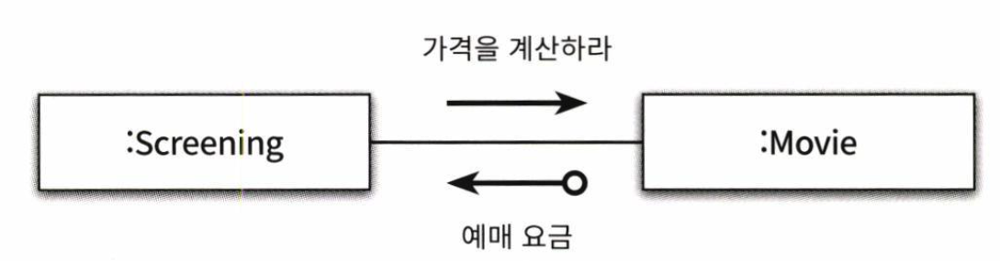
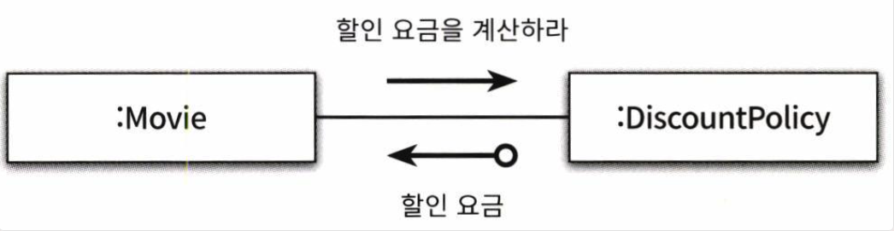

# CHAPTER 06. 메시지와 인터페이스

</br>

> 객체지향에 대한 가장 큰 오해는 애플리케이션이 클래스의 집합으로 구성된다는 것  
> 객체지향을 위해서는 클래스가 아니라 `객체를 지향해야한다.`  
> `즉, 협력 안에서 객체가 수행하는 책임에 초점을 맞춰야 한다는 것`

</br>

- `객체지향에서 가장 중요한 것은 클래스가 아니라 객체들이 주고받는 메시지다.`
- 애플리케이션은 클래스로 구성되지만 메시지를 통해 정의된다.

</br>

## 협력과 메시지

</br>

> 우리가 흔히 웹애플리케이션을 만들 때  
> 클라이언트로부터 요청을 받은 서버는 응답을 위해  
> 다른 객체들과 소통하여 정보를 얻은 후에 클라이언트가  
> 요구하는 정보를 반환해 준다.

</br>

- 협력안에서 메시지 전송쪽을 클라이언트
- 메시지 수신쪽을 서버라 지칭
- 협력이란 클라이언트가 서버의 서비스를 요청하는 단방향 상호작용

</br>

|              Screening - Movie               |
| :------------------------------------------: |
|  |

</br>

> Screening은 Movice에게 가격을 `계산하라`는 메시지를 보낸다.

</br>

|               Movie - DiscountPolicy               |
| :------------------------------------------------: |
|  |

</br>

> 요청을 받은 Movie는 할인 요금을 계산하기 위한 정보가 부족하여  
> DiscountPolicy에게 `할인 요금을 계산하라`는 메시지를 보낸다.

</br>

> 위의 사례로 알 수 있듯, 객체간의 협력은 클라이언트와 서버의 역할을 동시에 수행 한다.  
> 따라서 우리는 객체가 수신하는 메시지에만 초점을 맞추는 것이 아니라  
> `외부의 전송하는 메시지 집합까지도 고려하는 것이 바람직하다.`

</br>

- 용어 정리

  - 메시지 : 객체들이 협력하기 위해 사용하는 유일한 의사소통
  - 메시지 전송(패싱) : 한 객체가 다른 객체에게 도움을 요청하는 것
  - 메시지 전송자
  - 메시지 수신자

- 메시지 구성 요소
- 오퍼레이션명
- 인자
- 메시지 수신자

</br>

|              message               |
| :--------------------------------: |
|  |

</br>

> 메시지를 수신했을 때 실제로 어떤 코드가 실행되는지 결정하는 것은 메시지 수신자의 타입  
> condition이 PeriodCondition이냐 SequenceCondition이냐에 따라서 달라진다.  
> 즉 메시지를 수신했을 때 `실제로 실행되는 함수 또는 프로시저를 메서드라 지칭`
> 메시지와 메서드가 실행시점에 연결되어야 함으로 컴파일 타임과 런타임에서의 의미가 달라질 수 있다.

</br>

### 여기서 다시 한 번 중간 정리

> 그러니까 저자의 메시지와 메서드를 구분하라는 말은,  
> 다형성을 살려, 메시지 전송자가 어떤 메시지를 요청할 건지만 알면 된다는 것이다.  
> 메시지 수신자도 그냥 행위만 처리해줄 뿐, 구체적인 타입이 컴파일 타임에 정해지지 않아,  
> `메시지 메서드 구분하라! = 다형성을 잘 살리면`  
> 결합도가 낮아진다!

</br>

- 용어 정리
  - 오퍼레이션 : 인터페이스 각 요소로서 구현이 아닌 추상화
  - 메서드 : 오퍼레이션을 구현한 것

## 인터페이스 설계 품질

</br>

> 좋은 인터페이스는  
> `최소한의 인터페이스`, 즉 꼭 필요한 오퍼레이션만을 포함  
> `추상적인 인터페이스`, 어떻게 수행할지가 아닌 무엇을 할지를 표현

</br>

### 디미터 법칙

</br>

> 객체 내부 구조에 강하게 결합되지 않도록 협력 경로를 제한하라는 것.  
> 그러니까 ERD에서 최대한 의존성이 근접하게 물려있는 객체들하고만  
> 메시지를 주고받으라는 것.

</br>

> 모든 클래스 C와 C에서 구현된 모든 메서드 M에 대하여  
> M이 메시지를 전송할 수 있는 모든 객체는

</br>

- M의 인자로 전달된 클래스(C 자체 포함)
- C의 인스턴스 변수의 클래스

</br>

- this 객체
- 메서드의 파라미터
- this의 속성
- this의 속성인 컬렉션의 요소
- 메서드 내에서 생성된 지역 객체

</br>

```java
public class ReservationAgency{
  // Screening에 있는 Movie를 꺼내서 계산하는 것이 아니라, 메시지를 던지고 책임을 위임
  public Reservation reserve(Screening screening, Customer customer, int audienceCount){
    Money fee = screening.calculateFee(audienceCount);
    return new Reservation(customer, screening, fee, audienceCount);
  }
}
```

> ReservationAgency는 Screening에 메시지를 전송하기만 하여 screening 내부에 대한 정보를 모른다.  
> 즉, Screening의 내부 구조 및 속성과 결합되어 있지 않아서  
> Screening이 변경된다 하더라도 ReservationAgency를 함께 변경할 필요가 없다.

</br>

- 캡슐화는 클래스 내부의 구현을 감춰야 한다는 것을 강조
- 디미터 법칙은 `협력하는 클래스의 캡슐화를 지키기 위해 접근해야하는 요소를 제한하는 것`
- 정보를 처리하는 데 `필요한 책임을 정보를 알고 있는 객체에게 할당`하기 때문에 응집도가 높은 객체가 만들어짐

```java
// 디미터 법칙을 위반하는 코드의 전형적인 모습
screening.getMovie().getDiscountConditions();
```

</br>

### 묻지 말고 시켜라

> 메시지 전송자는 메시지 수신자의 상태를 알고 메시지를 보내는 것이 아님.  
> 메시지 수신자의 상태를 기반으로 결정을 내린 후에  
> 수신자의 상태를 바꿔서는 안된다

- 객체 내부 상태를 알고 명령을 결정하는 것 -> 캡슐화 위반.

</br>

- 오퍼레이션이 내부 상태를 요구한다면 설계를 다시 고민
  - 항상 행동을 요청하는 오퍼레이션을 고려하여 인터페이스를 향상 시킬 것
  - 그리고 행동을 요청하되 `오퍼레이션이 어떻게 동작하는지 노출해서도 안된다.`

</br>

### 의도를 드러내는 인터페이스 : 어떻게 동작하는지가 아니라, 무엇을 하느냐!

- 아래같으 코드가 안좋은 이유

```java
public classs PeriodCondition{
  public boolean isSatisfiedByPeriod(Screening Screening){

  }
}

public classs SequenceCondition{
  public boolean isSatisfiedBySequence(Screening Screening){

  }
}

```

- 1. 메서드가 제대로 소통하지 못한다.
  - 둘 다 조건이 만족하는지 판별하는 동일한 작업을 수행한다.
  - 하지만 메서드 네이밍이 달라 두 메서드 내부 구조를 이해해야함.
  - `어떻게 동작하는지 유추 가능`
- 2. 메서드 수준에서 캡슐화 위반
  - 협력하는 객체의 종류를 알도록 한다,
  - 참조하는 객체 ..Condition 뿐만 아니라 호출하는 메서드도 변경해야하기 때문!

</br>

```java
public classs PeriodCondition implements DiscountCondtion{
  public boolean isSatisfiedBy(Screening Screening){

  }
}

public classs SequenceCondition implements DiscountCondition{
  public boolean isSatisfiedBy(Screening Screening){

  }
}

```

</br>

> 앞장에서 계속 말하든 행위(operation)이 정해지고 추상화가 정해진다면  
> 다형성을 활용하자 -> 합성  
> 메서드만 같다고 동작하지 않는다. -> `JAVA가 Complie 언어야!`

</br>

```java
public class Theater {
    private TicketSeller ticketSeller;

    public Theater(TicketSeller ticketSeller) {
        this.ticketSeller = ticketSeller;
    }

    public void enter(Audience audience) {
        if (audience.getBag().hasInvitation()) {
            Ticket ticket = ticketSeller.getTicketOffice().getTicket();
            audience.getBag().setTicket(ticket);
        } else {
            Ticket ticket = ticketSeller.getTicketOffice().getTicket();
            audience.getBag().minusAmount(ticket.getFee());
            ticketSeller.getTicketOffice().plusAmount(ticket.getFee());
            audience.getBag().setTicket(ticket);
        }
    }
}
```

> 디미터 법칙에서 Theater가 인자로 전달된 audience와 ticketSeller에 메시지를 전달하는 것은 문제 X  
> 문제는 지금 다른 객체의 프로퍼티에 마구 접근한다는 것.

</br>

> 위와같이 프로퍼티에 접근하거나  
> 프로퍼티 정보를 마구 가져와서 사용하는 행위 모두  
> 결합도를 높이는 행위다.  
> 또한 내부 속성을 가져온다는 것은 `클래스 내부 구조를 모두 알고 있다는 것!` -> `캡슐화 어김`

</br>

```java
public class TicketSeller{
  public void setTicket(Audience audience){
    if(audience.getBag().hasInviatation()){
      Ticket ticket = ticketOffice.getTicket();
      audience.getBag().setTicket(ticket);
    }
    else{
      Ticket ticket = ticketOffice.getTicket();
      audience.getBag().minusAmount(ticket.getFee());
      ticketOffice.plusAmount(ticket.getFee());
      audience.getBag().setTicket(ticket);
    }
  }
}
```

</br>

> 현재 Theater와 TicketSeller만 의존성을 가지도록 하였다.  
> 이제 TicketSeller는 Audiencerk ticket을 가지도록 하는 것임으로  
> Audience에 setTicket 메서드를 추가함으로써 스스로 티켓을 가지도록 하자

</br>

```java
public class Audience{
  public Long setTicket(Ticket ticket){
    if(bag.hasInvitation()){
      bag.setTicket(ticket);
      return 0L;
    }
    else{
      bag.setTicket(ticket);
      bag.minusAmount(ticket.getFee());
      return ticket.getFee();
    }
  }
}
```

</br>

```java
public class TicketSeller {
    private TicketOffice ticketOffice;

    public void setTicket(Audience audience) {
        ticketOffice.plusAmount(audience.setTicket(ticketOffice.getTicket()));
    }

```

> 티켓셀러가 관객에게 티켓을 할당하는 행위에서  
> audience가 setTicket을 호출하는데,  
> 이때 bag의 hasInvitation()을 통해  
> 초대권 여부를 묻는데, 메시지를 통해 서로 협력하는 것이 아니라  
> 그냥 내부 속성을 알고 호출함으로 디미터 법칙에 위반된다.

</br>

```java
public class Audience {
    private Bag bag;

    public Audience(Bag bag) {
        this.bag = bag;
    }

    public Long setTicket(Ticket ticket) {
        return bag.setTicket(ticket);
    }

}
```

- 나도 항상 생각할 것
  - 도메인이 크게 잘못되지 않았다면 되도록 의존성을 가진 객체들끼리만 결합할 것.
    - 생각없이 객체 박지 않기.
  - `저런식으로 Audience에 던져주고, 다시 내부 객체가 메시지 호출하여 책임 위임하는 것도 고려해보기`

</br>

### 다시 한 번 인터페이스에 의도 드러내기

- TicketSeller -> Audience : 티켓을 파는 행위, 반대로 관객은 사는 행위
- Audience -> Bag : 티켓을 보관하는 행위

```java
public class TicketSeller{
  public void sellTo(Audience audience){}
}

public class Audience{
  public Long buy(Ticket ticket){}
}

pulbic class Bag{
  public Long hold(Ticket ticket){}
}

```

> 객체입장에서 동일한 액션이라도  
> `의도가 분명한 네이밍 고민하기`

</br>

## 원칙의 함정

</br>

```java
public clalss PeriodCondtion implements DiscountCondition{
  public boolean isSatisfiedBy(Screening screening){
    return screening.getStartTime().getDayOfWeek().equals(dayOfWeek) &&
      startTime.compareTo(screening.getStartTime().toLocalTime() <= 0 &&
      endTime.compareTo(screening.getStartTime().toLocalTime()) >= 0;
  }
}
```

> 현재 위의 코드는 Screenin의 내부 속성을 모두 가져와서  
> 메서드의 구현을 결정한다. -> `캡슐화를 어긴것?`

```java
public class Screening{
  public boolean isDiscountable(DayOfWeek dayOfWeek, LocalTime startTime, LocalTime endTime){
    ...
  }
}

public class PeriodCondtion implements DiscountCondtion{
  public boolean isSatisfiedBy(Screening screening){
    return screening.isDiscountable(dayOfWeek, startTime, endTime);
  }
}
```

> 이런식으로 처리한다면 Screening이 내부 할인 조건을 판단하는 책임을 가져야한다.  
> `Screening이 갖는 적합한 책임인지..?`

- 또한 이것이 결합도를 높인다.
  - PeriodCondition의 속성들을 파라미터로(dayOfWeek...) 넘겨주기 때문에
  - 기간할인 조건이 바뀌게 될 경우(
    - 예시 : 시작 시간 이후 모두 할인해주겠다... 하면 endTime도 필요없고.. 또 Screening도 수정되고..

</br>

> 이 경우 캡슐화를 조금 낮추더라도  
> Screening의 응집도를 높이고 Screenign과 PeriodCondition의 결합도를 낮추는 것이  
> 더 좋은 방법! -> `결국 설계는 기회비용이다.`

</br>

## 명령 쿼리 분리 원칙

</br>
</br>
```
