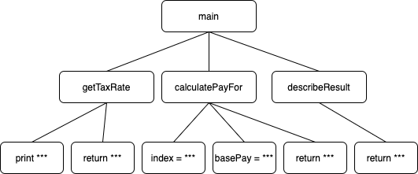

# CHAPTER 07. 객체 분해

## 프로시저 추상화와 데이터 추상화

</br>

- 프로시저 추상화
  - 소프트웨어가 무엇을 해야하는 지를 추상화
  - `기능 분해, 알고리즘 분해`
- 데이터 추상화
  - 소프트웨어가 무엇을 알아야하는 지를 추상화
  - `데이터를 중심으로 타입으로 추상화, 추상 데이터 타입`
  - `데이터를 중심으로 프로시저를 추상화, 객체지향`

> 소프트웨어는 데이터를 이용하여 정보를 표현하고 프로시저를 이용해 데이터를 조작

</br>

> 시스템을 분해하는 방법을 결정하려면 먼저 프로시저 추상화를 중심으로 할 것인지  
> 데이터 추상화를 중심으로 할 것인지 결정

</br>

## 프로시저 추상화와 기능 분해

</br>

### 메인 함수로서의 시스템

</br>

> 기능은 오랜 시간 시스템을 분해하는 기준이 되었으며  
> 이 같은 시스템 분해 방식을 알고리즘 분해 또는 기능 분해(`프로시저 추상화`)라고 부른다.

</br>

> 프로시저는 반복적으로 실행되거나 `거의 유사하게 실행되는 작업들을 하나의 장소에 모아놓음`으로써  
> 로직을 재사용하고 `중복을 방지할 수 있는 추상화 방법`  
> 프로시저를 추상화라 부르는 이유는 내부 구현을 몰라도 인터페이스를 사용할 수 있기 때문

</br>

- TOP-DOWN-Approach

> 최상위 기능을 추상화 해둔 뒤  
> 좀 더 작은 단계의 하위 기능으로 분해해 나가는 방법  
> 상위기능이 더 추상적

</br>

### 급여 시스템

</br>

> 급여 = 기본급 - (기본급 \* 소득세율)  
> 최상위 프로시저 `직원의 급여를 계산한다.`

</br>

- 직원의 급여를 계산한다
  - 사용자로부터 소득세율을 입력받는다
  - 직원의 급여를 계산한다
  - 양식에 맞게 결과를 출력한다.

</br>

> 모든 문장이 정제 과정을 거쳐 하위 문장은 보다 더 구체적이어야 함
> 보다 더 저수준의 문장이 될 때까지 기능을 분해해야한다.

</br>

- 직원의 급여를 계산한다
  - 사용자로부터 소득세율을 입력받는다
    - "세율을 입력하세요: " 라는 문장을 화면에 출력
    - 키보드를 통해 세율을 입력받는다.
  - 직원의 급여를 계산한다
    - 전역 변수에 저장된 직원의 기본급 정보를 얻는다.
    - 급여를 계산한다.
  - 양식에 맞게 결과를 출력한다.
    - "이름: {직원명}, 급여: {계산된 금액}" 형식에 따라 출력 문자열을 생성한다.

</br>

```ruby
$employees = ["직원A", "직원B", "직원C"]
$basePays = [400, 300, 250]

def main(name)
  taxRate = getTaxRate()
  pay = calculatePayFor(name, taxRate)
  puts(describeResult(name, pay))
end

def getTaxRate()
  print("세율을 입력하세요: ")
  return gets().chomp().to_f()
end

def calculatePayFor(name, taxRate)
  index = $employees.index(name)
  basePay = $basePays[index]
  return basePay - (basePay * taxRate)
end

def describeResult(name, pay)
  return "이름 : #{name}, 급여 : #{pay}"
end
```

> 위에서 Top Down 방식으로 구현한 ruby

</br>

- Top Down 문제점

|                  Top Down                   |
| :-----------------------------------------: |
|  |

</br>

- 시스템은 하나의 메인 함수로 구성돼 있지 않다.

> 모든 기능을 자식 노드를 가지는 하나의 메인 기능으로 정의?  
> 하나의 메인 기능이라는 개념보다는 모든 기능들은 규모라는 측면에서 상이하다할지라도,  
> 기능성의 측면에서는 동등하게 독립적이고 완결된 하나의 기능을 표현

</br>

- 기능 추가나 변경으로 인해 메인함수를 빈번하게 수정할 경우?

> 위의 내용과 비슷한 말인데  
> 시스템은 여러개이 정상이 존재하지만 유일한 메인으로 설정할 경우  
> 새로운 기능을 추가할 때마다 매번 메인 함수를 수정해야한다... (TOP DOWN인데 변경은 양방향..)

```ruby
def sumOfBasePays()
  result = 0
  for basePay in $basePays
    result += basePay
  end
  puts(result)
end

```

</br>

> 모든 직원들의 기본급의 총합을 기능을 추가하는 요구사항이 접수 되었을 때  
> 메인 함수와는 성격이 맞지 않는 기능임으로 `어느 단계에 넣을지 애매하다.`

</br>

```ruby
def calculatePay(name)
  taxRate = getTaxRate()
  pay = calculatePayFor(name, taxRate)
  puts(describeResult(name, pay))
end
```

> 이런식으로 main 바로 하위 메서드로 정의한 후

</br>

```ruby
def main(operation, args={})
  case(operation)
  when :pay then calculatePay(args[:name])
  when :basePays then sumOfBasePays()
  end
end
```

</br>

> 이런식으로 Top Down 계층을 지키기 위해서  
> 잦은 main의 수정이 발생할 수 밖에 없다.  
> 기존 코드의 빈번한 수정은 버그 확률이 높아진인다!

</br>

- 비즈니스 로직이 사용자 인터페이스와 강하게 결합된다.

> 비즈니스 로직을 설계하는 초기 단계에 사용자 인터페이스의 관심사가 섞인다.  
> 이 경우의 문제는 비즈니스 로직과 사용자 인터페이스가 변경되는 빈도가 다르다.  
> 사용자 인터페이스가 시스템 내에서 가장 많이 변경되는 부분인데  
> 비즈니스 로직은 변경이 적게되는 영역  
> `따라서 두 로직이 섞여있는 하향식 접근법이 변경에 불안정한 아키텍처`

</br>

- 하향식 분해는 `너무 이른 시기에 함수들의 실행 순서를 고정시키기 때문에 유연성과 재사용성이 저하`

> main을 기준으로 더 작게 나누는 과정은  
> 설계를 시작하는 시점에 무엇을 해야하는 목적이 아닌  
> 어떻게 동작해야하는지에 대해 집중하게 한다.
>
> 즉, 구현을 염두에 두기 때문에 자연스레 함수들의 실행 순서를 정의하는 시간 제약을 강조...

</br>

- 데이터 형식이 변경 경우 파급효과를 예측할 수 없다.

</br>

> 어떤 함수가 어떤 데이터를 사용하고 있는지 추적하기 어렵다.  
> 즉 데이터의 변경이 어떤 버그를 야기하는지 찾기 어렵다.

```ruby
$employees = ["직원A", "직원B", "직원C", "아르바이트D", "아르바이트E", "아르바이트F"]
$basePays = [400, 300, 250, 1, 1, 1.5]
$hourlys = [false, false, false, true, true, true]
$timeCards = [0, 0, 0, 120, 120, 120]
```

> 아르바이트 직원의 이름과 시급은 정규 직원의 이름과 기본급을 보관하던 전역변수 `employees`와 `basePays`에 저장  
> 각 인덱스에 위치한 정보가 정규직원의 것인지, 아르바이트직원의 것인지 여부를 나타내는 변수 `hourlys`  
> timecards는 업무 누적시간, 정규직원의 경우 0

</br>

- 데이터가 마구잡이로 추가되고 변경된느 것이 하위 함수에 어떤 영향을 미치는지 파악하기 어렵다는 것..

</br>

> 급여시스템의 문제점은  
> 하나의 main 기능을 토대로 실행 순서를 모두 정해놓고 작성했다는 것이다.  
> 메인 기능 및 다른 상위기능이 변경된다고 할 때  
> 하위 기능의 변경을 야기 시켜 `변경에는 취약한 설계`

</br>

### 언제 하향식 분해가 유용?

</br>

> 설계가 어느 정도 안정화 된 후, 설계의 다양한 측면을 논리적으로 설명하고 문서화하기에 용이하지만  
> 설계를 용이하게 하는 것과 좋은 구조를 설계하는 방법이 동일한 것은 아니다.  
> 하향식은 이미 완전히 이해된 사실을 서술하기에 적합한 것이지,  
> 새로운 것을 개발하고 설계하고 발견하는 데에 적합한 것이 아니다...

</br>

## 모듈

</br>

> 시스템의 변경을 관리하는 기본 전략은 함께 변경되는 부분을 하나의 구현 단위로 묶고  
> 퍼블릭 메서드를 통해서 접근 가능하도록 가능하는 것  
> 기능을 main으로 시스템을 분해하는 것이 아니라 `변경의 방향에 맞춰서 시스템 분해`

</br>

- 정보 은닉

</br>

> 시스템을 모듈 단위로 분해하기 위한 기본 원리로  
> 시스템에서 자주 변경되는 부분을 상대적으로 덜 변경되는  
> 인터페이스 뒤로 감춰야한다는 것.  
> 시스템을 모듈로 분할하는 원칙은 외부에 유출돼서는 안되는  
> 비밀의 윤곽을 따라가야한다고 주장... -> 솔직히 아직 와닿지 않는다..
>
> 모듈은 변경될 가능성이 있는 비밀을 내부로 감추고,  
> 잘 정의되고 쉽게 변경되지 않을 퍼블릭 인터페이스를 외부에 제공해서  
> 내부의 비밀에 함부로 접근하지 못하게 한다.
>
> `시스템을 모듈로 분해한 후`에는 각 모듈 내부를 구현하기 위해 기능 분해를 적용  
> `기능 분해`가 하나의 기능을 구현하기 위해 필요한 기능들을 순차적으로 찾아가는 탐색의 과정이라면  
> `모듈 분해`는 감춰야하는 비밀을 선택하고 비밀 주변에 안정적인 보호막을 설치하는 보존 과정

</br>

- 퍼블릭 인터페이스(클래스의 퍼블릭 메서드) : 외부에서 내부의 비밀에 접근하지 못하도록 방어막
- 모듈은 두가지 비밀을 감춰야 한다.
  - 복잡성 : 외부에 모듈을 추상화할 수 있는 간단한 인터페이스 제공해서 복잡도 낮추기
  - 변경 가능성 : 변경 발생시 하나의 모듈만 수정하면 되도록 변경 가능한 설계 결정을 내부로 감추고, 쉽게 변경되지 않는 부분만 인터페이스로 제공

</br>

```ruby
module Employees
  $employees = ["직원A", "직원B", "직원C", "아르바이트D", "아르바이트E", "아르바이트F"]
  $basePays = [400, 300, 250, 1, 1, 1.5]
  $hourlys = [false, false, false, true, true, true]
  $timeCards = [0, 0, 0, 120, 120, 120]

  def Employees.calculatePay(name, taxRate)
    if (Employees.hourly?(name)) then
      pay = Employees.calculateHourlyPayFor(name, taxRate)
    else
      pay = Employees.calculatePayFor(name, taxRate)
    end
  end

  def Employees.hourly?(name)
    return $hourlys[$employees.index(name)]
  end

  def Employees.calculateHourlyPayFor(name, taxRate)
    index = $employees.index(name)
    basePay = $basePays[index] * $timeCards[index]
    return basePay - (basePay * taxRate)
  end

  def Employees.calculatePayFor(name, taxRate)
    return basePay - (basePay * taxRate)
  end

  def Employees.sumOfBasePays()
    result = 0
    for name in $employees
      if (not Employees.hourly?(name)) then
        result += $basePays[$employees.index(name)]
      end
    end
    return result
  end
end
```

</br>

> 전역 변수였던 변수들을 `Employees` 모듈 안에서 정의하고,  
> ruby를 잘 모르긴 하지만...  
> 내부 함수들 안에서 변수를 조작하고 연산하여 리턴하는 것을 확인 가능.

</br>

### 잠깐 넘어기가전에 정리

> 정보은닉화든 비밀이든 복잡성 및 변경가능성 어려운 말로 계속 반복하는데  
> 그냥 용건은 class 내부 private 인스턴스 변수를 함부로 getter로 내보내지도 말고,  
> public 메서드로 열어두는 것도, 필드를 유추할 수 있거나  
> 필드를 그대로 내보내서 의존성을 높이지 말라는 소리.

</br>

```ruby
def main(operation, args={})
  case(operation)
  when :pay then calculatePay(args[:name])
  when :basePays then sumOfBasePays()
  end
end

def calculatePay(name)
  taxRate = getTaxRate()
  pay = Employees.calculatePay(name, taxRate)
  puts(describeResult(name, pay))
end

def getTaxRate()
  print("세율을 입력하세요: ")
  return gets().chomp().to_f()
end

def describeResult(name, pay)
  return "이름 : #{name}, 급여 : #{pay}"
end

def sumOfBasePays()
  puts(

```

> 모듈의 정보 은닉화 통해서 main에서  
> Employees 모듈 내부 정보를 자세히 모르더라도  
> 사용하는데 지장없다.

</br>

- 모듈의 장점

  - 모듈 내부 변수가 변경되더라도 모듈 내부에만 영향을 미친다
  - 비즈니스 로직과 사용자 인터페이스에 대한 관심사를 분리한다.
    - 사용자 입력 및 화면 출력을 Employees 모듈이 외부에 두었다.
    - Employees는 비즈니스 로직을 담당하고, main은 ui를 담당
    - 따라서 `사용자 인터페이스가 변경되더라도 ui가 변경될 일이 없고`, 반대도 마찬가지다!
  - 전역변수와 전역함수를 제거함으로써 네임스페이스 오염을 방지
    - 모듈은 하나의 네임스페이스르 제공
    - 즉, A모듈에서 사용하는 name을 B모듈에서도 사용 가능하여 `name collision 방지`

- 모듈의 단점
  - 인스턴스의 개념을 제공하지 않는다
    - Employees는 단지 회사에 속한 모든 직원 정보를 가지고 있는 모듈
    - 좀 더 고차원의 추상화를 위해 직원 전체가 아닌 `개별직원을 독립적인 객체로 다뤄야한다.`
    - `아 class와 객체를 왜 나눠서 표현하는지 이제 이해했다...`

</br>

### 한 번 더 정리

</br>

> 하향식 접근법은 상위기능을 하위기능으로 분해하여 구성  
> 반면에 모듈은 `변경의 정도에 따라 시스템`으로 분해 -> `모듈은 응집도가 높아야한다.`  
> 즉 모듈은 외부에 감춰야하는 비밀과 관련성 높은 데이터 및 함수의 집합

</br>

## 데이터 추상화와 추상 데이터 타입

</br>

- 타입: 변수에 저장할 수 있는 내용물의 종류와 변수에 적용될 수 있는 연산의 가짓수
  - 실행 할 수 있는 연산의 집합을 결정
  - 변수의 값이 어떻게 행동할 것이라는 것을 예측할 수 잇게 한다.

</br>

> 절차지향 언어에서는 한정적인 built-in-type 제공  
> 절차형 언어 프로그램에서 사용되는 주된 추상화는 `프로시저 추상화 - 기능 분해`
> 따라서 리스코프는 프로시저 추상화 한계가 있다는 것을 알고  
> 그 대안으로 `데이터 추상화의 개념을 제안`

</br>

- 추상 데이터 타입을 위한 프로그래밍 언어의 지원
  - 타입 정의를 선언할 수 있어야 한다.
  - 타입의 인스턴스를 다루기 위해 사용할 수 있는 오퍼레이션의 집합 정의
  - `제공된 오퍼레이션을 통해서만 조작할 수 있도록 데이터를 보호`
  - 타입에 대해 `여러개의 인스턴스를 생성 가능`해야한다.
    - User user1 = new User();
    - User user2 = new User();
    - `객체를 하나의 독립적인 존재로 바라보기 위해!`

</br>

- ruby에서 추상 데이터 타입처럼 사용하는 struct

```ruby
Employee = Struct.new(:name, :basePay, :hourly, :timeCard) do
End
```

> 내부에 캡슐화할 데이터를 결정

</br>

```ruby
Employee = Struct.new(:name, :basePay, :hourly, :timeCard) do
  def calculatePay(taxRate)
    if (hourly) then
      return calculateHourlyPay(taxRate)
    end
    return calculateSalariedPay(taxRate)
  end

private
  def calculateHourlyPay(taxRate)
    return (basePay * timeCard) - (basePay * timeCard) * taxRate
  end

  def calculateSalariedPay(taxRate)
    return basePay - (basePay * taxRate)
  end
end
```

> 그 후 오퍼레이션을 작성하여하는데  
> 직원의 유형에 따라 급여를 계산하는 calculatePay()를 구현

</br>

- 데이터 추상화 이전

```ruby
  def Employees.calculatePay(name, taxRate)
    if (Employees.hourly?(name)) then
      pay = Employees.calculateHourlyPayFor(name, taxRate)
    else
      pay = Employees.calculatePayFor(name, taxRate)
    end
  end
```

</br>

> 이전에는 이름을 인자로 포함하였으나  
> 이제 `Employee를 데이터 추상화함으로써`  
> 내부 오퍼레이션을 통해 연산 가능하게 되어 name이 필요 없게 되었다!

</br>

```ruby
  def monthlyBasePay()
    if (hourly) then return 0 end
    return basePay
  end
```

> 기본급은 알바생 같은 경우 0원을 리턴하고  
> 정규직은 가지고 있는 basePay(기본급)을 리턴한다.

</br>

- 클라이언트 코드 작성

```ruby
$employees = [
  Employee.new("직원A", 400, false, 0),
  Employee.new("직원B", 300, false, 0),
  Employee.new("직원C", 250, false, 0),
  Employee.new("아르바이트D", 1, true, 120),
  Employee.new("아르바이트E", 1, true, 120),
  Employee.new("아르바이트F", 1, true, 120),
]
```

```ruby
def calculatePay(name)
  taxRate = getTaxRate()
  for each in $employees
    if (each.name == name) then employee = each; break end
  end
  pay = employee.calculatePay(taxRate)
  puts(describeResult(name, pay))
end
```

</br>

> 이름을 통해 특정 Employee를 찾아낸 후  
> calculatePay operation 실행

</br>

### 마지막 정의

</br>

> 데이터 추상화를 통해서 사용자 정의 타입을 추가할 수 있게 되었으나  
> 데이터와 기능을 분리하는 절차적인 설계 틀을 벗어나지 못한다.  
> `추상 데이터타입은 말 그대로 시스템의 상태를 저장할 데이터를 표현할 뿐!`

</br>

## 클래스

</br>

> 추상 데이터 타입과 클래스는 유사해보임! -> `데이터 추상화를 기반으로 시스템 분해하니깐?`  
> `class는 상속과 다형성을 지원한다!`

</br>

> 윌리엄 쿡은 추상 데이터 타입은 타입을 추상화 한 것이고  
> `클래스는 절차를 추상화한 것`이라는데 이거 무슨 소리...?

</br>

|               employee                |
| :-----------------------------------: |
|  |

</br>

> employee는 직원과 알바로 나뉜다.  
> calculatePay()와 monthlyBasePay()가  
> 각각 직원의 종류에 따라 다른 연산을 실행하게 된다... -> `오퍼레이션 기준으로 타입을 묶는다.`  
> 다형성 통해서 재정의가 없네..  
> 반면 객체지향에서는 `직원의 타입을 기준으로 오퍼레이션이 묶인다`

</br>

### 추상 데이터 타입에서 클래스로 변경하기

</br>

```ruby
class Employee
  attr_reader :name, :basePay

  def initialize(name, basePay)
    @name = name
    @basePay = basePay
  end

  def calculatePay(taxRate)
    raise NotImplementedError
  end

  def monthlyBasePay()
    raise NotImplementedError
  end
end
```

```ruby
class SalariedEmployee < Employee
  def initialize(name, basePay)
    super(name, basePay)
  end

  def calculatePay(taxRate)
    return basePay - (basePay * taxRate)
  end

  def monthlyBasePay()
    return basePay
  end
end

class HourlyEmployee < Employee
  attr_reader :timeCard
  def initialize(name, basePay, timeCard)
    super(name, basePay)
    @timeCard = timeCard
  end

  def calculatePay(taxRate)
    return (basePay * timeCard) - (basePay * timeCard) * taxRate
  end

  def monthlyBasePay()
    return 0
  end
end
```

> 자바에서 상속처럼 상위 Employee에 공통 속성을 정의한 후  
> 추상 메서드의 구현을 각각의 직원의 타입에 맞게 재정의한다.

</br>

> 추상데이터타입에서 모든 직원타입에 대해 인스턴스를 생성해야했는데  
> 이제는 각 `Employee 타입에 맞는 직원의 인스턴스를 생성 가능`

</br>

### 변경을 기준으로 선택 하라

</br>

> 객체지향에서는 `특정 타입에 대한 조건문을 다형성으로 대체해야한다.`  
> 클라이언트가 객체의 타입을 확인한 후 적절한 메서드를 호출하는 것이 아니라  
> `객체가 메시지를 처리할 적절한 메서드를 선택한다.`

</br>

### 항상 추상 데이터 타입의 설계가 나쁜 것인가?

</br>

> 설계는 변광과 관련된 것  
> 설계의 유용성은 변경의 방향성과 발생 빈도에 따라 결정  
> 추상 데이터타입과 객체지향 설계의 유용성은 설게에 요구되는 것이  
> `타입 추가`냐, `오퍼레이션`추가냐에 따라 달라진다.

</br>

- 타입 추가 관점
  - 다형성을 통해 객체가 메시지를 선택하도록 하는 객체지향 설계가 더 유리하다
  - 변경의 관점에서 클라이언트가 타입을 확인할 필요가 없다.
    - 변경의 여파가 적음!
- 오퍼레이션 관점
  - 당연히 추상 데이터 타입
    - 예를 들어 객체지향에서 오퍼레이션 하나 추가하려면 부모부터 모든 자식의 오퍼레이션을 추가해야한다!

</br>

### 협력이 중요하다

> 결국은 객체지향에서 중요한 것은 역할, 책임, 협력!  
> `다형성은 협력이라는 문맥 안에서 책임을 수행하도록 해야하는 것`이지  
> 다형성을 위한 설계 그 자체가 목적이 되어서는 안된다!
