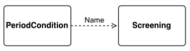
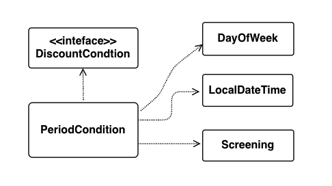

# CHAPTER 08. 의존성 관리하기

</br>

> `작고 응집도 높은 객체`는 책임의 초점이 명확하고 한 가지 일만 수행하면 되는 객체  
> 애플리케이션 내에서 단독으로 수행할 수 있는 작업이 없음으로 `다른 객체와 협력을 해야한다.`  
> 그러나 협력은 해당 객체의 존재를 알아야하고 이것은 필히 `의존성을 낳는다.`  
> `의존성을 관리하고 객체가 변화를 받아들일 수 있게 하는것이 객체지향 설계!`

</br>

## 의존성 이해하기

</br>

### 변경과 의존성

</br>

- 의존성 : 객체의 책임을 수행하기 위해 다른 객체를 필요로하는 경우 발생
  - 런타임 의존성 : 실행 시에 의존 대상 객체 존재
  - 컴파일 타임 의존성 : 의존 대상 객체가 컴파일 타임에 존재

</br>

```java
public class PeriodCondition implements DiscountCondition {
  private DayofWeek dayOfWeek;
  private LocalDateTime startTime;
  private LocalDateTime endTime;

  ...

  public boolean isSatisfiedBy(Screening screening){
    return screening.getStartTime().getDayOfWeek().equals(dayOfWeek) &&
      startTime.compareTo(screening.getStartTime().toLocalTime()) <= 0 &&
      endTIme.compareTo(screening.getStartTime().toLocalTime()) >= 0;
  }

}

```

> PeriodCondtion의 인스턴스가 동작하기 위해서는 Screening의 인스턴스가 존재해야한다.  
> isSatisfiedBy메서드가 정상적으로 동작하기 위해서!

</br>

- 의존성은 방향성을 가지며 `항상 단방향`

|              PeriodCondtion과 Screening의 관계              |
| :---------------------------------------------------------: |
|  |

</br>

|       PeriodCondtion가 갖는 의존성        |
| :---------------------------------------: |
|  |

</br>

- DiscountCondtion
  - 인터페이스 이름이 변경 될 경우
  - isSatisfiedBy 오퍼레이션이 변경될 경우
- DayOfWeek와 LocalDateTime
  - 두 개의 인스턴스 타입이 변경될 경우
- Screening이 변경될 경우 내부 메서드 내용 변경 가능성

</br>

### 의존성 전이

> Screening은 Movie, LocalDateTieme, Customer에 의존한다.  
> PeriodCondtion이 Screening에 의존하고  
> Screening이 Movie에 의존할 때  
> `PeriodCondtion은 Screening이 갖는 의존성에 전이되어`  
> Moive를 간접적으로 의존한다.

</br>

> 물론 의존성이 함께 변경 될 가능성을 의미함으로  
> 의존성이 실제로 전이될지 여부는 변경의 방향과 캡슐화의 정도에 따라 달라짐  
> 그러니까 `의존성 전이는 변경에 의해 영향이 널리 전파 될 수 있다는 경고`

</br>

- 의존성의 종류
  - 직접 의존성
    - 한 요소가 다른 요소에 직접 의존하는 경우
    - `PeriodCondtion과 Screening의 관계`
    - 코드에서 명시적으로 드러남
  - 간접 의존성
    - 직접적인 관계가 존재하지 않지만 `의존성 전이에 의해 영향이 전파`되는 경우
    - `PeriodCondtion과 Movie의 관계`
    - 코드에서 명시적으로 드러나지 않는다.

</br>

### 런타임 의존성과 컴파일타임 의존성

</br>

> 런타임 의존성이 다루는 주제는 객체 사이의 의존성  
> 컴파일타임 의존성이 다루는 주제는 클래스 사이의 의존성

</br>

|       컴파일 타임의 Movie DiscountPolicy        |
| :---------------------------------------------: |
|  |

</br>

|        런타임의 Movie DiscountPolicy        |
| :-----------------------------------------: |
|  |

</br>

> 컴파일 탕미에서 Movie와 Amount, Percent는 어떠한 의존성도 존재하지 않는다.  
> 하지만 런타임에서 실질적으로 생성되는 인스턴스에 따라 의존성이 생기게 된다.
> `다형성을 활용하여 컴파일타임에 직접적인 결합`을 없애고  
> 변경에 용이한 방식의 설계!

</br>

> 어떤 클래스의 인스턴스가 다양한 클래스의 인스턴스와 협력하기 위해서는  
> 협력할 인스턴스의 구체적인 클래스를 알아서는 안된다.  
> 되도록 현력할 객체가 어떤 것인지는 런타임에 해결하도록 해야한다.  
> 컴파일타임구조와 런타임구조가 멀어질수록 설계가 유연해지고 재사용이 가능해진다!

### 의존성 해결하기

</br>

- 의존성 해결 : 실행 컨텍스트에 맞는 적절한 런타임 의존성으로 교체하는 것
  - 생성자 주입 : 객체를 생성하는 시점에 의존성 해결
  - 세터 주입 : 객체 생성 후 setter 메서드 통해서 의존성 해결
  - 메서드 실행시 인자를 이용해 의존성 해결

</br>

> setter 주입은 객체를 생성한 이후에도 의존하고 있는 대상을 변경하고 싶을때 유용!
> 하지만 객체가 생성된 후에 협력에 필요한 의존 대상을 설정함으로  
> 객체를 생성하고 의존 대상을 설정하기 전까지는 `객체가 불완전할 수 있다.`

</br>

```java
Movie avartar = new Moive(..);
avartar.calculateFee(..); -> null pointer exception
avartar.setDiscountPolicy(new AmountDiscountPolicy(..));
```

> 위 처럼 생성시에 인스턴스 변수가 null인데  
> 해당 변수를 사용할 경우 null pointer exception 발생!

</br>

> 더 좋은 방법은 우선 생성자 주입을 통해 객체간의 의존성을 설정하고  
> 필요할때 실행시점에서 setter를 통해 의존대상을 변경할 수 있도록 해야한다!

</br>

```java
public class Movie{
  public Monye calculateMovieFee(Screening screening, DiscountPolicy discountPolicy){
    ...
  }
}
```

</br>

> 협력 대상에 대해 지속적으로 의존 관계를 맺을 필요가 없을 때  
> 즉, 메서드가 실행되는 동안만 일시적으로 의존 관계가 존재해도 무방하거나  
> 메서드가 실행 될 때마다 의존 대상이 매번 달라져야할 때 유용!

</br>

## 유연한 설계

</br>

### 의존성과 결합도

</br>

> 객체간의 협력을 위해서 의존성은 당연한 것  
> 그러나 과한 의존성은 문제를 발생시킬 수 있다.

</br>

```java
public class Movie {
    ...
    private PercentDiscountPolicy percentDiscountPolicy;

    public Movie(String title, Duration runningTime, Money fee, PercentDiscountPolicy percentDiscountPolicy) {
        ...
        this.percentDiscountPolicy = percentDiscountPolicy;
    }

    public Money calculateMovieFee(Screening screening) {
        return fee.minus(percentDiscountPolicy.calculateDiscountAmount(screening));
    }
}
```

</br>

> 현재 위 코드에서 percentDiscountPolicy와 Movie가 의존성을 갖는 것은 당연한 것  
> 그러나, 문제는 의존성의 정도다.  
> Movie가 구체클래스에 의존한 탓에 다른 종류의 할인정책이 필요할 경우 Movie를 재사용할 수 있는 가능성을 없애버렸다. -> `class type이 달라 setter주입도 불가능`

</br>

- 바람직한 의존성

</br>

> 재사용성과 관련이 있다.  
> 어떤 의존성이 다양한 환경에서 클래스를 재사용할 수 없도록 제한한다면 바람직X  
> 다시말하자면 `컨텍스트에 독립적인 의존성이 바람직한 의존성!`  
> -> 결합도(coupling)의 개념!  
> 특정한 컨텍스트에 강하게 의존하는 클래스를 다른 컨텍스트에서 재사용할 수 있는 방법은 구현을 뜯어내는 것 뿐..

</br>

- 의존성과 결합도

> 그러니까 두 객체의 관계를 얘기할 때 의존성의 관점에서는  
> `의존성이 존재한다 vs 존재`하지 않는다로 표현  
> 결합도는 객체의 의존성의 정도를 표현함으로  
> `결합도가 강하다 vs 느슨하다`로 표현

</br>

### 지식이 결합을 낳는다

</br>

> Movie - PercentDiscountPolicy는 결합도가 강하다  
> Movie - DiscountPolicy는 결합도가 느슨하다.

</br>

> 결합도의 정도는한 요소가 자신의 의존하고 있는 다른 요소에 대해 알고있는 `정보의 양으로 결정`  
> Movie는 PercentDiscountPolicy와 의존할 경우 협력할 객체가 비율 할인 정책에 따라 할인 요금을 계산할 것이라는 것을 알고 있다.  
> 반면 DiscountPolicy에 의존할 경우 구체적인 계산 방법을 모른다.  
> 이런 관점에서 `더 많이 알 수록 더 높게 결합된다라고 표현`

</br>

> 더 많이 알 수록 더 적은 컨텍스트에서 재사용 가능하다는 것을 의미  
> 결합도를 느슨하게 하기 위해 협력하는 대상에 대해 필요한 정보 외에  
> 최대한 감추는 것이 중요! -> `추상화`

</br>

### 추상화에 의존하라

</br>

- 추상화

> 어떤 양상, 세부사항, 구조를 좀 더 명확하게 이해하기 위해 특정 `절차나 물체를 의도적으로 생략하거나 감춤으로써 복잡도를 극복하는 방법`

</br>

> DiscoutPolicy는 PercentDisountPolicy와 AmountDisountPolicy의  
> 각 정책에 따라 할인 요금을 계산한다는 사실을 숨겨주기 때문에 각 class의 추상화다!  
> Movie와 DisountPolicy가 더 느슨하게 결합되는 이유는 Movie가 구체클래스가 아닌 `추상화에 의존하기 때문`이다!

</br>

- 결합도의 관점
  - 구체 클래스
  - 추상 클래스 : 여전히 상속계층이 무엇인지에 대해 알아야한다.
  - 인터페이스 : 상속계층 X, 런타임에 의존성이 결정되기 때문에 가장 낮다!

> 실행 컨텍스트에 대해 알아야 하는 정보를 줄일수록  
> `즉 의존하는 대상이 더 추상적일 수록 결합도가 낮아진다!`

</br>

### 명시적인 의존성

</br>

- 이 코드는 한 가지 실수로 결합도가 불필요하게 높아졌다?

> 생성시점에 주입된 인자에 의해 인스턴스 변수의 의존성이 결정되는 것이 아니라  
> 코드레벨에서 그냥 생성시점에 AmountDiscountPolicy로 의존성을 결정했다.

```java
public class Movie{
  ...
  private DiscoutPolicy discountPolicy;

  public Movie(String title, Duration runningTime, Money fee){
      ...
      this.discountPolicy = new AmountDiscountPolicy(...);
  }

}
```

</br>

> 정답은 현재 Movie가 추상화에 의존하여 유연하고 재사용 가능할 것처럼 보이지만  
> 별도로 AmoundDiscountPolicy에도 의존하게 된다!
>
> 결합도를 느슨하게 만들기 위해서는 인스턴스 변수의 타입을 추상 클래스나  
> `인터페이스로 선언하는 것뿐만 아니라 클래스 내부에서 구체 클래스에 대한 모든 의존성을 제거해야한다!` -> 생성자 주입, 세터주입, 메서드인자 활용방식등!

</br>

```java
public class Movie{
  ...
  private DiscountPolicy discountPolicy;

  public Movie(String title, Duration runningTime, DiscountPolicy disountPolicy){
    this.discountPolicy = discountPolicy;
  }

}
```

> 생성자 주입 및 세터 주입, 메서드 인자 등 퍼블릭 메서드에 명시적으로 의존성이 노출된다. -> `명시적인 의존성`  
> 반면 인스턴스를 직접 생성하는 방식은 Movie가 DiscountPolicy에 의존한다는 사실을 감춘다.  
> 의존성이 퍼블릭 인터페이스에 표현되지 않는다! -> `숨겨진 의존성`

</br>

- 의존성이 명시적이어야 하는 이유!

> 우리가 파라미터 정보만을 통해서 의존성을 파악할 수 있는데 의존성이 숨겨진다면  
> 내부 구현을 살펴 볼 수 밖에없다. -> `Spring에서 생성자 주입을 권장하는 이유 중 하나`  
> `의존성을 구현 내부에 숨겨두지 마라`  
> 의존성을 명시적으로 드러내야 퍼블릭 인터페이스를 통해 컴파일타임 의존성을  
> 적절한 런타임 의존성으로 교체할 수 있다.

</br>

### new는 해롭다

</br>

- 결합도 측면에서 new가 해로운 이유
  - new 연산자는 구체 클래스의 이름을 직접 기술해야 한다
    - 따라서 new를 사용하는 클라이언트는 추상화가 아닌 구체클래스에 의존하여 결합도가 높아진다!
  - new 연산자는 구체 클래스 뿐만 아니라 어떤 인자를 이용해 클래스의 생성자를 호출해야 하는지도 알아야 한다!
    - 그만큼 client가 알아야 하는 지식의 양도 늘어난다!

</br>

> Movie가 DiscoutPolicy가 필요하고 의존하는 이유는 단 하나  
> calculateDiscountAmount 메시지를 전송하기 위함임!  
> 그 밖에 다른 의존성은 결합도를 높이는 불필요한 행위  
> 따라서 `구체 클래스를 생성하는 new의 사용은 결합도를 높인다!`
> 그러니까 내가 작성하는 클라이언트 코드에서 함부로 new를 쓰지마라!
> `사용과 생성의 책임을 분리하여 Movie의 결합도를 낮추자!`

</br>

### 중간 정리

</br>

- 사용과 생성의 책임을 분리하고
- 의존성을 생성자에 명시적으로 드러내고
- 구체 클래스가 아닌 추상클래스에 의존

> 이렇게 설계해보도록 노력하기

</br>

### 가끔은 생성해도 무방하다

</br>

```java
public class Movie{
  ...
  private DiscountPolicy discountPolicy;

  public Movie(String title, Duration runningTime){
    this(title, runningTime, new AMountDiscountPolicy());
  }

  public Movie(String title, Duration runningTime, DiscountPolicy disountPolicy){
    this.discountPolicy = discountPolicy;
  }

}
```

> 직접생성하는 방식이 유용한 경우  
> 주로 협력하는 기본객체를 설정하고 싶을때!  
> 예를 들어 Movie가 대부분의 경우 AmountDiscountPolicy()의 인스턴스를 사용하고  
> 아주 가끔 PercentDiscountPolicy를 사용할 경우  
> `위와 같이 작성하는 것은 생성하는 책임을 지는 클라이언트의 중복 코드를 줄일 수 있다!`

</br>

- 이런 설계 역시 트레이드 오프. (결합도 vs 사용성)
  - 구체클래스에 의존하게 되더라도 클래스의 사용성을 높이기 위해!

</br>

### 표준 클래스에 대한 의존은 해롭지 않다

> 의존성이 불편한 이유는 항상 변경에 대한 영향을 암시  
> 따라서 변경될 확률이 거의 없는 클래스라면 의존성이 문제 되지 않는다!  
> JDK에 포함된 표준 클래스가 이 부류에 속한다.

</br>

```java
public abstract class DiscountPolicy{
  private List<DiscountCondtion> condtions = new ArrayList<>();

  public void switchCondtions(List<DiscountCondition> condtions){
    this.condtions = condtions;
  }
}
```

> 클래스를 직접 생성하긴 하였어도 타입은 추상타입 사용하는 것이 확장성 유리  
> 의존성에 의한 영향이 적은 경우에도 추상화에 의존하고  
> 의존성을 명시적으로 드러내는 것이 좋은 설계 습관

</br>

### 컨텍스트 확장하기

</br>

- 할인 혜택을 제공하지 않는 영화

```java

public class Movie {
    private String title;
    private Duration runningTime;
    private Money fee;
    private DiscountPolicy discountPolicy;

    public Movie(String title, Duration runningTime, Money fee){
      this(title, runningTime, fee, null);
    }

    public Movie(String title, Duration runningTime, Money fee, DiscountPolicy discountPolicy) {
        ...
        this.discountPolicy = discountPolicy;
    }

    public Money calculateMovieFee(Screening screening) {
        if(discountPolicy == null){
          return fee;
        }

        return fee.minus(discountPolicy.calculateDiscountAmount(screening));
    }
}
```

</br>

> DiscountPolicy가 null인 경우를 체크한다.  
> Movie와 DiscountPolicy 협력방식에 예외 케이스 추가  
> 그로 인해 내부 코드를 `직접수정해야하는 변경 발생` -> 버그 발생률 높인다

</br>

- 기존의 Amount와 Percent를 활용하는 방식으로 협력관계 유지하기

</br>

```java
public class NoneDiscountPolicy extends DiscountPolicy {
    @Override
    protected Money getDiscountAmount(Screening screening) {
        return Money.ZERO;
    }
}
```

> 이런식으로 자식 클래스를 작성하면  
> if문을 제거 + 명시적인 의존성이 가능해진다!

</br>

- 다수의 할인 정책을 중복해서 적용하는 영화를 처리!

</br>

```java
public class OverlappedDiscountPolicy extends DiscountPolicy {
    private List<DiscountPolicy> discountPolicies = new ArrayList<>();

    public OverlappedDiscountPolicy(DiscountPolicy ... discountPolicies) {
        this. discountPolicies = Arrays.asList(discountPolicies);
    }

    @Override
    protected Money getDiscountAmount(Screening screening) {
        Money result = Money.ZERO;
        for(DiscountPolicy each : discountPolicies) {
            result = result.plus(each.calculateDiscountAmount(screening));
        }
        return result;
    }
}
```

</br>

> 중복 할인 정책을 할인정책의 한가지로 바라보기  
> 중복할인 정책을 구현하는 OverlaapedDiscountPolicy를  
> DiscountPolicy의 자식 클래스로 만들어서  
> 기존 Movie와 DiscountPolicy 사이의 협력 방식을  
> 수정하지 않고도 여러개의 할인 정책을 적용할 수 있다.

</br>

### 조합 가능한 행동

</br>

> 우리가 다양한 종류의 할인 정책이 필요한 컨텍스트에서 Movie를  
> 재사용 할 수 있었던 이유는 코드를 직접 수정하지 않고도  
> `협력 대상인 DiscountPolicy 인스턴스를 교체할 수 있었기 때문이다.`  
> Movie에 어떤 DiscountPolicy의 인스턴스를 연결하냐에 따라서 Movie의 행동이 달라진다.

</br>

> 저런식으로 의존성을 잘관리하여 조합을 잘한다면  
> 굳이 Movie에 어떻게 해야하는지에 대한 자신의 책임이 아닌 로직들을  
> 넣을 필요 없이 클래스를 구성할 수 있다는 것!

</br>

```java
new Movie("아바타",
  Duration.ofMinutes(120),
  Money.wons(10000),
    new AmountDiscountPolicy(Money.wons(800),
    new SequenceCondtion(1),
    new SequenceCondtion(10),
    new PeriodCondtion(...),
    new PeriodCondtion(...),
  )
);
```

> 코드 내부에 드러난 로직을 해석 할 필요 없이  
> 클라이언트는 어떤 객체와 연결됐는지 파악하고 객체의 행동을 예상하여 이해할 수 있다.  
> 위 코드처럼 선언적으로 객체의 행동을 정의할 수 있다는 것!

</br>

### 마지막 정리

> 의존성을 적절하게 관리해라!  
> 의존성은 항상 변경의 여파에 관심도를 가진다.  
> 따라서 변경할 일이 없다면 의존성이 높아도 큰 문제가 발생되지는 않는다.  
> 가급적이면 추상클래스, 인터페이스에 의존하도록 설계하고  
> 생성자 주입을 통해 클래스를 정의하자!  
> 새로운 비즈니스 로직이 추가될 때 그냥 작성하지 말고  
> 어떻게 하면 협력관계의 변경 없이 작성할지 고민하자!
