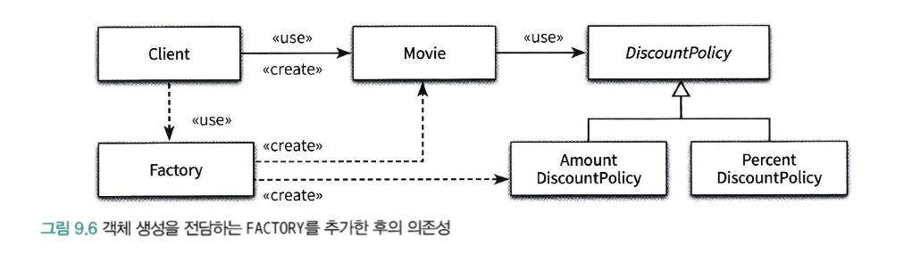

# CHAPTER 09. 유연한 설계

</br>

## 개방 - 폐쇄 원칙

</br>

> OCP는 소프트웨어 개채(클래스, 모듈, 함수)는 확장에 대해 열려있어야하고  
> 수정에 대해서는 닫혀있어야한다.

</br>

- `확장에 대해 열려있다` : 변경이 일어날때, 변경에 맞는 새로운 동작을 추가하여 기능을 확장할 수 있다!
- `수정에 대해 닫혀 있다` : 기존의 '코드'를 수정하지 않고도 애플리케이션의 동작을 추가하거나 변경할 수 있다.

</br>

> 개방 폐쇄 원칙에서 말하는 유연한 설계는 `코드를 수정하지 않고`  
> `애플리케이션의 새로운 동작을 확장`하는 설계!

</br>

### 컴파일 타임 의존성을 고정시키고 런타임 의존성을 변경하라!

</br>

| 할인 정책에서 컴파일 타임 의존성과 런타임 의존성의 차이 |
| :-----------------------------------------------------: |
|    |

</br>

- 컴파일 타임 : Movie는 추상 클래스인 DiscountPolicy에 의존한다
- 런타임 : 실제 인스턴스인 AmountDiscountPolicy와 PercentDiscountPolicy에 의존

> 개방 폐쇄 원칙은 런타임 의존성과 컴파일 의존성에 관련한 이야기!  
> Movie의 관점에서 `컴파일타임 의존성과 런타임 의존성은 다르다!`
> 앞서 08장에서 컨텍스트 확장하기 부분에서 OverlappedDiscountPolicy와  
> NoneDiscountPolicy를 추가하여 `기존 코드를 수정하지 않고 기능을 확장할 수 있었다!`  
> 현재 설계는 개방 - 폐쇄 원칙을 수용하는 설계이다.

</br>

|             OCP 설계             |
| :------------------------------: |
|  |

</br>

### 추상화가 핵심이다

</br>

> OCP의 핵심은 `추상화에 의존하는 것`이다!  
> 추상화는 핵심적인 부분만 남기고 불필요한 부분은 생략함으로써 복잡성을 극복하는 기법!
>
> 말 복잡하게 써놓으셨는데  
> 그냥 Movie가 추상 클래스에 의존하여 변하지 않는 공통 부분을 남기고  
> 컨텍스트가 확장되거나 변경되어도 런타임에 컨텍스트에 맞는 구체 클래스가 결정 되어  
> 각 환경에 맞는 기능을 수행할 수 있도록 한다!
> `공통적인 부분은 문맥이 바뀌더라도 변하지 않아야한다!` -> `추상화`
> 따라서 추상화는 변경에 닫혀 있어야하고,  
> 추상화를 통해 생략된 부분(구체 클래스)은 확장의 여지를 남겨야한다!

</br>

```java
public abstract class DiscountPolicy {
    private List<DiscountCondition> conditions = new ArrayList<>();

    public DiscountPolicy(DiscountCondition ... conditions) {
        this.conditions = Arrays.asList(conditions);
    }

    public Money calculateDiscountAmount(Screening screening) {
        for(DiscountCondition each : conditions) {
            if (each.isSatisfiedBy(screening)) {
                return getDiscountAmount(screening);
            }
        }

        return screening.getMovieFee();
    }

    abstract protected Money getDiscountAmount(Screening Screening);
}

```

</br>

> 코드를 살펴보면 공통적인, 즉 변하지 않는 부분은 할인 여부를 판단하는 calculateDiscountAmount이다.  
> 그 후 상속을 통해 할인 요금을 계산하는 getDiscountAmount를 확장하여  
> DiscountPolicy를 확장할 수 있다!

</br>

- 단순히 어떤 추상화 개념을 추상화했다고 해서 OCP가 아니다.
  - 의존성의 방향이 중요하다!
  - 모든 요소가 추상화에 의존할때 수정에 대한 영향을 최소화 할 수 있다.

</br>

```java
public class Movie {
    ...
    private DiscountPolicy discountPolicy;

    public Movie(String title, Duration runningTime, Money fee, DiscountPolicy discountPolicy) {
        ...
        this.discountPolicy = discountPolicy;
    }


    public Money calculateMovieFee(Screening screening) {
        return fee.minus(discountPolicy.calculateDiscountAmount(screening));
    }
}

```

> Movie는 DisCountPolicy에 의존하고  
> DiscountPolicy에서 오퍼레이션을 추가하거나  
> 자식 클래스가 추가 되더라도 영향을 받지 않는다.  
> 따라서, Movie와 DiscountPolicy는 수정에 대해 닫혀있다.
>
> 추상화 했다고 모두가 OCP가 아니다.  
> 중요한 것은 변경에 의한 파급효과를 피하기 위해서  
> `변하는 것과 변하지 않는 것이 무엇인지를 이해하고`  
> 이를 추상화의 목적으로 삼아야한다!

</br>

## 생성 사용 분리

</br>

```java
public class Movie {
    ...
    private DiscountPolicy discountPolicy;

    public Movie(String title, Duration runningTime, Money fee) {
        ...
        this.discountPolicy = new AmountDiscountPolicy(...);
    }


    public Money calculateMovieFee(Screening screening) {
        return fee.minus(discountPolicy.calculateDiscountAmount(screening));
    }
}

```

</br>

> Movie가 오직 추상클래스에만 의존하기 위해서는  
> Movie 내부에서 DiscountPolicy의 자식 클래스들의 인스턴스가 생성되어서는 안된다.  
> `외부에서 인스턴스를 생성하여 Moive의 생성 시점에 파라미터로 전달하기.`

</br>

```java
public class Client{
  public Money getAvatar(){
      Movie avatar = new (
        "아바타",
        Duartion.ofMinutes(120),
        Money.wons(10000),
        new AmountDiscountPolicy(...)
      );

      return avatar.getFee();
  }
}
```

> 현재 컨텍스트에서 결정권을 가지는 Client의 역할로  
> Movie는 특정 클라이언트에 종속되지 않을 수 있다!

</br>

- AmountDiscountPolicy를 내부에서 생성하면?(복습)
  - Movie와 DisountPolicy는 숨겨진 의존성을 갖는다.
  - 또 AmountDiscountPolicy의 생성에 대한 책임도 Movie가 가진다.
    - AmountDiscountPolicy의 생성에 대한 정보를 알아야하니깐!

</br>

### FACTORY 추가하기

</br>

> 생성 책임을 Client로 옮겨도 되는 전제는 Movie는 특정 컨텍스트에 묶여서는 안되지만  
> Client는 묶여도 상관 없다는 전제가 깔려있음!

```java
public class Client{
  public Money getAvatar(){
      Movie avatar = new (
        "아바타",
        Duartion.ofMinutes(120),
        Money.wons(10000),
        new AmountDiscountPolicy(...)
      );

      return avatar.getFee();
  }
}
```

> 코드를 다시 보면 Movie의 인스턴스를 생성한 후  
> 바로 getFee 메시지를 전송한다 -> client는 생성과 사용의 책임
>
> 한 번 더 여기서 객체 생성과 관련된 책임을 전담하는 팩토리를 추가하고  
> Client가 해당 객체를 사용하도록 만드는 것!
> 생성과 사용의 분리를 위해 생성에 특화된 객체를 `FACTORY!`

</br>

```java
public class Factory {
    public Movie createAvatarMovie() {
        return new Movie("아바타",
                Duration.ofMinutes(120),
                Money.wons(10000),
                new AmountDiscountPolicy(...);
    }
}
```

```java
public class Client {
    private Factory factory;

    public Client(Factory factory) {
        this.factory = factory;
    }

    public Money getAvatarFee() {
        Movie avatar = factory.createAvatarMovie();
        return avatar.getFee();
    }
```

</br>

> 위처럼 생성은 Factory가 담당하고,  
> Client는 Factory를 사용하여 생성된 Movie의 인스턴스를 반환하여 사용하기만 하면 된다!

</br>

|               객체 생성 전담하는 FACTORY 추가 한 후의 의존성               |
| :------------------------------------------------------------------------: |
|  |

</br>

> 1. Movie와 AmountDiscountPolicy를 생성하는 책임을 팩토리가 가진다.
> 2. Client는 오직 사용과 관련된 책임만 지고, 생성과 관련된 어떠한 지식도 가지지 않는다.

</br>

### 순수한 가공물에게 책임 할당하기

</br>

> 책임 할당의 가장 기본은 책임을 수행하는데 필요한 정보를 가장 많이 알고 있는  
> INFORMATION EXPERT에게 책임을 할당하는 것  
> 도메인 모델은 INFORMATION EXPERT를 찾기 위해 참조할 수 있는 재료
>
> 이 관점에서 팩토리는 도메인 모델에 속하지 않는다는 것을 알 수 있음  
> 팩토리의 사용이유는 전체적인 결합도를 낮추고 재사용성을 높이기 위해  
> 도메인 개념에 할당 돼 있던 객체 생성 책임을 도메인 개념과는 상관 없는  
> 가공객체로 이동한 것! -> `단지 기술적인 결정이라는 것!`

</br>

- 시스템을 객체로 분해하는 두 가지 방식
  - 표면적 분해 : 도메인 모델에 존재하는 시물 또는 개념을 표현하는 객체를 사용하는 것
    - 도메인과 소프트웨어 사이의 표현적 차이를 최소화하는 것이 목적
    - 객체지향 설계를 위한 가장 기본적인 접근법
    - `하지만 도메인 개념 뿐만 아니라 DB 접근과 같은 도메인 개념을 뛰어넘는 기계적 개념이 필요할 수도 있다.`
    - 모든 행위에 대한 책임을 도메인에게 할당하면 낮은 응집도, 높은 결합도, 재사용성 저하와 같은 문제 발생
  - 행위적 분해 : 도메인 개념을 표현한 객체가 아닌 설계자가 편의를 위해 임의로 만든 객체를 이용하여 시스템 분해하는 것
    - 책임을 할당하기 위해 도메인과 무관한 인공적 객체를 `순수 가공물`이라 한다
    - 행위를 책임질만한 도메인이 적절하지 않다면 `순수 가공물을 추가하고 이 객체에게 책임을 할당하게 할 것!`

## 의존성 주입 - DI

</br>

> 외부에서 인스턴스를 생성한 후 이를 전달하여 의존성을 해결하는 방법

- 생성자 주입
  - 컴파일타임의 의존성에 대상이 결정되고 생명주기 전체에 걸쳐 유지
- setter 주입
  - 런타임에서도 의존 대상을 교체 가능
  - setter 주입만 사용한다면 불완전한 객체가 생성될 수 있음.
  - 생성자 주입과 함께 사용하며 런타임에 의존대상이 변경될 경우 고려
- 메서드 주입

</br>

### 숨겨진 의존성은 나쁘다.

> SERVICE LOCATOR 패턴을 통해 의존성을 해결할 수 있다.  
> SERVICE LOCATOR는 의존성을 해결할 객체들을 보관하는 일종의 저장소다.  
> 의존성 주입과 달리, `객체가 직접 SERVICE LOCATOR에게 의존성을 해결해달라고 요청한다!`

</br>

```java
import org.eternity.movie.step03.DiscountPolicy;

public class ServiceLocator {
    private static ServiceLocator soleInstance = new ServiceLocator();
    private DiscountPolicy discountPolicy;

    public static DiscountPolicy discountPolicy() {
        return soleInstance.discountPolicy;
    }

    public static void provide(DiscountPolicy discountPolicy) {
        soleInstance.discountPolicy = discountPolicy;
    }

    private ServiceLocator() {
    }
}
```

> 로케이터라는 싱글톤 객체를 만들고  
> provide를 통해 외부에서 인스턴스를 건네받는다.
> discountPolicy()를 통해 내부에서 결정된  
> discountPolicy의 자식 클래스를 반환해준다.

```java
import java.time.Duration;

public class Movie {
    private String title;
    private Duration runningTime;
    private Money fee;
    private DiscountPolicy discountPolicy;

    public Movie(String title, Duration runningTime, Money fee) {
        this.title = title;
        this.runningTime = runningTime;
        this.fee = fee;
        this.discountPolicy = ServiceLocator.discountPolicy();
    }

    public Money getFee() {
        return fee;
    }

    public Money calculateMovieFee(Screening screening) {
        return fee.minus(discountPolicy.calculateDiscountAmount(screening));
    }
}
```

</br>

```java
Movie avartar = new Movie("아바타", Duration.ofMinutes(120), Money.wons(10000));
```

> NullPointerException 터지고,  
> 추후에 디버깅 후 원인을 알게 된다면

</br>

```java
ServiceLocator.provide(new AmountDiscountPolicy());
Movie avartar = new Movie("아바타", Duration.ofMinutes(120), Money.wons(10000));
```

> 이런식으로 코드를 작성할 것이다.

</br>

> 의존성이 숨겨져 있다.  
> 의존성을 해결해주는 객체를 별도로 두어  
> 우리가 의존성을 컴파일타임에서 이해하기 어렵게 한다.  
> `개발자로 하여금 내부 구현 정보를 이해하도록 강요한다.`

</br>

## 의존성 역전 원칙

</br>

|            DI             |
| :-----------------------: |
|  |

</br>

> 앞서 책에서 말하듯 단순히 추상화 개념을 사용하고 의존한다는 것이  
> OCP 설계가 아니라고 하였다. -> `+ 의존성의 방향도 중요하다`
>
> 위 그림을 다시 보면 Movie는 추상클래스에 의존하고  
> Amount, PercentDiscountPolicy도 추상클래스도 의존한다.  
> 하위 클래스 즉, Movie 와 자식클래스들의 변경이  
> 추상클래스에 어떠한 영향을 미치지 못한다는 것이고,
> 싱위 수준의 개념(추상)을 빌려 재사용할 때 하위 수준의 클래스(구체)에 얽히지 않고도  
> 재사용이 가능하다!

</br>

### 중간 정리

</br>

- 추상화 개념과 더불어 의존성의 방향도 신경써야한다.
  - 추상화를 의존하는 방향으로!
- 상위 수준의 모듈이 하위 수준의 모듈에 의존할 경우 하위수준의 변경에 취약하다.
  - Movie와 AmountDiscountPolicy 관계!
  - 그냥 추상화에 의존해
- 추상화는 구체적 사항에 의존해서는 안된다.
  - 구체적인 사항이 추상화에 의존해야한다.

</br>

### 의존성 역전 원칙과 패키지

</br>

| 인터페이스의 소유권을 역전시킨 객체지향적인 모듈 구조 |
| :---------------------------------------------------: |
|              |

</br>

- SEPERATED INTERFACE 패턴

</br>

> Movie의 재사용을 위해 필요한 것이 DiscountPolicy뿐이라면  
> DiscountPolicy를 Movie와 같은 패키지로 모으고  
> AmountDiscountPolicy와 PercentDiscountPolicy를  
> 별도의 패키지에 위치시켜 의존성 문제를 해결할 수 있다.

</br>

> 따라서 그림과 같이 추상화를 별도의 독립적인 패키지가 아닌  
> 클라이언트가 속한 패키지에 포함시켜야한다.  
> 그리고 함께 재사용될 필요가 없는 클래스들은 별도의 독립적인 패키지에 모아야한다.

</br>

- 자 그래서 저거랑 원래 그림이랑 무슨 차인데 대체...

|            DI             |
| :-----------------------: |
|  |

> 이 그림을 다시 보면 Movie, AmountDiscountPolicy, PercentDiscountPolicy  
> 모두 추상클래스인 DiscountPolicy에 의존

- 근데 여기서 Movie를 다양한 컨텍스트와 재사용하려면 불필요한 클래스들이 Movie와 함꼐 배포?
  - Movie를 컴파일하기 위해서는 DiscountPolicy가 필요
    - 컴파일 의존성이 사실 그냥 컴파일 성공할 때 필요한 클래스 정의 돼있냐 이거다
  - 자 그런데 원래 구조에서는 DiscountPolicy 패키지에 자식 클래들까지 있다.
    - DiscountPolicy에 의존하기 위해서 같은 패키지에 있는 자식 클래스들도 있어야한다.
      - 의존성에 정의에 따라 DiscountPolicy를 수정할 경우 Movie는 영향을 받아서는 안된다.

</br>

#### 한 번 더 집중해서 정리하기

</br>

> 하지만 위의 내용은 코드 수정에 있어서는 사실이나 컴파일 측면에서는 아니다.
>
> 예를 들어 AmountDiscountPolicy가 수정 되면 해당 패키지 전체가 재배포 되어야 한다.  
> 그런데 DiscountPolicy를 Movie가 의존함으로 Movie의 패키지도 재컴파일 되어야하고  
> 이것이 타고타고 올라가서 전체적인 빌드 시간이 늘어날 것이다.

</br>

#### 마지막 정리

- 의존성의 방향도 중요하다
- 인터페이스의 소유권도 역전시켜야한다.

</br>

## 유연성에 대한 조언

</br>

> 유연하고 재사용 가능한 설계란 런타임 의존성과 컴파일 타임 의존성의 차이를 인식  
> 그 후 동일한 컴파일 타임 의존성으로부터 다양한 런타임 의존성을 만드는 코드 구조를 가지는 설계  
> 유연한 설계 = 복잡한 설계다. -> 한눈에 파악하기 어렵다.

</br>

- 유연성이 필요할 때 설계를 사용하라!
  - 아직 일어나지 않은 변경에 대한 설계를 하지말것
  - 추 후 확장이 일어날 때 설계를 뜯어내는 버릇을 들이자

</br>

### 협력과 책임이 중요하다

</br>

> 협력에 참여하는 객체가 다른 객체에게 어떤 메시지를 전송하는지가 중요  
> 다양한 컨텍스트에서 재사용할 필요가 없다면 설계를 유연하게 만들 당위성도 함께 사라진다.  
> 중요한 비지니스 로직을 처리하기 위해 책임을 할당하고 협력의 균형을 맞추는 것이 객체 생성에 관한 책임을 할당하는 것 보다 우선이다.  
> 객체를 생성하는 방법에 대한 결정은 모든 책임이 자리를 잡은 후 가장 마지막 시점에 내리는 것이 적절하다.  
> 의존성을 관리해야 하는 이유는 역할, 책임, 협력의 관점에서 설계가 유연하고 재사용 가능해야 하기 때문이다.  
> 따라서 역할, 책임, 협력에 먼저 집중해야 한다.

</br>
