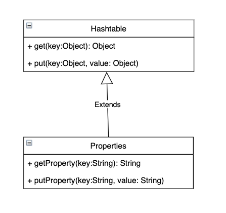

# CHAPTER 10. 상속과 코드 재사용

## 상속과 중복 코드

</br>

### DRY 원칙(반복하지 마라 - Don't Repeat Yourself)

</br>

> 프로그램의 본질은 비즈니스 지식을 코드로 변환하는 것이다.  
> 그러나 비즈니스는 변하고, 그에 따른 코드 역시 변경되어야 한다.  
> 그런데 이런 코드가 중복으로 작성된다면  
> 중복으로인한 변경이 더욱 불편해질 것이다!

</br>

- 어떤 코드가 중복인지를 찾고
- 모든 중복된 코드를 수정해야 한다...
- 중복된 코드의 값을 모두 보장하기 위해 테스트도 필요하다.

</br>

> 중복을 판단하는 기준은 변경이다.  
> 변경이 발생하였을 때 두 코드를 모두 수정해야한다면 중복!  
> 코드의 모양이 유사하다는 것은 중복의 징후이지  
> 결정하는 기준은 코드가 변경에 반응하는 방식이다.

</br>

### 중복과 코드 변경

</br>

- 개별 통화 기간을 저장하는 Call

```java
public class Call {
    private LocalDateTime from;
    private LocalDateTime to;

    public Call(LocalDateTime from, LocalDateTime to) {
        this.from = from;
        this.to = to;
    }

    public Duration getDuration() {
        return Duration.between(from, to);
    }

    public LocalDateTime getFrom() {
        return from;
    }
}
```

</br>

> 한 달에 한 번씩 가입자별로 전화 요금을 계산하는 간단한 애플리케이션 개발하기!  
> 전화 요금을 계산하는 규칙은 통화 시간을 단위 시간당 요금을 나눠주면 된다.  
> 10초다 5원의 통화료를 부과하는 요금제  
> `사용자가 100초 사용한다면 100 / 10 * 5 = 50원`

</br>

- Call의 목록을 관리할 Phone

```java
public class Phone {
    private Money amount;
    private Duration seconds;
    private List<Call> calls = new ArrayList<>();

    public Phone(Money amount, Duration seconds) {
        this.amount = amount;
        this.seconds = seconds;
    }

    public void call(Call call) {
        calls.add(call);
    }

    public List<Call> getCalls() {
        return calls;
    }

    public Money getAmount() {
        return amount;
    }

    public Duration getSeconds() {
        return seconds;
    }

    public Money calculateFee() {
        Money result = Money.ZERO;

        for(Call call : calls) {
            result = result.plus(amount.times(call.getDuration().getSeconds() / seconds.getSeconds()));
        }

        return result;
    }
}
```

- amount : 단위 요금 저장
- seconds : 단위 시간
- calls : 전체 통화목록을 저장하고 있는 Call의 리스트

> calcualteFee 메서드를 통해 전체 통화 요금을 계산한다!

</br>

- 추후 심야 인 요금제라는 비즈니스 추가

</br>

> 밤 10시 이후의 통화에 대해 요금을 할인 해주는 방식이다.  
> Phone에 구현된 기존 요금제는 `일반요금제`라고 지칭하겠다!

</br>

- 상속을 이용하지 않고 복사해서 코드 추가한 후 비즈니스 추가

```java
public class NightlyDiscountPhone {
    private static final int LATE_NIGHT_HOUR = 22;

    private Money nightlyAmount;
    private Money regularAmount;
    private Duration seconds;
    private List<Call> calls = new ArrayList<>();

    public NightlyDiscountPhone(Money nightlyAmount, Money regularAmount, Duration seconds) {
        this.nightlyAmount = nightlyAmount;
        this.regularAmount = regularAmount;
        this.seconds = seconds;
    }

    public Money calculateFee() {
        Money result = Money.ZERO;

        for(Call call : calls) {
            if (call.getFrom().getHour() >= LATE_NIGHT_HOUR) {
                result = result.plus(nightlyAmount.times(call.getDuration().getSeconds() / seconds.getSeconds()));
            } else {
                result = result.plus(regularAmount.times(call.getDuration().getSeconds() / seconds.getSeconds()));
            }
        }

        return result;
    }
}
```

</br>

### 중복 코드 수정하기

</br>

> 중복 코드가 코드 수정에 미치는 영향을 살펴보기 위해 새로운 요구사항 추가하자!
> 추가할 기능은 통화 요금에 부과할 세금을 계산 하는 것이다.  
> 부과되는 세율은 가입자의 휴대폰마다 다르다고 가정  
> 그러나 현재 통화 요금을 계산하는 로직은  
> Phone과 NightlyDiscountPhone 모두 구현 돼있어  
> `세금을 추가하기 위해서 두 클래스 모두 함께 수정해야 한다.`

</br>

```java
public class Phone {
    ...
    private double taxRate;

    public Phone(Money amount, Duration seconds, double taxRate) {
        ...
        this.taxRate = taxRate;
    }

    ...

    public Money calculateFee() {
        Money result = Money.ZERO;

        for(Call call : calls) {
            result = result.plus(amount.times(call.getDuration().getSeconds() / seconds.getSeconds()));
        }

        return result.plus(result.times(taxRate));
    }
}
```

```java
public class NightlyDiscountPhone {
    ...
    private double taxRate;

    public NightlyDiscountPhone(Money nightlyAmount, Money regularAmount,
      Duration seconds, double taxRate) {
        ...
        this.taxRate = taxRate;
    }

    public Money calculateFee() {
        Money result = Money.ZERO;

        for(Call call : calls) {
            if (call.getFrom().getHour() >= LATE_NIGHT_HOUR) {
                result = result.plus(nightlyAmount.times(call.getDuration().getSeconds() / seconds.getSeconds()));
            } else {
                result = result.plus(regularAmount.times(call.getDuration().getSeconds() / seconds.getSeconds()));
            }
        }

        return result.minus(result.times.(taxRate));
    }
}
```

</br>

> 비즈니스 로직인 변경되거나 추가될 때마다 모든 클래스에서 수정이 발생된다.  
> 변경 부담이 커질 뿐만 아니라, 실수할 확률도 높다.
> Phone은 plus, night는 minus로 실수 작성!

</br>

### 상속을 이용해서 중복 코드 제거하기

</br>

> 이미 기존의 클래스와 유사한 클래스가 필요하다면 코드를 복사하지 말고  
> 상속을 이용하여 코드를 재사용하라는 것이다.  
> NightlyDisountPhone 클래스의 코드 대부분이 Phone과 유사함으로  
> NightlyDisountPhone 클래스가 Phone을 상속 받도록 하면  
> 코드 대부문을 재사용할 수 있다.

</br>

```java
public class NightlyDiscountPhone extends Phone {
    private static final int LATE_NIGHT_HOUR = 22;

    private Money nightlyAmount;

    public NightlyDiscountPhone(Money nightlyAmount, Money regularAmount, Duration seconds) {
        super(regularAmount, seconds);
        this.nightlyAmount = nightlyAmount;
    }

    @Override
    public Money calculateFee() {
        // 부모클래스의 calculateFee 호출
        Money result = super.calculateFee();

        Money nightlyFee = Money.ZERO;
        for(Call call : getCalls()) {
            if (call.getFrom().getHour() >= LATE_NIGHT_HOUR) {
                nightlyFee = nightlyFee.plus(
                        getAmount().minus(nightlyAmount).times(
                                call.getDuration().getSeconds() / getSeconds().getSeconds()));
            }
        }

        return result.minus(nightlyFee);
    }
}
```

</br>

> calculateFee를 살펴보면  
> 슈퍼클래스로 일반 요금제를 계산 한 후에,  
> 통화 시작 시간이 10시 이후인 통화 요금을 빼도록 연산한다.
>
> 코드 작성이야 개발자 마음이긴 하지만,  
> 위처럼 작성할 경우에 발생할 또 다른 문제는  
> 슈퍼 클래스 메서드에 의존적으로 메서드를 작성할 경우  
> 이 역시 변경에 취약할 뿐더러 현재 비즈니스에서도 직관적이지 못하다.

</br>

- 상속을 위한 경고 1

> 자식 클래스의 메서드 안에서 super 참조를 이용해 부모 클래스의 메서드를 직접 호출할 경우  
> 두 클래스는 강하게 결합 된다. super 호출을 제거할 수 있는 방법을 찾아 결합도를 제거하라.

</br>

## 취약한 기반 클래스 문제

</br>

> 부모 클래스의 변경에 의해 자식 클래스가 영향을 받는 현상을  
> `취약한 기반 클래스 문제`라고 한다.  
> 이 문제는 상속을 사용한다면 피할 수 없는 객체지향 프로그래밍의 근본적인 취약성이다.

</br>

> 취약 기반 클래스 문제는 상속이라는 컨텍스트에서 결합도가 초래하는 문제점을 가리키는 사용이다.  
> 기본적으로 상속 관계를 추가할 수록 결합도가 높아진다는 것을 인지해야한다.  
> 점진적으로 자식 클래스를 추가하다가 높은 결합도로 인해,  
> 부모 클래스를 개선하는 것이 더 어려울 수 있다.  
> 또 최악의 경우에는 `모든 자식 클래스를 동시에 수정하고 테스트 해야할 수도..`

- 하 자식 클래스 다 바꾸고 테스트까지 수정한 경험이 있었다 나는..ㅠㅠ

</br>

> 객체지향의 기반은 캡슐화를 통한 변경의 통제다.  
> 상속은 코드의 재사용을 위해 캡슐화의 장점을 희석시키고  
> 구현에 대한 결합도를 높임으로써 객체지향을 반감시킨다.

</br>

### 불필요한 인터페이스 상속 문제

</br>

|              Vector와 Stack의 상속 관계              |
| :--------------------------------------------------: |
|  |

</br>

> Stack은 LIFO 자료구조이다.  
> Vector는 임의의 위치에서 요소를 추추랗고 삽입할 수 있는 자료구조이다.
> Stack은 마지막 원소에 요소를 추가하고 삭제할 수 있도록 허용해야하는데,  
> Vector를 상속받음으로써 Stack의 규칙을 쉽게 위반 할 수 있다.

</br>

```java
Stack<String> stack = new Stack<>();
stack.push("1st");
stack.push("2nd");
stack.push("3rd");
stack.add(0, "4th");

assertEquals("4th", stack.pop());
```

</br>

> 마지막으로 추가 한 값은 "4th"이지만 반환값은 "3rd"인데  
> vector의 퍼블릭 인터페이스를 활용하여 첫번째 원소의 값을 넣었기 때문이다.  
> 인터페이스 설계는 제대로 쓰기엔 쉽게, 잘못 쓰기엔 어렵게 만들어야한다.
> 위처럼 일시적 편의 사항을 위해 인터페이스를 사용할 경우  
> 추후 버그를 찾기 힘들 수도..

</br>

|                     HashMap과 Properties                     |
| :----------------------------------------------------------: |
|  |

</br>

```java
public class Properties extends HashTable<Object, Object>{
  ...
  @Override
  public synchronized Object put(Object key, Object value) {
    return map.put(key, value);
  }

  public synchronized Object setProperty(String key, String value) {
      return put(key, value);
  }

  @Override
  public Object get(Object key) {
     return map.get(key);
  }

  public String getProperty(String key) {
      Object oval = map.get(key);
      String sval = (oval instanceof String) ? (String)oval : null;
      Properties defaults;
      return ((sval == null) && ((defaults = this.defaults) != null)) ? defaults.getProperty(key) : sval;
  }
}
```

</br>

> Properties 내부 메서드를 보면  
> 제네릭이 도입되기 전이라 컴파일러가 키와 값의 타입이  
> String인지 체크할 수 있는 방법이 없었다.  
> put은 String 타입외에도 Object 타입은 모두 넣는 것이 가능하다.  
> Propeties의 규칙을 쉽게 위반 가능

</br>

- 상속을 위한 경고 2
  - 상속받은 부모 클래스의 메서드가 자식 클래스의 내부 구조에 대한 규칙을 깨트릴 수 있다.

</br>

### 메서드 오버라이딩의 오작용 문제

</br>

```java
public class InstrumentedHashSet<E> extends HashSet<E>{
  private int addCount = 0;

  @Override
  public boolean add(E e){
    addCount++;
    return super.add(e);
  }

  @Override
  public boolean addAll(Collection<> extends E> c){
    addCount += c.size();
    return super.addAll(c);
  }
}
```

</br>

```java
InstrumentedHashSet<String> languages = new InstrumentedHashSet<>();
languages.addAll(Arrays.asList("Java", "Ruby", "Scala"));
```

</br>

- 문제점

> addCount의 값은 6이다.
> 우선 addAll 함수가 호출 될때 3이 증가되고,  
> super.addAll() 즉 HashSet의 addAll은  
> 각각의 요소를 추가하기 위해 add() 메서드를 실행한다.  
> 결과 적으로 InstrumentedHashSet의 add가 3번 호출 되어  
> 최종적으로 6이 된다.

</br>

- 상속을 위한 경고 3

> 자식 클래스가 부모 클래스의 메서드를 오버라이딩할 경우
> 부모 클래스가 자신의 메서드를 사용하는 방법에 자식 클래스가 결합될 수 있다.

</br>

> 조슈아 블로치는 클래스를 상속해서 쓸 거면  
> 상속을 위해 클래스를 설계하고 문서화 해야하며,  
> 그렇지 않은 경우에는 상속을 금지 시켜야 한다고 주장한다.  
> 그러나 `내부 구현을 캡슐화하는 것이 객체지향의 핵임인데 구현을 공개하는 것이 옳은가?`

</br>

### 부모 클래스와 자식 클래스의 동시 수정 문제

</br>

> 음악 목록을 추가할 수 있는 플레이리스트를 구현한다고 가정하자  
> 음악정보를 저장할 Song 클래스와  
> 음악목록을 저장할 PlayList 클래스가 필요하다.

</br>

```java
public class Song {
    private String singer;
    private String title;

    public Song(String singer, String title) {
        this.singer = singer;
        this.title = title;
    }

    public String getSinger() {
        return singer;
    }

    public String getTitle() {
        return title;
    }
}
```

</br>

```java
public class Playlist {
    private List<Song> tracks = new ArrayList<>();

    // 노래를 추가할 수 있는 메서드
    public void append(Song song) {
        getTracks().add(song);
    }

    public List<Song> getTracks() {
        return tracks;
    }
}
```

</br>

```java
public class PersonalPlaylist extends Playlist {
    public void remove(Song song) {
        getTracks().remove(song);
    }
}
```

</br>

> 플레이리스트에서 노래를 삭제할 수 있는 기능이 추가된  
> PersonalPlaylist가 필요하다고 가정하여 상속을 통해 구현하였다.

</br>

> 요구사항 변경으로 PlayList에 노래 목록뿐만 아니라  
> 가수별 노래의 제목도 함께 관리해야한다고 가정하자.

</br>

```java
public class Playlist {
    private List<Song> tracks = new ArrayList<>();
    private Map<String, String> singers = new HashMap<>();

    public void append(Song song) {
        tracks.add(song);
        singers.put(song.getSinger(), song.getTitle());
    }

    public List<Song> getTracks() {
        return tracks;
    }

    public Map<String, String> getSingers() {
        return singers;
    }
}
```

</br>

> 위와같은 수정된 내용이 정상적으로 동작하려면  
> PersonalPlaylist의 remove 메서드도 함께 수정해야한다.
> tracks에서는 노래가 제거되는데  
> singers에는 남아있을 것이기 때문이다.

</br>

```java
public class PersonalPlaylist extends Playlist {
    public void remove(Song song) {
        getTracks().remove(song);
        getSingers().remove(song.getSinger());
    }
}
```

</br>

> 자식 클래스에서 불필요한 메서드를 생성하지 않았음에도 불구하고,  
> 상위 클래스의 목적이나 기능이 변경될 때, 자식 클래스와의 강결합으로 인하여  
> 자식 클래스도 변경해야하는 일이 빈번하게 발생한다!

</br>

- 상속을 위한 경고 4

> 클래스를 상속하면 결합도로 인해 자식 클래스와 부모 클래스의 구현을 영원히 변경하지 않거나,  
> 자식 클래스와 부모 클래스를 동시에 변경하거나 둘 중 하나를 선택할 수 밖에 없다.

</br>

## Phone 다시 살펴보기

</br>

> 상속으로 발생하는 취약한 기반 클래스 문제를 확인했고  
> 이제 다시 Phone과 NightDiscountPhone으로 돌아와  
> 상속으로 인한 피해를 최소화 할 수 있는 방법을 찾아보자!

</br>

</br>

### 추상화에 의존하자

</br>

> NightDiscountPhone의 가장 큰 문제는 Phone과 너무 강하게 결합되어 있어서  
> Phone이 변경될 경우 함께 변경될 가능성이 높다는 것이다.  
> 이 문제를 해결하는 가장 일반적인 방법이  
> 자식 클래스가 부모 클래스의 `구현이 아닌 추상화에 의존해야한다는 것이다!`  
> 정확히는 `부모클래스와 자식 클래스 모두 추상화에 의존해야 한다.`

</br>

- 코드 중복을 제거하기 위해 상속을 도입하는 두 가지 원칙
  - 두 메서드가 유사하게 보인다면 차이점을 메서드로 추출하라
  - 메서드 추출을 통해 두 메서드를 동일한 형태로 보이도록 만들 수 있다.
- 부모 클래스의 코드를 하위로 내리지 말고, `자식클래스의 코드를 상위로 올려라.`
  - 자식 클래스의 추상 메서드를 부모 클래스로 올리는 것이 재사용성과 응집도 측면에서 더 좋다!

</br>

### 차이를 메서드로 추출하라

</br>

> 가장 먼저 할 일은 중복 코드 안에서 차이점을 별도의 메서드로 추출하는 것

</br>

```java
public class Phone {
    private Money amount;
    private Duration seconds;
    private List<Call> calls = new ArrayList<>();

    public Phone(Money amount, Duration seconds) {
        this.amount = amount;
        this.seconds = seconds;
    }

    public void call(Call call) {
        calls.add(call);
    }

    public List<Call> getCalls() {
        return calls;
    }

    public Money getAmount() {
        return amount;
    }

    public Duration getSeconds() {
        return seconds;
    }

    public Money calculateFee() {
        Money result = Money.ZERO;

        for(Call call : calls) {
            result = result.plus(amount.times(call.getDuration().getSeconds() / seconds.getSeconds()));
        }

        return result;
    }
}
```

</br>

```java
public class NightlyDiscountPhone {
    private static final int LATE_NIGHT_HOUR = 22;

    private Money nightlyAmount;
    private Money regularAmount;
    private Duration seconds;
    private List<Call> calls = new ArrayList<>();

    public NightlyDiscountPhone(Money nightlyAmount, Money regularAmount, Duration seconds) {
        this.nightlyAmount = nightlyAmount;
        this.regularAmount = regularAmount;
        this.seconds = seconds;
    }

    protected Money calculateCallFee(Call call) {
        Money result = Money.ZERO;

        for(Call call : calls) {
            if(call.getFrom().getHour() >= LATE_NIGHT_HOUR){
              result = result.plus(
                nightlyAmount.times(call.getDuration().getSeconds() / second.getSeconds())
              )
            }
            else{
              result.plus(
                regularAmount.times(call.getDuration().getSeconds() / second.getSeconds())
              )
            }
        }
    }

}
```

</br>

> 먼저 할 일은 두 클래스의 메서드에서 다른 부분을 별도의 메서드로 추출하는 것  
> calculateFee의 계산 로직이 서로 다른 것을 확인 가능  
> 하나의 Call에 대한 통화 요금 계산하는 것을 calcuateCallFee로 수정

</br>

```java
public class Phone{

    public Money calculateFee() {
      Money result = Money.ZERO;
      for(Call call : calls) {
          result = result.plus(amount.times(call.getDuration().getSeconds() / seconds.getSeconds()));
      }
      return result;
    }

    private Money calcuateCallFee(Call call){
      return amount.times(call.getDuration().getSeconds()/ seconds.getSeconds());
    }

}

```

```java
public class NightlyDiscountPhone {

    public Money calculateFee() {
      Money result = Money.ZERO;
      for(Call call : calls) {
          result = result.plus(amount.times(call.getDuration().getSeconds() / seconds.getSeconds()));
      }
      return result;
    }

    private Money calcuateCallFee(Call call){
     if(call.getFrom().getHour() >= LATE_NIGHT_HOUR){
        result = result.plus(
          nightlyAmount.times(call.getDuration().getSeconds() / second.getSeconds())
        )
      }
      else{
        result.plus(
          regularAmount.times(call.getDuration().getSeconds() / second.getSeconds())
        )
      }
    }
}
```

> 이런식으로 전체 요금 계산과 call에 대한 요금계산을 분리하였다.
> 이제 중복 코드를 부모 클래스로 올려보자!

</br>

### 중복 코드를 부모 클래스로 올려라

</br>

```java
public abstract class AbstractPhone {
    private List<Call> calls = new ArrayList<>();

    public Money calculateFee() {
        Money result = Money.ZERO;

        for(Call call : calls) {
            result = result.plus(calculateCallFee(call));
        }

        return result;
    }

    abstract protected Money calculateCallFee(Call call);
}
```

> 영호님은 `메서드를 먼저 옮기는 것이 편하다고 함.`  
> 메서드를 옮기고 나면 그 메서드에 필요한 인스턴스 변수가 무엇인지  
> 컴파일 에러에서 잡아주기 때문에 `꼭 필요한 인스턴스만 이동 시킬 수 있다!`

</br>

```java
public class Phone extends AbstractPhone {
    private Money amount;
    private Duration seconds;

    public Phone(Money amount, Duration seconds) {
        this.amount = amount;
        this.seconds = seconds;
    }

    @Override
    protected Money calculateCallFee(Call call) {
        return amount.times(call.getDuration().getSeconds() / seconds.getSeconds());
    }
}
```

```java
public class NightlyDiscountPhone extends AbstractPhone {
    private static final int LATE_NIGHT_HOUR = 22;

    private Money nightlyAmount;
    private Money regularAmount;
    private Duration seconds;

    public NightlyDiscountPhone(Money nightlyAmount, Money regularAmount, Duration seconds) {
        this.nightlyAmount = nightlyAmount;
        this.regularAmount = regularAmount;
        this.seconds = seconds;
    }

    @Override
    protected Money calculateCallFee(Call call) {
        if (call.getFrom().getHour() >= LATE_NIGHT_HOUR) {
            return nightlyAmount.times(call.getDuration().getSeconds() / seconds.getSeconds());
        } else {
            return regularAmount.times(call.getDuration().getSeconds() / seconds.getSeconds());
        }
    }
}
```

</br>

> 공통적인 (행위와 메서드 상태)속성은 추상클래스에 두자!  
> 그 후 구현이 다른 행위를 추상 메서드로 정의한 후  
> 하위 클래스로부터 구현을 강제하자!

</br>

### 추상화가 핵심이다

</br>

> 공통 코드를 이동시킨 후에 이제 각 클래스는 서로 다른 변경의 이유를 가진다.  
> AbstractPhone은 전체 통화 목록을 계산하는 방식  
> Phone은 일반 요금제의 통화 한 건을 계산하는 방식  
> NightlyDiscountPhone은 심야 할이 요금제의 통화 한 건을 계산하는 방식  
> 세 클래스가 각각 하나의 변경 이유를 가진다.  
> 각 클래스가 단일 책임 원칙을 준수함으로 응집도가 높아진다.
>
> 부모 클래스도 자신의 내부에 구현된 추상 메서드를 호출함으로  
> 추상화에 의존한다고 말할 수 있다.  
> 의존성 역전 원칙도 준수하는데
> 상위 정책(추상 클래스가) 하위 정책에 의존하지 않기 때문이다.  
> </br>

### 의도를 드러내는 이름 선택하기

</br>

> Phone이 NightlyDiscountPhone처럼 의미를 명확히 전달하지 못한다.  
> 따라서 책에서는 Phone이라는 네이밍보다 RegularPhone이라는 네이밍 선택.  
> 자바에서 이경우 여러가지 선택지가 있다. Impl, Base 등등

</br>

## 차이에 의한 프로그래밍

</br>

> 위에서 상속을 사용하여 기존 코드와 다른 부분만을 추가함으로써  
> 기능을 확장하는 방법을 차이에 의한 프로그래밍이라고 부른다.  
> 상속을 이용하면 이미 존재하는 클래스의 코드를 쉽게 재사용할 수 있다.
>
> 차이에 의한 프로그래밍의 목표는 중복 코드를 제거하고 코드를 재사용하는 것!  
> 상속을 이용하며면 이처럼 새로운 기능을 추가하여 코드 중복을 최소화 할 수 있다.  
> 하지만 상속은 꼭 필요한 곳에 사용하지 않으면 그만큼 부작용이 크다.
>
> 꼭 필요한 곳에 상속을 사용하고  
> 가급적 인터페이스를 사용하자!(합성)

</br>
