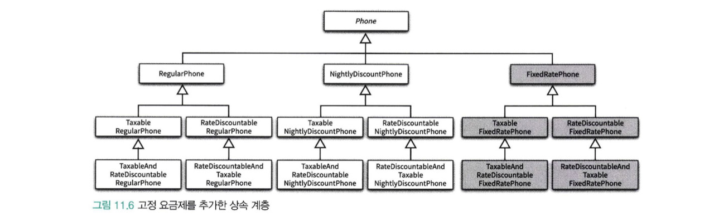
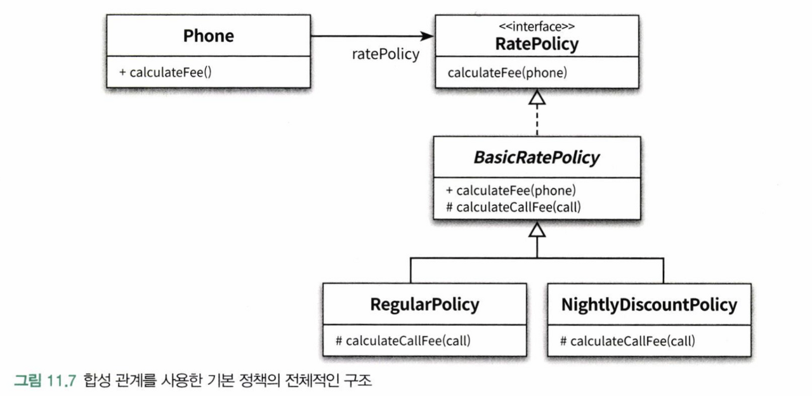
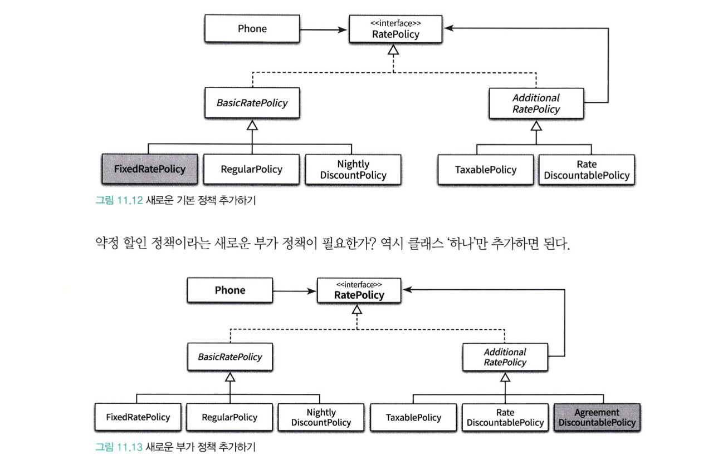
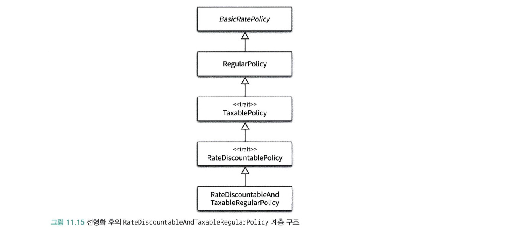

# CHAPTER 11. 합성과 유연한 설계

</br>

> 상속과 인터페이스의 가장 큰 차이점은  
> 상속의 의존성은 컴파일타임에서 결정되지만  
> 합성에서 두 객체 사이의 의존성은 런타임에 결정된다.

</br>

- 상속의 가장 큰 단점은 부모 클래스 내부 구현을 자세히 알아야한다.
  - 캡슐화가 깨짐
  - 자식 클래스가 부모 클래스의 구현에 의존적이라는 것

</br>

- 인터페이스는 구현에 의존하지 않는다
  - 내부 포함된 객체의 구현이 아닌 퍼블릭 인터페이스(오퍼레이션)에 의존한다.
  - 그래서 포함된 객체의 내부 구현이 변경되더라도 영향을 최소화 할 수 있다.

</br>

## 상속을 합성으로 변경하기

</br>

- 코드 재사용을 위해 상속을 남용했을 때의 문제점
  - 불필요한 인터페이스 상속문제
    - java.util.Properties와 java.util.Stack
  - 메서드 오버라이딩의 오작용 문제
    - 자식클래스가 부모 클래스의 메서드를 오버라이딩할 때 부모 클래스의 영향을 받는 문제
  - 부모 클래스와 자식 클래스의 동시 수정 문제
    - 부모 클래스를 변경할 때 자식 클래스도 함께 변경해야 하는 문제

</br>

### 불필요한 인터페이스 상속 문제: java.util.Properties와 java.util.Stack

</br>

#### java.util.Properties

</br>

```java
public class Properties extends HashTable<Object, Object>{
  ...
  @Override
  public synchronized Object put(Object key, Object value) {
    return map.put(key, value);
  }

  public synchronized Object setProperty(String key, String value) {
      return put(key, value);
  }

  @Override
  public Object get(Object key) {
     return map.get(key);
  }

  public String getProperty(String key) {
      Object oval = map.get(key);
      String sval = (oval instanceof String) ? (String)oval : null;
      Properties defaults;
      return ((sval == null) && ((defaults = this.defaults) != null)) ? defaults.getProperty(key) : sval;
  }
}
```

</br>

```java
import java.util.Hashtable;

public class Properties {
    private Hashtable<String, String> properties = new Hashtable <>();

    public String setProperty(String key, String value) {
        return properties.put(key, value);
    }

    public String getProperty(String key) {
        return properties.get(key);
    }
}
```

</br>

> 합성으로 바꾸면서 불필요한 HashTable의 오퍼레이션들이  
> Properties 클래스의 인터페이스를 오염시키지 않는다.

</br>

#### java.util.Stack

</br>

```java
public class Stack<E> {
    private Vector<E> elements = new Vector<>();

    public E push(E item) {
        elements.addElement(item);
        return item;
    }

    public E pop() {
        if (elements.isEmpty()) {
            throw new EmptyStackException();
        }
        return elements.remove(elements.size() - 1);
    }
}
```

> Stack도 상속이 아닌 합성을 이용하여  
> Vector의 오퍼레이션을 포함하지 않아  
> 더이상 Stack의 규칙을 어기지 못하게 한다.

</br>

### 메서드 오버라이딩의 오작용 문제 : InstrumentedHashSet

</br>

```java
public class InstrumentedHashSet<E> extends HashSet<E>{
  private int addCount = 0;

  @Override
  public boolean add(E e){
    addCount++;
    return super.add(e);
  }

  @Override
  public boolean addAll(Collection<> extends E> c){
    addCount += c.size();
    return super.addAll(c);
  }
}
```

</br>

> 현재 오버라이딩의 문제점은 자식 클래스가 부모 클래스의 메서드를 오버라이딩할 경우  
> 부모 클래스가 자신의 메서드를 사용하는 방법에 자식 클래스가 결합될 수 있다는 것이다.

</br>

```java

public class InstrumentedHashSet<E> implements Set<E> {
    private int addCount = 0;
    private Set<E> set;

    public InstrumentedHashSet(Set<E> set) {
        this.set = set;
    }

    @Override
    public boolean add(E e) {
        addCount++;
        return set.add(e);
    }

    @Override
    public boolean addAll(Collection<? extends E> c) {
        addCount += c.size();
        return set.addAll(c);
    }

    public int getAddCount() {
        return addCount;
    }

    @Override public boolean remove(Object o) {
        return set.remove(o);
    }

    @Override public void clear() {
        set.clear();
    }

    @Override public boolean equals(Object o) {
        return set.equals(o);
    }

    @Override public int hashCode() {
        return set.hashCode();
    }

    @Override public Spliterator<E> spliterator() {
        return set.spliterator();
    }

    @Override public int size() {
        return set.size();
    }

    @Override public boolean isEmpty() {
        return set.isEmpty();
    }

    @Override public boolean contains(Object o) {
        return set.contains(o);
    }

    @Override public Iterator<E> iterator() {
        return set.iterator();
    }

    @Override public Object[] toArray() {
        return set.toArray();
    }

    @Override public <T> T[] toArray(T[] a) {
        return set.toArray(a);
    }

    @Override public boolean containsAll(Collection<?> c) {
        return set.containsAll(c);
    }

    @Override public boolean retainAll(Collection<?> c) {
        return set.retainAll(c);
    }

    @Override public boolean removeAll(Collection<?> c) {
        return set.removeAll(c);
    }
}
```

</br>

> 위 방식은 합성을 이용하여 HashSet의 의존도를 해결하면서  
> HashSet이 제공하는 인터페이스를 그대로 제공하는 방식이다.  
> Set의 오퍼레이션을 오버라이딩한 인스턴스 메서드에서 내부의

- 포워딩
  - HashSet 인스턴스에게 동일한 메서드 호출을 그대로 전달한다는 것을 알 수 있다.

> 포워딩은 기존 클래스의 인터페이스를 그대로 외부에 제공하면서 구현에 대한 결합 없이  
> 일부 작동 방식을 변경하고 싶은 경우에 사용할 수 있는 유용한 기법

</br>

## 상속으로 인한 조합의 폭발적인 증가

</br>

- 상속으로 인해 결합도가 높아지면 코드수정 작업양이 과도하게 늘어난다.
  - 하나의 기능을 추가 및 수정하기 위해 많은 수의 클래스를 추가하거나 수정
  - 단일 상속만 지원하는 자바에서는 중복코드의 양이 늘어날 수도 있다.

</br>

### 기본 정책과 부가 정책 조합하기

</br>

- 기본 정책
  - 일반 요금제
  - 심야 할인 요금제
- 부가 정책
  - 세금 정책
  - 기본 요금 할인 정책

</br>

> 새로운 요구사항은 기본 요금제에 `부가 정책을 추가`

</br>

- 기본 정책은 가입자의 통화 정보를 기반으로 한다.
- 기본 정책은 `가입자의 한달 통화량을 기준`으로 부과 할 요금 계산

</br>

- 기본 정책의 계산 결과에 적용된다.
  - 세금 정책은 기본 정책인 RegularPhone이나 NightlyDiscountPhone의 계산이 끝난 결과에 세금 부과
- 선택적으로 적용
  - 기본 정책의 계산 결과에 세금 정책을 적용 할 수도 안 할 수도!
- 조합 가능
  - 기본 정책에 세금정책만 적용하는 것도 가능하고
  - 기본 요금 할인 정책만 적용하는 것도 가능
  - 세금 정책과 기본 요금 할인 정책을 함께 적용하는 것도 가능
- 부가 정책은 임의의 순서로 적용 가능
  - 기본 정책에 세금 정책과 기본 요금 할인 정책을 함께 적용할 경우 세금 정책을 적용한 후
  - 기본 요금 할인 정책을 적용할 수도 있고, 기본 요금 할인 정책을 적용한 후에 세금 정책을 적용할 수도 있다.

</br>

|  다양한 조합에 따른 폭발적인 증가  |
| :--------------------------------: |
|  |

</br>

```java
public abstract class Phone {
    private List<Call> calls = new ArrayList<>();

    public Money calculateFee() {
        Money result = Money.ZERO;

        for(Call call : calls) {
            result = result.plus(calculateCallFee(call));
        }

        return result;
    }

    abstract protected Money calculateCallFee(Call call);
}
```

```java
public class RegularPhone extends AbstractPhone {
    private Money amount;
    private Duration seconds;

    public RegularPhone(Money amount, Duration seconds) {
        this.amount = amount;
        this.seconds = seconds;
    }

    @Override
    protected Money calculateCallFee(Call call) {
        return amount.times(call.getDuration().getSeconds() / seconds.getSeconds());
    }
}
```

```java
public class NightlyDiscountPhone extends AbstractPhone {
    private static final int LATE_NIGHT_HOUR = 22;

    private Money nightlyAmount;
    private Money regularAmount;
    private Duration seconds;

    public NightlyDiscountPhone(Money nightlyAmount, Money regularAmount, Duration seconds) {
        this.nightlyAmount = nightlyAmount;
        this.regularAmount = regularAmount;
        this.seconds = seconds;
    }

    @Override
    protected Money calculateCallFee(Call call) {
        if (call.getFrom().getHour() >= LATE_NIGHT_HOUR) {
            return nightlyAmount.times(call.getDuration().getSeconds() / seconds.getSeconds());
        } else {
            return regularAmount.times(call.getDuration().getSeconds() / seconds.getSeconds());
        }
    }
}
```

> RegularPhone과 NightlyDiscountPhone의 인스턴스 단독으로 생성하는 것은  
> 부가 정책을 적용하지 않겠다는 것을 의미한다.

</br>

### 기본 정책에 세금 조합하기

</br>

- 일반 요금제에 세금 정책을 조합
  - 가장 간단하게 그냥 RegularPhone을 상속받은 클래스를 추가하는 것

```java
public class TaxableRegularPhone extends RegularPhone {
    private double taxRate;

    public TaxableRegularPhone(Money amount, Duration seconds,
                               double taxRate) {
        super(amount, seconds);
        this.taxRate = taxRate;
    }

    @Override
    public Money calculateFee() {
        Money fee = super.calculateFee();
        return fee.plus(fee.times(taxRate));
    }
}
```

> 부모 클래스의 메서드를 재사용하기 위해 super를 호출하면 편하지만  
> 자식 클래스와 부모 클래스 사이의 결합도가 높아진다!  
> `결합도를 낮추는 방법`은 자식 클래스가 부모 클래스의 메서드를  
> 호출하지 않도록 부모 클래스에 추상 메서드를 제공하는 것이다.

</br>

```java
public abstract class Phone {
    private List<Call> calls = new ArrayList<>();

    public Money calculateFee() {
        Money result = Money.ZERO;

        for(Call call : calls) {
            result = result.plus(calculateCallFee(call));
        }

        return afterCalculated(result);
    }

    protected abstract Money calculateCallFee(Call call);
    protected abstract Money afterCalculated(Money fee);
}
```

</br>

> 자신이 정의한 추상 메서드를 호출하고 자식 클래스가 이 메서드를 오버라이딩해서  
> 부모 클래스가 원하는 로직을 제공하도록 수정하면  
> 부모 클래스와 자식 클래스 사이의 결합도를 느슨하게 만들 수 있다.
> 자식 클래스가 부모 클래스의 구체적 구현이아니라 `필요한 동작의 명세를 기술하는 추상화에 의존하도록 한다`

</br>

```java
public class RegularPhone extends Phone {
    private Money amount;
    private Duration seconds;

    public RegularPhone(Money amount, Duration seconds) {
        this.amount = amount;
        this.seconds = seconds;
    }

    @Override
    protected Money calculateCallFee(Call call) {
        return amount.times(call.getDuration().getSeconds() / seconds.getSeconds());
    }

    @Override
    protected Money afterCalculated(Money fee) {
        return fee;
    }
}
```

```java
public class NightlyDiscountPhone extends Phone {
    private static final int LATE_NIGHT_HOUR = 22;

    private Money nightlyAmount;
    private Money regularAmount;
    private Duration seconds;

    public NightlyDiscountPhone(Money nightlyAmount, Money regularAmount, Duration seconds) {
        this.nightlyAmount = nightlyAmount;
        this.regularAmount = regularAmount;
        this.seconds = seconds;
    }

    @Override
    protected Money calculateCallFee(Call call) {
        if (call.getFrom().getHour() >= LATE_NIGHT_HOUR) {
            return nightlyAmount.times(call.getDuration().getSeconds() / seconds.getSeconds());
        } else {
            return regularAmount.times(call.getDuration().getSeconds() / seconds.getSeconds());
        }
    }

    @Override
    protected Money afterCalculated(Money fee) {
        return fee;
    }
}
```

</br>

> 자식클래스는 afterCalculated 메서드를  
> 오버라이딩해서 계산된 요금에 적용할 작업을 추가한다.
> 기본 정책에 해당하는 위의 두 클래스들은 전달된 요금을 그대로 반환하도록 구현

</br>

- TaxableRegularPhone(기본 정책 + 세금 정책 조합)이 추상메서드에 의존하게 하려고 했을때
  - 부모 클래스에 추상 메서드 추가 이후 모든 자식들이 추상 메서드를 오버라이딩 해야했다.
  - 자식 클래스의 수가 많다면 제법 번거러운 일.
  - 중복 코드를 야기할 수 있다.

</br>

- 기본 정책에서 중복 코드 제거
  - 기본 정책에 대한 afterCalculated 구현을 부모 클래스로 올리기!

```java
public abstract class Phone {
    private List<Call> calls = new ArrayList<>();

    public Money calculateFee() {
        Money result = Money.ZERO;

        for(Call call : calls) {
            result = result.plus(calculateCallFee(call));
        }

        return afterCalculated(result);
    }

    protected Money afterCalculated(Money fee) {
        return fee;
    }

    protected abstract Money calculateCallFee(Call call);
}
```

</br>

- 추상 메서드와 훅 메서드

> calculateCallFee와 같이 자식 클래스에서 오버라이딩할 목적의 메서드이지만  
> 편의를 위해 기본 구현을 제공하는 메서드를 훅 메서드라고 한다!

</br>

- 이제 afterCalculated 오버라이딩

```java
public class TaxableRegularPhone extends RegularPhone {
    private double taxRate;

    public TaxableRegularPhone(Money amount, Duration seconds, double taxRate) {
        super(amount, seconds);
        this.taxRate = taxRate;
    }

    @Override
    protected Money afterCalculated(Money fee) {
        return fee.plus(fee.times(taxRate));
    }
}
```

- NightlyDiscountPhone에도 세금을 부과 할 수 있도록 NightlyDiscountPhone의 자식 클래스 추가

```java
public class TaxableNightlyDiscountPhone extends NightlyDiscountPhone {
    private double taxRate;

    public TaxableNightlyDiscountPhone(Money nightlyAmount, Money regularAmount, Duration seconds, double taxRate) {
        super(nightlyAmount, regularAmount, seconds);
        this.taxRate = taxRate;
    }

    @Override
    protected Money afterCalculated(Money fee) {
        return fee.plus(fee.times(taxRate));
    }
}
```

> 현재 코드들을 살펴보면 TaxableDiscountPhone과 TaxableNightlyDiscountPhone의  
> 코드가 중복됐다는 것이다. 현재 부모클래스 이름만 다르고 거의 동일하다.  
> 자바를 비롯한 대부분의 객체지향 언어가 단일 상속만 지원하여  
> 상속으로 인해 발생하는 중복코드 문제를 해결하기 어렵다.

</br>

### 기본 정책에 기본 요금 할인 정책 조합하기

</br>

- 부가 저액인 기본 요금 할인 정책을 Phone의 상속 계층에 추가

> 기본 요금 할인 정책이란 매달 청구되는 요금에서  
> 고정된 요금을 차감하는 부가 정책을 가리킨다.  
> 예를들어 매달 1000원을 할인해주는 요금제가 있다면  
> 이 요금제에는 부가정책으로 기본 요금 할인 정책이 조합돼있다.

</br>

- RateDiscountableRegularPhone(일반 요금제 + 기본 요금 할인 정책)

```java
public class RateDiscountableRegularPhone extends RegularPhone {
    private Money discountAmount;

    public RateDiscountableRegularPhone(Money amount, Duration seconds, Money discountAmount) {
        super(amount, seconds);
        this.discountAmount = discountAmount;
    }

    @Override
    protected Money afterCalculated(Money fee) {
        return fee.minus(discountAmount);
    }
}
```

</br>

- RateDiscountableNightlyDiscountPhone(심야 할인 요금제 + 기본요금 할인정책)

```java
public class RateDiscountableNightlyDiscountPhone extends NightlyDiscountPhone {
    private Money discountAmount;

    public RateDiscountableNightlyDiscountPhone(Money nightlyAmount,
                                                Money regularAmount, Duration seconds, Money discountAmount) {
        super(nightlyAmount, regularAmount, seconds);
        this.discountAmount = discountAmount;
    }

    @Override
    protected Money afterCalculated(Money fee) {
        return fee.minus(discountAmount);
    }
}
```

</br>

> 이것 역시 다른 정책의 조합을 위해 작성하였지만  
> 중복 코드가 발생하였다.

</br>

### 중복 코드의 덫에 걸리다

> 부가 정책은 자유롭게 조합 할 수 있어야하고 적용되는 순서도 결정할 수 있어야 함  
> 요구사항에 따르면 앞에서 구현한 세금 정책하고 기본요금 할인 정책 적용도 가능해야하지만  
> 모든 가능한 조합마다 자식클래스를 추가해야만 한다.

</br>

- ... 무의미한 조합들 작성하는 것 생략..

</br>

|                   클래스 폭발                   |
| :---------------------------------------------: |
|  |

</br>

> 위에서 하나의 정책을 만들기 위해서 하나의 클래스가 계속 추가되는 상황이 발생하였다.
> 이것을 클래스 폭발 또는 조합의 폭발이라고 부르는데  
> 이 문제는 자식 클래스가 부모 클래스의 구현에 강하게 결합되도록 강요받기 때문이다.  
> 컴파일 타임에 결정된 부모-자식간의 관계는 변경될 수 없음으로  
> 조합이 필요한 상황에서 해결 방법은 조합의 수만큼 새로운 클래스를 추가하는 것이다. -> 관리도 어려워..  
> 이렇게 클래스가 많으면 기능을 수정할때도 수정하는 양이 장난이 이니다.. 또한 버그문제도..

</br>

## 합성 관계로 변경하기

</br>

> 상속 관계는 컴파일타임에 결정되고 고정되기 때문에  
> 코드를 실행하는 도중에 변경할 수 없다.  
> 따라서 여러 기능을 조합해야 하는 설계에 상속을 이용하면  
> 모든 조합 가능한 경우별로 클래스를 추가해야하는 문제가 발생한다.

</br>

> 반면, 합성은 런타임에 정책들의 관계를 고정시킬 필요 없이  
> 실행 시점에 정책들의 관계를 유연하게 변경할 수 있게 된다.  
> 상속이 `조합의 결과를 개별 클래스 안으로 밀어넣는 방법`이라면  
> 합성은 조합을 구성하는 요소들을 개별 클래스로 구현 한 후  
> `실행 시점에 인스턴스를 조립하는 방법을 사용하는 것`이라고 할 수 있다!

</br>

### 기본 정책 합성하기

</br>

```java
public interface RatePolicy {
    Money calculateFee(Phone phone);
}
```

> RatePolicy는 기본정책과 부가 정책을 포관하는 인터페이스이다.  
> Phone을 인자로 받아 계산된 요금을 반환하는  
> calculateFee 오퍼레이션을 포함하는 간단한 인터페이스다.

</br>

```java
public abstract class BasicRatePolicy implements RatePolicy {
    @Override
    public Money calculateFee(Phone phone) {
        Money result = Money.ZERO;

        for(Call call : phone.getCalls()) {
            result.plus(calculateCallFee(call));
        }

        return result;
    }

    protected abstract Money calculateCallFee(Call call);
}
```

</br>

> 기본 정책을 구성하는 일반 요금제와 심야할인 요금제는  
> 개별 요금을 계산하는 방식을 제외한 전체 처리 로직이 거의 동일  
> 이 중복 코드를 담기 위한 추상 클래스가 BasicRatePolicy다.

</br>

- 일반 요금제

```java
public class RegularPolicy extends BasicRatePolicy {
    private Money amount;
    private Duration seconds;

    public RegularPolicy(Money amount, Duration seconds) {
        this.amount = amount;
        this.seconds = seconds;
    }

    @Override
    protected Money calculateCallFee(Call call) {
        return amount.times(call.getDuration().getSeconds() / seconds.getSeconds());
    }
}
```

</br>

- 심야 할인 요금제

```java
public class NightlyDiscountPolicy extends BasicRatePolicy {
    private static final int LATE_NIGHT_HOUR = 22;

    private Money nightlyAmount;
    private Money regularAmount;
    private Duration seconds;

    public NightlyDiscountPolicy(Money nightlyAmount, Money regularAmount, Duration seconds) {
        this.nightlyAmount = nightlyAmount;
        this.regularAmount = regularAmount;
        this.seconds = seconds;
    }

    @Override
    protected Money calculateCallFee(Call call) {
        if (call.getFrom().getHour() >= LATE_NIGHT_HOUR) {
            return nightlyAmount.times(call.getDuration().getSeconds() / seconds.getSeconds());
        }

        return regularAmount.times(call.getDuration().getSeconds() / seconds.getSeconds());
    }
}
```

</br>

- 기본 정책(일반 요금제 + 심야할인 요금제)을 이용해 요금을 계산할 Phone

</br>

```java
public class Phone {
    private RatePolicy ratePolicy;
    private List<Call> calls = new ArrayList<>();

    public Phone(RatePolicy ratePolicy) {
        this.ratePolicy = ratePolicy;
    }

    public List<Call> getCalls() {
        return Collections.unmodifiableList(calls);
    }

    public Money calculateFee() {
        return ratePolicy.calculateFee(this);
    }
}
```

</br>

> Phone이 인스턴스 변수로 RatePolicy를 가진다.  
> 폰이 다양한 요금정책과 협력할 수 있어야함으로 요금정책의 타입이  
> RatePolicy라는 인터페이스로 정의  
> 또 런타임 의존성 대체를 위해 생성자를 통해  
> RatePolicy의 인스턴스에 대한 의존성을 주입받는다.

</br>

|                  합성 관계를 사용한 기본 정책의 전체적인 구조                   |
| :-----------------------------------------------------------------------------: |
|  |

</br>

> Phone처럼 다양한 종류의 객체와 협력하기 위해 합성 관계를 사용하는 경우는  
> 합성하는 객체의 타입을 인터페이스나 추상클래스로 선언하고  
> 의존성 주입을 사용해 런타임에 필요한 객체를 설정할 수 있도록 구현하는 것이 일반적이다.
> 따라서 위 코드는 ratePolicy가 인터페이스의 구현체 타입에 따라 요금 계산하는 방식이 달라진다.

</br>

### 부가 정책 적용하기

</br>

> 부가정책은 기본 정책에 대한 계산이 끝난 후에 적용된다.  
> 세금 정책을 추가한다면 세금 정책은 RegularPolicy의 계산이 끝나고  
> Phone에게 반환되기 전에 적용되어야한다.  
> 따라서 Phone -> TaxablePolicy -> RegularPolicy  
> 이렇게 인스턴스를 연결해야한다.

</br>

- 기본 요금제에 기본 요금 할인 정책을 적용한 후 세금 정책을 부과한 인스턴스 관계

> Phone -> TaxablePolicy -> RateDiscountablePolicy -> RegularPolicy
> 요약하면 부가 정책은 RatePolicy 인터페이스를 구현해야 하며,  
> 내부에 또 다른 RatePolicy 인스턴스를 합성할 수 있어야 한다.

</br>

```java
public abstract class AdditionalRatePolicy implements RatePolicy {
    private RatePolicy next;

    public AdditionalRatePolicy(RatePolicy next) {
        this.next = next;
    }

    @Override
    public Money calculateFee(Phone phone) {
        Money fee = next.calculateFee(phone); // 기본정책 계산 후
        return afterCalculated(fee) ; // 추후 계산
    }

    abstract protected Money afterCalculated(Money fee);
}
```

</br>

- 세금 정책 구현

```java
public class TaxablePolicy extends AdditionalRatePolicy {
    private double taxRatio;

    public TaxablePolicy(double taxRatio, RatePolicy next) {
        super(next);
        this.taxRatio = taxRatio;
    }

    @Override
    protected Money afterCalculated(Money fee) {
        return fee.plus(fee.times(taxRatio));
    }
}
```

</br>

- 기본 요금 할인 정책

```java
public class RateDiscountablePolicy extends AdditionalRatePolicy {
    private Money discountAmount;

    public RateDiscountablePolicy(Money discountAmount, RatePolicy next) {
        super(next);
        this.discountAmount = discountAmount;
    }

    @Override
    protected Money afterCalculated(Money fee) {
        return fee.minus(discountAmount);
    }
}
```

</br>

|             기본 정책과 부가 정책을 조합할 수 있는 상속 구조              |
| :-----------------------------------------------------------------------: |
|  |

</br>

- 일반 요금제에 세금 정책 조합할 경우

</br>

```java
Phone phone = new Phone(new TaxablePolicy(0.05, new RegularPolicy(...)))
```

</br>

> 설계는 복잡해졌지만 상속을 사용한 방식보다 더 유연하고 변경에 강하다.

</br>

### 새로운 정책 추가하기

</br>

|                새로운 부가 정책 추가하기                |
| :-----------------------------------------------------: |
|  |

</br>

> 고정 요금제가 필요하다면 고정 요금제를 구현한 클래스 하나만 추가한 후 조합

</br>

|                새로운 부가 정책 추가하기2                |
| :------------------------------------------------------: |
|  |

</br>

> 약정 할인 정책도 클래스 하나만 추가하면 된다.

</br>

> 합성을 이용한 설계를 사용할 경우 우리는 조합에 필요한 클래스들이 아닌  
> 기능에 대한 클래스 하나만 추가하고 런타임에 필요한 정책들을 조합해서  
> 원하는 기능을 얻을 수 있다.

</br>

## 믹스인

> 믹스인은 객체를 생성할 때 코드 일부를 클래스 안에 섞어 넣어  
> 재사용하는 기법을 가리키는 용어이다.  
> 합성이 런타임에 객체를 조합하는 재사용 방법이라면  
> 믹스인은 컴파일 타임에 필요한 코드 조각을 조합하는 재사용 방법이다.

</br>

- 믹스인과 상속의 차이

> 상속은 말 그대로 자식 클래스를 부모클래스와 동일 범주의 관계를 만들기 위함  
> 반면 믹스인은 말 그대로 코드를 다른 코드 안에 섞어넣기 위한 방법  
> 하지만 상속이 클래스와 클래스 사이의 관계를 고정 시키는데 비해  
> 믹스인은 유연하게 관계를 재구성 할 수 있다.
> `믹스인은 합성처럼 유연하면서 상속처럼 쉽게 코드를 재사용 할 수 있다`

</br>

> 믹스인은 Flaovrs 언어에서 처음으로 도입됐고  
> Flavors의 특징을 흠수한 CLOS에 의해 대중화  
> 책에서는 스칼라에서 제공하는 트레이트를 이용하여 믹스인 구현

- 트레이트

> 스칼라에서 제공하는 믹스인 기법으로  
> trait는 super라는 키워드가 부모 클래스 하나를 고정하지 않으며  
> super 역시 런타임에 달라질 수 있어서  
> 실제로 trait가 믹스인 되는 시점에 결정된다.

</br>

### 기본 정책 구현하기

</br>

```java
abstract class BasicRatePolicy {
  def calculateFee(phone: Phone): Money = phone.calls.map(calculateCallFee(_)).reduce(_ + _)

  protected def calculateCallFee(call: Call): Money;
}
```

> 기본 정책을 구현하는 BasicRatePolicy는 기본 정책에 속하는  
> 전체 요금제 클래스들이 확장할 수 있도록 추상클래스로 구현한다.

```java
class RegularPolicy(val amount: Money, val seconds: Duration) extends BasicRatePolicy {
  override protected def calculateCallFee(call: Call): Money = amount * (call.duration.getSeconds / seconds.getSeconds)
}
```

> RegularPolicy는 BasicRatePolicy를 상속받아  
> 개별 Call의 요금을 계산하는  
> calculateCallFee 메서드를 오버라이딩한다.

</br>

- 심야 요금제도 마찬가지

```java
class NightlyDiscountPolicy(
    val nightlyAmount: Money,
    val regularAmount: Money,
    val seconds: Duration) extends BasicRatePolicy {

  override protected def calculateCallFee(call: Call): Money =
    if (call.from.getHour >= NightltDiscountPolicy.LateNightHour) {
      nightlyAmount * (call.duration.getSeconds / seconds.getSeconds)
    } else {
      regularAmount * (call.duration.getSeconds / seconds.getSeconds)
    }
}

object NightltDiscountPolicy {
  val LateNightHour: Integer = 22
}
```

</br>

### 트레이트로 부가 정책 구현하기

</br>

```java
trait TaxablePolicy extends BasicRatePolicy {
  val taxRate: Double
  override def calculateFee(phone: Phone): Money = {
    val fee = super.calculateFee(phone)
    return fee + fee * taxRate
  }
}
```

> BasicRatePolicy와 다른 코드를 조합하여  
> TaxablePolicy 구현  
> 위 코드에서 TabablePolicy 트레이트가 BasicRatePolicy를 확장한다  
> 상속의 개념이 아니라 TaxablePolicy가 BasicRatePolicy나  
> 그 자손에 해당하는 경우에만 믹스인 될 수 있다는 것을 의미

</br>

> 상속은 정적이지만 믹스인은 동적이다.  
> 상속은 컴파일타임에 관계를 고정시키지만  
> 믹스인은 제약을 둘 뿐 실제로  
> 어떤 코드에 믹스인 될 지 결정하지 않는다.

</br>

> 또한 super가 가리키는 대상 역시 컴파일 타임이 아닌 실행시점에 결정되어  
> BasicRatePolicy 타임에 따라 다른 super.calcaulteFee(..)가 실행된다.

</br>

### 부가 정책 트레이트 믹스인 하기

</br>

> 스칼라는 특정 클래스에 믹스인한 클래스와 트레이트를 선형화하여  
> 어떤 메서드를 호출할지 결정한다.  
> 클래스의 인스턴스를 생성할 때에는  
> 클래스 자식과 조상클래스, 트레이트를 일렬로 나열해서 순서를 정한다.  
> 그 후 실행중인 메서드 내부에서 super 호출을 하면 다음 단계에 위치한  
> 클래스나 트레이트의 메서드가 호출 된다.

</br>

```java
class RateDiscountableAndTaxableRegularPolicy(
  amount: Money,
  seconds: Duration,
  val taxRate: Double)
extends RegularPolicy(amount, seconds)
with TaxablePolicy
with RateDiscountablePolicy
```

</br>

|                 트레이트 선형화                  |
| :----------------------------------------------: |
|  |

</br>

> RateDiscountableAndTaxableRegularPolicy가  
> calculateFee 메시지를 수신한다면  
> 바로 윗 단계의 RateDiscountablePolicy에 존재하는 지 찾고  
> 이를 반복하여 선형으로 순차적으로 올라간다.

</br>

```java
class RateDiscountableAndTaxableRegularPolicy(
  amount: Money,
  seconds: Duration,
  val taxRate: Double)
extends RegularPolicy(amount, seconds)
with RateDiscountablePolicy
with TaxablePolicy
```

> 반대로 TaxablePolicy와 RateDiscountablePolicy의 순서를 바꾸고 싶다면  
> 트레이트의 순서를 변경하여 선형화 순서를 바꿀 수 있다.

</br>

> 믹스인을 사용하더라도 클래스 폭발이 남아있는 것인가?  
> 믹스인을 사용하더라도 상속에서 클래스의 숫자가 기하급수적으로 늘어나는 클래스  
> 폭발 문제는 여전히 남아있는게 아니냐고 반문할 수 있다.  
> 클래스 폭발 문제의 단점은 클래스가 늘어난다는 것이 아니라 클래스가 늘어날수록
> 중복 코드도 함께 기하급수적으로 늘어난다는 점이다.
> `믹스인은 이런 문제가 발생하지 않는다.`

</br>

### 쌓을 수 잇는 변경

</br>

> 믹스인은 상속 계층 안에서 확장한 클래스보다 더 하위에 위치하게 된다.  
> 다시 말해 믹스인은 대상 클래스의 자식 클래스처럼 사용될 용도로 만들어 지는 것이다.

</br>

```java
class RateDiscountableAndTaxableRegularPolicy(
  amount: Money,
  seconds: Duration,
  val taxRate: Double)
extends RegularPolicy(amount, seconds)
with RateDiscountablePolicy
with TaxablePolicy
```

> 위의 코드 처럼 trait를 믹스인한 with 구문은 항상 extends 구문 뒤에 나온다.  
> 믹스인을 사용하면 특정한 클래스에 대한 변경 또는 확장을 독립적으로 구현한 후  
> 필요한 시점에 차례대로 추가할 수 있다.  
> 믹스인의 이러한 특징을 쌓을 수 있는 변경(stackable modification) 이라고 부른다.

</br>
