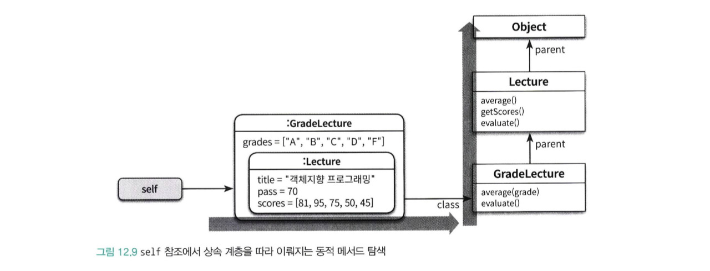
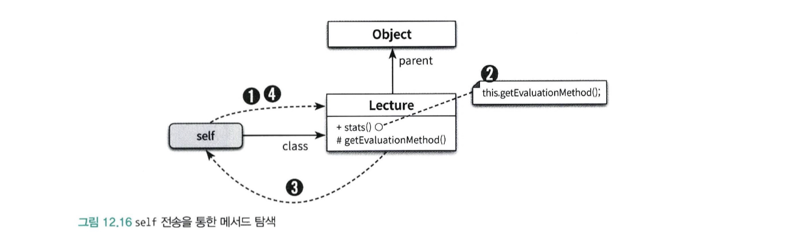
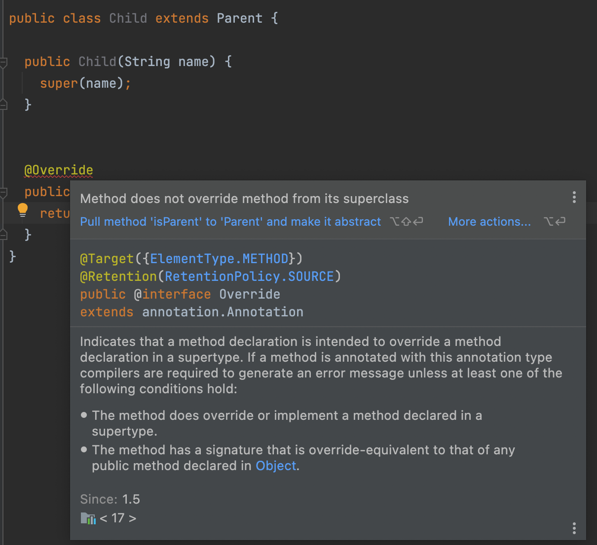
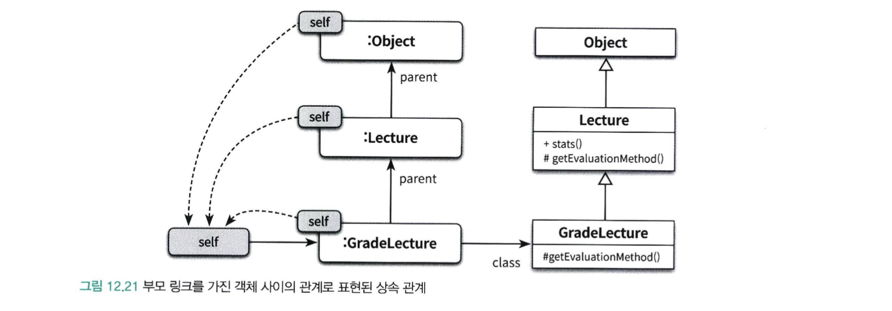
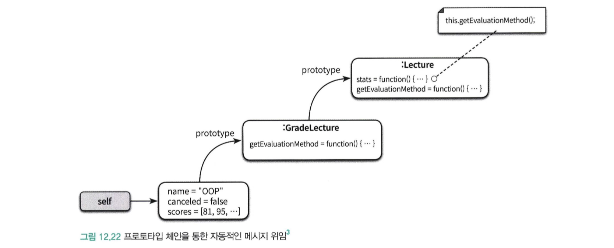

# CHAPTER 12. 다형성

</br>

> 상속의 목적은 코드 재사용이 아니다.  
> 상속은 타입 계층을 구조화하기 위해 사용해야 한다.  
> 부모 클래스의 코드를 재사용하기 위해 상속을 사용했을 경우  
> 부모 코드와 자식 코드가 강결합 되는 것을 볼 수 있었다!

</br>

## 다형성

</br>

> 여러 타입을 대상으로 동작할 수 있는 코드를 작성할 수 있는 방법

</br>

|                 다형성의 분류                  |
| :--------------------------------------------: |
|  |

</br>

- 매개변수
  - 제네릭과 관련이 깊고, 변수나 메서드의 매개변수 타입을 임의이ㅡ 타입으로 선언 후
  - 사용하는 시점에 구체적인 타입으로 지정하는 방식
  - List\<T> 는 실제 인스턴스 생성 시점에 T를 지정한다.
- 포함
  - 메시지가 동일하더라도 수신하는 객체에 따라 실제로 수행하는 행동이 달라지는 능력
  - 서브타입 다형성
  - 일반적인 다형성을 얘기할 때!
- 오버로딩
  - 메서드 파라미터 타입이 다를때 메서드 이름이 다를 경우
- 강제 다형성
  - 언어가 지원하는 자동적인 타입 변환이나, 사용자가 지정하는 타입변환을 통해 다른 타입에 적용할 수 있는 것

## 상속의 양면성

</br>

### 상속을 사용한 강의 평가

</br>

- 원하는 결과물

```text
Pass:3 Fail:2, A:1 B:1 C:1 D:0 F:2
```

</br>

> Pass:3 Fail:2는 강의를 이수한 학생의 수와 낙제한 학생의 수  
> 나머지는 등급별로 학생들 분포 현황이다.

</br>

```java
public class Lecture {
    private int pass;
    private String title;
    private List<Integer> scores = new ArrayList<>();

    public Lecture(String title, int pass, List<Integer> scores) {
        this.title = title;
        this.pass = pass;
        this.scores = scores;
    }

    public double average() {
        return scores.stream().mapToInt(Integer::intValue).average().orElse(0);
    }

    public List<Integer> getScores() {
        return Collections.unmodifiableList(scores);
    }

    public String evaluate() {
        return String.format("Pass:%d Fail:%d", passCount(), failCount());
    }

    private long passCount() {
        return scores.stream().filter(score -> score >= pass).count();
    }

    private long failCount() {
        return scores.size() - passCount();
    }
}
```

</br>

> Lecture를 살펴보면 pass - 기준, title - 강의 제목, scores - 학생들의 점수를 갖는다.  
> evalueate를 통해 `Pass:3 Fail:2` 이렇게 출력 가능하다.
> 학생의 점수가 pass 이상이면 이수한 것으로 판단한다.

</br>

```java
public class GradeLecture extends Lecture {
    private List<Grade> grades;

    public GradeLecture(String name, int pass, List<Grade> grades, List<Integer> scores) {
        super(name, pass, scores);
        this.grades = grades;
    }

}
```

> Lecture에서 점수를 평가하고 기본 출력을 이미 담당해주어  
> 상속을 통해 원하는 출력물을 만들기 위한 클래스를 작성한다.
> 우선 GradeLecture의 인스턴스 변수로 grades를 갖고

</br>

```java
public class Grade {
    private String name;
    private int upper,lower;

    private Grade(String name, int upper, int lower) {
        this.name = name;
        this.upper = upper;
        this.lower = lower;
    }

    public String getName() {
        return name;
    }

    public boolean isName(String name) {
        return this.name.equals(name);
    }

    public boolean include(int score) {
        return score >= lower && score <= upper;
    }
}
```

> Grade는 등급의 이름과 각 등급의 범위를 정의하는 성적을 인스턴스로 갖는다.  
> include는 수강생의 성적이 등급에 포함된느지를 검사한다.

</br>

```java
public class GradeLecture extends Lecture {
    @Override
    public String evaluate() {
        return super.evaluate() + ", " + gradesStatistics();
    }

    private String gradesStatistics() {
        return grades.stream().map(grade -> format(grade)).collect(joining(" "));
    }

    private String format(Grade grade) {
        return String.format("%s:%d", grade.getName(), gradeCount(grade));
    }

    private long gradeCount(Grade grade) {
        return getScores().stream().filter(grade::include).count();
    }

    public double average(String gradeName) {
        return grades.stream()
                .filter(each -> each.isName(gradeName))
                .findFirst()
                .map(this::gradeAverage)
                .orElse(0d);
    }

    private double gradeAverage(Grade grade) {
        return getScores().stream()
                .filter(grade::include)
                .mapToInt(Integer::intValue)
                .average()
                .orElse(0);
    }
}
```

</br>

> 이제 원하는 출력물, 학생들의 이수 여부와 등급별 통계를 함께 반환하도록  
> evaluate 메서드 재정의하였다.

</br>

> evaluate에서는 `super의 evaluate를 먼저 출력한다.`  
> GradeLecture의 시그니처와 Lecture의 시그니처가 동일하다.  
> 이 경우 자식 클래스의 메서드 우선순위가 더 높은데,  
> 메시지를 수신할 경우 부모 클래스의 메서드가 아닌  
> 자식 클래스의 메서드가 실행된다는 것이다.

</br>

> 결과적으로 오버라이딩한 동일한 시그니처를 가진 자식 메서드가  
> 부모클래스의 메서드를 가리게 된다.  
> 따라서 GradeLecture의 evaluate가 메시지를 수신 받으면  
> Lecture의 evaluate 메서드를 오버라이딩 한  
> GradeLecture의 evalueate 메서드가 실행 된다.

</br>

```java
    public double average(String gradeName) {
        return grades.stream()
                .filter(each -> each.isName(gradeName))
                .findFirst()
                .map(this::gradeAverage)
                .orElse(0d);
    }
```

> 부모 클래스의 없는 메서드도 작성 가능하다.  
> 부모 클래스와 시그니처가 달라 공존 할 수 있고  
> 이를 메서드 오버로딩이라고 한다.

</br>

### 데이터 관점의 상속

</br>

```java
Lecture = new Lecture("객체지향 프로그래밍",
                      70,
                      Arrays.asList(81, 95, 75, 50, 45));
```

> Lecture의 인스턴스를 생성하면 시스템은 인스턴스 변수 title, pass, scores를  
> 저장할 수 있는 메모리 공간을 할당하고 생성자의 매개 변수를 이용해 값을 설정한 후  
> 생성된 인스턴스의 주소를 lecture라는 이름의 변수에 대입한다.

</br>

```java
Lecture lecture = new GradeLecture("객체지향 프로그래밍",
                       70,
                      Arrays.asList(
                          new Grade("A", 100, 95),
                          new Grade("B", 94, 80),
                          new Grade("C", 79, 70),
                          new Grade("D", 69, 50),
                          new Grade("F", 49, 0),
                      ),
                      Arrays.asList(81, 95, 75, 50, 45));
```

</br>

> 이번에는 GradeLecture의 인스턴스를 생성할 경우  
> 직접 정의한 인스턴스 변수뿐만 아니라 부모 클래스인 Lecture가  
> 정의한 인스턴스 변수도 포함한다.

</br>

|                   부모 클래스의 인스턴스를 포함하는 자식                   |
| :------------------------------------------------------------------------: |
|  |

</br>

> 상속을 인스턴스 관점에서 바라볼 때 개념적으로  
> 자식 클래스의 인스턴스 안에 부모 클래스의 인스턴스가  
> 포함되는 것으로 생각하는 것이 유용하다.  
> 인스턴스를 참조하는 lecutre는 GradeLecture의 인스턴스를 가리키기 때문에  
> 특별한 방법을 사용하지 않으면 GradeLecture안에 포함된
> Lecture의 인스턴스에 직접 접근 할 수 없다.

</br>

> 데이터 관점에서 상속은 자식 클래스의 인스턴스 안에  
> 부모 클래스의 인스턴스를 포함하는 것으로 볼 수 있다.  
> 따랄서 자식 클래스의 인스턴스는 자동으로 부모 클래스에서  
> 정의한 모든 인스턴스 변수를 내부에 포함하게 되는 것이다.

</br>

### 행동 관점의 상속

</br>

> 행동 관점의 상속은 부모 클래스가 정의한 일부 메서드를  
> 자식 클래스의 메서드로 포함 시키는 것을 의미

</br>

- 어떻게?

> 런타임에 자식클래스가 메서드를 실행 시키려고 할 때  
> 자식 클래스에서 메서드 탐색 과정을 실행 한 후  
> 없다면 상위 클래스로 메서드 탐색을 이어가기 때문이다.

</br>

> 객체의 경우 서로 다른 상태를 저장할 수 있도록 각 인스턴스 별로  
> 독립적인 메모리를 할당 받아야 한다.  
> 하지만 메서드는 동일한 클래스의 인스턴스끼리 공유가 가능함으로 클래스는 한 번만  
> 메모리에 로드하고 각 인스턴스별로 클래스를 가리키는 포인터를 갖게하는 것이 경제적

</br>

|                  클래스와 인스턴스의 개념적인 관계                   |
| :------------------------------------------------------------------: |
|  |

</br>

> 그림을 살펴 보면 인스턴스는 두개가생성 됐지만  
> 클래스는 단 하나만 메모리에 로드 되었다.  
> 메시지를 수신한 객체는 class 포인터로 연결된 자신의 클래스에서  
> 적절한 메서드가 존재하는지 판단한다.  
> 그 후 재하지 않으면 parent 포인터를 타고 올라가  
> 부모 클래스를 차례대로 훑어 가면서 메서드가 존재하는지 탐색한다.

</br>

## 업캐스팅과 동적 바인딩

</br>

```java
public class Professor {
    private String name;
    private Lecture lecture;

    public Professor(String name, Lecture lecture) {
        this.name = name;
        this.lecture = lecture;
    }

    public String compileStatistics() {
        return String.format("[%s] %s - Avg: %.1f", name,
                lecture.evaluate(), lecture.average());
    }
}
```

> 실행 시점에 메서드 탐색하는 과정을 보기 위해  
> 지금까지 작성한 성적 계산 프로그램에 각 교수별로 강의에 대한  
> 성적 통계 계산하느 기능 추가하기.

</br>

> 통계 계산 책임은 Professor 클래스가 맡도록 하자.  
> compileStatics는 통계 정보를 생성하기 위해  
> Lecture의 evaluate와 average 메서드 호출

</br>

> lecture가 GradeLecture로 전달 되어도 아무 문제없이 실행 된다.  
> 동일한 객체 참조인 lecture에 대해 동일한 evaluate 메시지를 전송하면  
> 코드 안에서 서로 다른 클래스 안에 구현된 메서드가 실행된다.

</br>

> 이처럼 코드 안에서 선언된 참조 타입(`Professor의 Lecture`)과 무관하게  
> 실제로 메시지를 수신하는 객체의 타입에 따라 실행되는 메서드가 달라질 수 있는 것이  
> 업캐스팅과 동적바인딩이라는 메커니즘이 작용하기 때문이다.

</br>

- 업캐스팅
  - 부모 클래스 타입으로 선언된 변수에 자식 클래스의 인스턴스를 할당하는 것이 가능
- 동적바인딩
  - 선언된 변수 타입이 아니라 메시지를 수신하는 객체의 타입에 따라 실행되는 메서드가 결정
  - 객체지향 시스템이 메시지를 처리할 메서드를 런타임에 결정하기 때문!

</br>

### 업캐스팅

</br>

> 상속을 이용하면 부모의 퍼블릭 인터페이스와 자식의 퍼블릭 인터페이스가 합쳐지기 때문에  
> 부모 클래스의 인스턴스에게 전송할 수 있는 메시지를 자식 클래스의 인스턴스에게 전송할 수 있다.  
> 또한 대입문과 파라미터 타입을 통해 부모 타입에 자식 타입을 전달하여 사용하는 것도 가능하다.

</br>

```java
Lecture lecture = new GradeLecture(); //대입문

public class Professor { // 파라미터
  public Professor(String name, Lecture lecture) {...}
}

Professor professor = new Professor("교수님", new GradeLecture());
```

</br>

```java
Lecture lecture = new GradeLecture();
GradeLecture gradeLecture = (GradeLecture) lecture;
```

|                 다운 캐스팅                  |
| :------------------------------------------: |
|  |

> 반대로 부모 클래스의 인스턴스를 자식 클래스타입으로 변환하기 위해  
> 사용하는 명시적 타입캐스팅을 다운 캐스팅이라고 한다.

</br>

### 동적 바인딩

> 전통적인 언어에서 함수를 실행하는 방법은 함수를 호출하는 것이다.  
> 객체지향 언어에서 메서드를 실행하는 방법은 메시지를 전송하는 것이다.  
> 이 두가지의 메커니즘은 완전히 다르다.

- 함수 호출
  - 코드를 작성하는 시점에 호출될 코드가 결정된다.
  - 컴파일 타임에 호출할 함수를 결정하는 방식을
  - 정적 바인딩(static binding), 초기 바인딩(early binding), 컴파일타임 바인딩(compile-time binding)
- 메서드 호출
  - 메시지를 수신했을 때 실행될 메서드가 런타임에 결정된다.
  - 실행될 메서드를 런타임에 결정하는 방식을 동적 바인딩(dynamic binding), 지연 바인딩(late binding)

</br>

## 동적 메서드 탐색과 다형성

</br>

- 객체 지향 시스템은 다음 규칙에 따라 실행할 메서드를 선택
  - 메시지를 수신한 객체는 자신을 생성한 클래스에 적합한 메서드가 존재하는지 검사
  - 메서드를 찾지 못했다면 부모 클래스에서 메서드를 계속 탐색한다.
  - 상속 계층의 가장 최상위 클래스에 이르렀지만 메서드를 발견하지 못하면 예외를 발생시키면서 탐색 중단

</br>

- self 참조

> 객체가 메시지를 수신하면 컴파일러는 self 참조라는 임시 변수를 자동으로 생성한 후 메시지를 수신한 객체를 가리키도록 한다.  
> 동적 메서드 탐색은 self가 가리키는 객체의 클래스에서 시작해서 상속 계층의 역방향으로 이뤄지며 메서드 탐색이 종료되는 순간 self 참조는 자동으로 소멸된다.  
> 시스템은 앞에서 설명한 class포인터와 parent 포인터와 함께 self 참조를 조합해서 메서드를 탐색한다.

</br>

|                  self 참조에서 상속 계층을 따라 이뤄지는 동적 메서드 탐색                   |
| :-----------------------------------------------------------------------------------------: |
|  |

</br>

> 메서드 탐색은 자식 -> 부모 방향으로 진행  
> 따라서 항상 자식 클래스의 메서드가 부모 클래스의 메서드보다 먼저 탐색 된다.

</br>

- `자동적인 메시지 위임` : 자식 클래스는 자신이 이해할 수 없는 메시지를 전송받은 경우 자동으로 상속 계층을 따라 부모 클래스에게 처리를 위임한다.
- `메서드를 탐색하기 위해 동적인 문맥을 사용` : 메시지를 수신했을 때 실제로 어떤 메서드를 실행할지는 런타임에 이뤄지며 self 참조를 이용하여 결정한다.

</br>

> 메시지가 처리되는 문맥은 컴파일타임이 아닌  
> 런타임에 실제로 메시지를 수신한 객체가 어떤 타입인지 추적해야한다.  
> 객체타입에 따라 메서드를 탐색하는 문맥이 동적으로 결정되며  
> 여기서 중요한 역할을 하는 것이 `self참조이다.`

</br>

### 동적인 문맥

</br>

> self 참조가 동적 문맥을 결정한다는 사실은 종종 어떤 메서드가 실행 될 지를 예상하기 어렵게 만든다.  
> 대표적인 경우가 자신에게 다시 전달하는 self 전송이다.

```java
public class Lecture {
    public String stats() {
        return String.format("Title: %s, Evaluation Method: %s",
                title, getEvaluationMethod());
    }

    public String getEvaluationMethod() {
        return "Pass or Fail";
    }
}
```

</br>

> 위의 stats() 메서드에서 `자기 자신의 메서드 getEvalutationMethod()`를 호출한다는 표현은 정확하지 않다.  
> 정확히는 현재 클래스의 메서드를 호출하는 것이 아니라, 현재 객체에게  
> getEvalutationMethod() 메시지를 전송하는 것이다.
> `self 참조가 가리키는 객체`, stats 메시지를 수신했던 객체다.

</br>

|             self 전송을 통한 메서드 탐색              |
| :---------------------------------------------------: |
|  |

</br>

> stats() 메서드를 실행하던 도중 getEvalutationMethod를 만나면  
> self 메시지를 수신한 Lecutre 인스턴스를 가리키토록 할당  
> 그리고 getEvaluation 메서드를 실행한 후 메서드 탐색 종료

</br>

- 이제 상속이 끼면 이야기가 달라진다.

</br>

```java
public class GradeLecture extends Lecutre{
    @Override
    public String getEvaluationMethod(){
        return "Grade"
    }
}
```

</br>

> GradeLecture에 stats() 메시지를 전달하면  
> 메서드 탐색으로 Lecture의 stats()를 발견하고 실행  
> 그 후 getEvaluationMethod()를 실행하는데  
> 이때 self 참조고 GradeLecture임으로  
> GradeLecture 클래스의 getEvaluationMethod가 실행 될 것이다.

</br>

### 잠깐 중간 정리

</br>

- 사실 위에서 발생하는 문제는 사전에 예방할 수 있다.

```java
public class Parent {

  String name;

  public Parent(String name) {
    this.name = name;
  }

  private boolean isParent() {
    return true;
  }
}
```

|              private method               |
| :---------------------------------------: |
|  |

</br>

> self 참조로 인한 예측 불가능한 상황을 만들지 않기 위해서  
> 반드시 오버라이딩의 목적으로 사용할 메서드가 아닌 경우에는  
> private으로 의도를 막아야한다.

</br>

### 이해할 수 없는 메시지

</br>

- 정적 타입 언어와 이해할 수 없는 메시지

> 정적 타입 언어에서는 코드를 컴파일 할 때 상속 계층 안의  
> 클래스들이 메시지를 이해할 수 있는지 여부를 판단한다.  
> 따라서 상속 계층 전체를 탐색한 후에도  
> 메시지를 처리할 수 있는 메서드를 발견하지 못했다면 컴파일 에러를 발생시킨다.

</br>

- 동적 타입 언어와 이해 할 수 없는 메시지

</br>

> 동적타입언어도 자식 -> 부모 클래스로 메서드를 탐색하지만  
> 동적 타입 언어는 컴파일 단계가 존재하지 않음으로  
> 실제 코드를 실행해보기 전에 메시지 처리 가능 여부를 알 수 없다.

</br>

### self 대 super

</br>

> self의 가장 큰 특징은 동적이라는 점이다.  
> self 참조는 메시지를 수신한 객체의 클래스에 따라 메서드 탐색을 위한 문맥을 실행 시점에 결정한다.

</br>

> 자식 크랠스에서 부모 클래스의 구현을 재사용해야 하는 경우가 있다.  
> 대부분 객체지향 언어들은 자식 클래스에서 부모 클래스의 인스턴스 변수나  
> 메서드에 접근하기 위해 사용할 수 있는 super 참조라는 내부 변수 제공한다.

</br>

```java
public class GradeLecture extends Lecture {
    @Override
    public String evaluate() {
        return super.evaluate() + ", " + gradesStatistics();
    }
}
```

</br>

> 위 코드는 Lecture의 evaluate 메서드 구현을 재사용하기위해  
> super 참조를 사용해 부모클래스에게 evaluate 메시지를 전송한다.  
> `호출하는 것이 아니라 전송한다.` 표현한 이유는  
> 부모 클래스가 아니라 더 상위에 위치한 조상 클래스의 메서드일 수도 있기 때문이다!

</br>

- super 참조의 용도는 부모 클래스에 정의된 메서드를 실행하기 위한 것이 아니다.

</br>

> super 참조의 정확한 의도는  
> `지금 이 클래스의 부모클래스에서 부터 메서드 탐색을 시작하라`이다.

</br>

## 상속 대 위임

</br>

### 위임과 self

</br>

> 상속을 이용할 경우 자식 클래스에서 메시지를 처리하지 못하는 경우  
> 상위 계층으로 메시지를 위임한다. 이때 self 참조는  
> 메시지를 위임하더라도 현재 메시지를 수신한 객체가 self가 된다.

</br>

|                부모 링크를 가진 객체 사이의 관계로 표현된 상속 관계                 |
| :---------------------------------------------------------------------------------: |
|  |

</br>

### 프로토타입 기반의 객체지향 언어

</br>

> 클래스가 존재하지 않고 오직 객체만 존재하는 프로토타입 기반의 객체지향 언어에서  
> 상속을 구현하는 유일한 방법은 객체 사이의 위임을 이용하는 것이다.  
> 프로토타입 기반 객체지향 언어도 상속을 이용해 self 참조를 통해 자동으로 전달한다.

</br>

```js
function Lecture(name, scores) {
  this.name = name;
  this.scores = scores;
}

Lecture.prototype.stats = function () {
  return (
    "Name: " + this.name + ", Evaludation Method: " + this.getEvaluationMethod()
  );
};

Lecture.prototype.getEvaluationMethod = function () {
  return "Pass or Fail";
};
```

> 자바스크립트의 인스턴스는 메시지를 수신하면 먼저 메시지를 수신한 객체의 prototype 안에서 메시지에 응답할 적절한 메서드가 있는지 체크한다.  
> 메서드가 없다면 prototype이 가리키는 객체를 따라 메시지 처리를 위임한다.  
> 자바스크립트에서는 prototype 체인으로 연결된 객체 사이에 메시지를 위임함하여 상속을 구현할 수 있다.

</br>

```js
function GradeLecture(name, canceled, scores) {
  Lecture.call(this, name, scores);
  this.canceled = canceled;
}

GradeLecture.prototype = new Lecture();

GradeLecture.prototype.constructor = GradeLecture;

GradeLecture.prototype.getEvaluationMethod = function () {
  return "Grade";
};
```

> GradeLecture의 prototype에 Lecture의 인스턴스를 할당했다는 것을 주목하라.  
> 이 과정을 통해 GradeLecutre를 이용해 모든 객체들이 prototype을 통해  
> Lecture에 정의된 모든 속성과 함수에 접근할 수 있게 된다.  
> 이제 메시지를 전송하면 prototype으로 연결된 객체 사이의 경로를 통해  
> 객체 사이의 메서드 탐색이 자동으로 이뤄진다.

</br>

|                   프로토타입 체인을 통해 자동적인 메시지 위임                   |
| :-----------------------------------------------------------------------------: |
|  |

</br>

```js
var grade_lecture = new GradeLecture("OOP", false, [1, 2, 3]);
grade_lecture.stats();
```

</br>

> js에서는 클래스가 존재하지 않음으로 오직 객체 사이의 메시지 위임만을 사용하여 다형성을 구현한다.  
> 이것은 객체지향 패러다임에서 클래스가 필수 요소가 아니라는 점을 잘 보여준다

</br>
