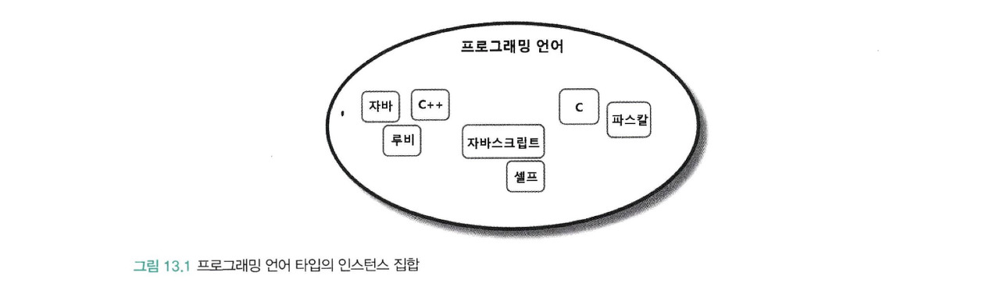
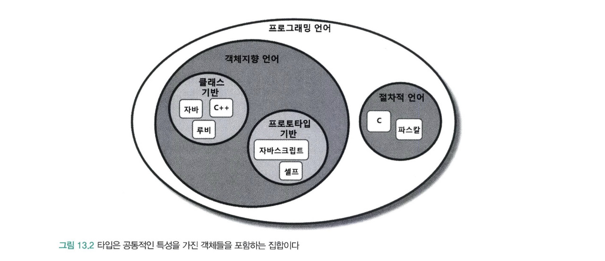
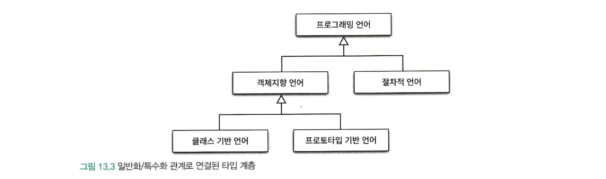
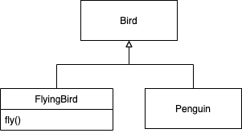
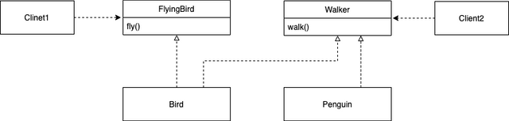
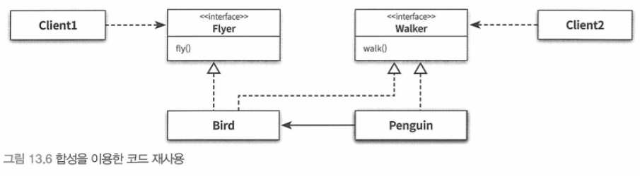

# CHAPTER 13. 서브클래싱과 서브타이핑

- 상속의 용도

  - 타입 계층을 구현하는 것

  </br>

  > 타입 계층 안에서 부모 클래스는 일반적인 개념을 구현하고 자식 클래스는 특수한 개념을 구현  
  > 부모 클래스는 자식클래스의 `일반화`이고, 자식 클래스는 부모 클래스의 `특수화`이다.

  </br>

  - 코드 재사용

  </br>

  > 부모 타입의 클래스를 재사용할 수 있긴 하지만,  
  > 상속을 사용할 경우 부모 클래스와 자식 크랠스가 강하게 결합되어  
  > 변경하기 어려운 코드를 얻을 확률이 높다.

  </br>

> 상속을 코드 재사용관점에서 사용하는 것이 아니라  
> 타입 계층을 목표로 사용할 경우 다형적으로 동작하는  
> 객체들의 관계에 기반해 확장 가능하고  
> 유연한 설계를 얻을 수 있게 된다.

</br>

## 타입

</br>

### 개념 관점의 타입

</br>

> 우리가 인지하는 세상의 사물의 종류

</br>

- 인스턴스 : 어떤 대상이 타입으로 분류될 때 그 대상
- 객체 : 일반적으로 타입의 인스턴스
- 심볼 : 타입에 이름을 붙인 것
- 내연 : 타입의 정의로서 타입에 속하는 객체들이 가지는 공통적인 속성이나 행동을 의미
- 외연 : 타입에 속하는 객체들의 집합, `프로그래밍 언어 타입`의 경우 자바, 루비, JS, C

### 프로그래밍 언어 관점의 타입

</br>

> 연속적인 비트에 의미와 제약을 주여하기 위해 사용  
> 비트에 담긴 데이터를 문자열로 다룰지 정수로 다룰지 전적으로 데이터를 사용하는 애플리케이션에 의해 결정된다.  
> 따라서 프로그래밍 언어의 관점에서 타입은 비트 묶음에 의미를 부여하기 위해 정의된 제약과 규칙을 가리킨다.

</br>

#### 프로그래밍 언어에서 타입이 사용되는 이유

</br>

- 타입에 수행될 수 있는 유효한 오퍼레이션의 집합 정의

  - 자바에서 '+' 연산자는 원시형 숫자 타입이나 문자열 타입의 객체에서는 사용할 수 있지만 다른 클래스의 인스턴스에 대해서는 사용할 수 없다.
  - C++ / C# 에서는 연산자 오버로딩을 통해 '+' 연산자 사용이 가능하다
  - 모든 객체지향 언어들은 객체의 타입에 따라 적용 가능한 연산자의 종류를 제한함으로써 프로그래머의 실수를 막아준다.

- 타입에 수행되는 오퍼레이션에 대해 미리 약속된 문맥 제공
  - 정수 a + b는 a와 b를 더한다. 문자열 a + b는 a와 b에 대해 문자열을 합친다 -> 즉, a 와 b에 부여된 타입이 '+' 연산자의 문맥을 정의
  - new 연산자는 타입에 정의된 크기만큼 저장 공간을 할당하고 생성된 객체를 초기화하기 위해 타입의 생성자를 자동으로 호출한다
  - 이 경우 객체를 생성하는 방법에 대한 문맥을 결정하는 것은 바로 객체의 타입이다.

</br>

> 타입을 정하는 이유는 적용 가능한 오퍼레이션의 정류와 의미를 정의하여  
> 코드의 의미를 명확하게 전달하고 개발자의 실수를 방지하기 위해 사용한다.

</br>

### 객체지향 패러다임 관점의 타입

</br>

- 개념관점에서 타입이란 공통의 특징을 공유하는 대상들의 분류
- 프로그래밍 언어관점에서 타입은 동일한 오퍼레이션을 적용할 수 있는 인스턴스들의 집합

</br>

> 객체지향 프로그래밍에서 오퍼레이션은 객체가 수실할 수 있는 메시지를 의미  
> 객체의 타입이란 `객체가 수신할 수 있는 메시지의 종류를 정의하는 것이다.`
> 객체지향에서는 객체가 수신할 수 있는 메시지를 기준으로  
> 타입을 분류함으로 동일한 퍼블릭 인터페이스를 가지는 객체들은 동일한 타입으로 분류할 수 있다.

</br>

## 타입 계층

</br>

### 타입 사이의 포함관계

> 수학에서 집합은 다른 집합을 포함할 수 있다.  
> 타입 역시 객체들의 집합이기 때문에 다른 타입을 포함하는 것이 가능하다.  
> 타입 안에 포함된 객체들은 좀 더 상세한 기준으로 묶어 새로운 타입을 정의하면 이 새로운 타입은 자연스럽게 기존 타입의 부분 집합이 된다.

|              프로그래밍 언어 타입의 인스턴스 집합               |
| :-------------------------------------------------------------: |
|  |

</br>

|              타입은 공통적인 특성을 가진 객체들을 포함하는 집합이다               |
| :-------------------------------------------------------------------------------: |
|  |

</br>

> 위 집합의 원소들을 집합의 관점에서 더 세분화된 타입의 집합을  
> 부분집합으로 포함할 수 있다.

- 객체지향 언어
  - 클래스 기반 : 자바, c++, 루비
  - 프로토타입 기반 : 자바스크립트, 셀프
- 절차적 언어 : c, 파스칼

</br>

> 다른타입을 포함하는 타입(`객체지향 언어`)은 포함되는 타입(`자바`)보다 좀 더 일반화된 의미를 표현할 수 있다.  
> 포함하는 타입은 외연 관점에서 더 크고 내연관점에 일반적이다.  
> 포함되는 타입은 외원 관점에서 더 작고 내연관점에서 더 특수하다.  
> 포함관계로 연결된 타입 사이에는 개념적으로 `일반화`와 `특수화` 관계가 존재한다는 것을 의미한다.

</br>

|              일반화/특수화 관계로 연결된 타입 계층               |
| :--------------------------------------------------------------: |
|  |

</br>

- 슈퍼타입 : 타입 계층을 구성할 때 두 타입 사이에서 더 일반적인 타입
  - 프로그래밍 언어는 객체지향언어와 절차적 언어의 슈퍼타입이다.
- 서브타입 : 더 특수한 타입

</br>

- 내연 관점
  - 일반화 : 어떤 타입의 정의를 좀 더 보편적이고 추상적으로 만드는 과정
  - 특수화 : 어떤 타입의 정의를 좀 더 구체적이고 문맥 종속적으로 만드는 과정
- 외연 관점
  - 일반화 : 특수한 타입의 인스턴스 집합을 표현하는 슈퍼셋(superset)
  - 특수화 : 일반적인 타입의 인스턴스 집합에 포함된 서브셋(subset)

</br>

- 슈퍼타입(superset)
  - 집합이 다른 집합의 모든 멤버를 포함한다
  - 타입 정의가 다른 타입보다 좀 더 일반적이다
- 서브타입(subset)
  - 집합에 포함되는 인스턴스들이 더 큰 집합에 포함된다
  - 타입 정의가 다른 타입보다 좀 더 구체적이다

</br>

### 객체지향 프로그래밍과 타입 계층

</br>

> 객체의 타입을 결정하는 것은 퍼블릭 인터페이스  
> 일반적인 타입이란 비교하려는 타입에 속한 객체들의 퍼블릭 인터페이스보다  
> 더 일반적인 퍼블릭 인터페이스를 가지는 객체들의 타입을 의미

</br>

- 퍼브릭 인터페이스의 관점에서 슈퍼타입과 서브타입을 다음과 같이 정의 할 수 있다.

</br>

- 슈퍼타입이란 서브타입이 정의한 퍼블릭 인터페이스를 일반화시켜 상대적으로 범용적이고 넓은 의미로 정의
- 서브타입이란 슈퍼타입이 정의한 퍼블릭 인터페이스를 특수화시켜 상대적으로 구쳊거이고 좁은 의미로 정의

</br>

## 서브클래싱과 서브타이핑

</br>

> 객체지향 프로그래밍 언어에서 타입을 구현하는 일반적인 방법은 클래스를 사용하는 것이다.  
> 그리고 타입 계층을 구현하는 일반적인 상속을 이용하는 것이다.  
> 상속을 이용해 타입계층을 구현한다는 것은 `부모 클래스가 슈퍼타입`, `자식 클래스가 서브타입`의  
> 역할을 수행하도록 클래스 사이의 관계를 정의한다는 것을 의미.

</br>

### 언제 상속을 사용해야 하는가?

</br>

> 아래 두 질문에 모두 '예'라고 답할 수 있는 경우에만 상속을 사용해야한다.

</br>

- 상속 관계각 is-a 관계를 모델링하는가?
  - 일반적으로 `자식클래스는 부모클래스다`라고 말해도 이상하지 않다면 상속을 사용할후보로 간주할 수 있다.
- 클라이언트 입장에서 부모 클래스의 타입으로 자식 클래스를 사용해도 무방한가?
  - 상속 계층을 사용하는 클라이언트 입장에서 부모클래스와 자식클래스의 차이점을 몰라야한다.
  - 이를 자식 클래스와 부모 클래스 사이의 `행동 호환성`이라 부른다.

</br>

> 두 번째 질문에 초점을 맞추어 클라이언트가 두 클래스에 대해 기대하는 행동이 다르다면  
> is-a 관계로 표현할 수 있다하더라도 상속을 사용해서는 안된다.

</br>

### is-a 관계

</br>

> 어떤 타입 S가 다른 타입 T의 일종이라면 당연히 `S is-a T`라고 말할 수 있어야 한다.  
> `하지만 is-a 관계가 직관적이고 명확하지 않다.`

</br>

- 펭귄은 새다.
- 새는 날 수 있다.

</br>

```java
public class Bird {
  public void fly() {....}
}

public class Penguin extends Bird {

}
```

> 하지만 코드에서는 `펭귄은 새이면서 날 수 있는 객체`로 표현되고 있다.  
> 어휘적으로 펭귄은 새가 맞지만 만약 새의 정의에 날 수 있다는 행동이 포함된다면  
> 펭귄은 새의 서브타입이 될 수 없다.
>
> 타입 계층의 의미는 행동이라는 문맥에 따라 달라질 수 있다.  
> 따라서 슈퍼타입과 서브타입의 관계는 is-a 관계보다 `행동호환성이 더 중요하다.`

</br>

### 행동 호환성

</br>

> 펭귄이 새가 아니라는 사실을 받아들이기 위한 출발점은 타입이 행동과 관련이 있다는 사실에 주목하는 것.  
> 타입의 이름 사이에 개념적 연관성이 있더라도, `행동에 연관성이 없다면 is-a 관계를 사용하지 말아야 한다.`

</br>

> 행동호환 여부를 판단하는 기준은 `클라이언트 관점`이다.  
> 클라이언트가 두 타입이 동일하게 행동할 것이라고 기대한다면 두 타입을 타입 계층으로 묶을 수 있다.

</br>

> Penguin이 Bird의 서브타입이 아닌 이유는 클라이언트 입장에서 모든 새가 날 수 있다고 가정하기 때문  
> 클라이언트가 날 수 있는 새만을 원한다고 가정할 때 Bird가 Penguin의 슈퍼타입일 경우  
> 업캐스팅을 막을 수 있는 방법은 없다.

</br>

- fly를 오버라이딩하여 내부 구현을 비워두는 경우
  - 클라이언트의 기대에 충족하지 못한다.
- peguin이 fly 메시지를 수신할 경우 exception을 던지는 경우
  - 이것 역시 클라이언트가 exception을 던지는 경우를 알고 있지 못하다면 기대에 충족하지 못하는 행위
- 혹은 fly를 호출할때 Penguin이 아닐 경우만 메시지를 수신할 수 있는 경우
  - 이 경우는 새로운 타입을 추가할 때마다 코드 수정을 요구하기 때문에 ocp 위반

</br>

> 코드를 생략하긴 했는데 제각기 다른 문제가 있지만 공통적으로 정리할 수 있는 것은  
> 클라이언트의 기대 충족을 하지 않는다는 것이다.  
> 클라이언트가 새는 날아야한다고 정의하였는데 못나는 새가 있다..?  
> 이제 이 부분에서 설계를 시작할 경우 사용자의 입장에서  
> 서브타입의 자세한 개념과 구현에 의존하여 개발할 수밖에 없을 것이다.

</br>

### 클라이언트의 기대에 따라 계층 분리하기

</br>

|                클라이언트 기대에 따라 상속 계층을 분리                 |
| :--------------------------------------------------------------------: |
|  |

</br>

```java
public class Bird{

}

public class FlyingBird extends Bird{
  public void fly(){

  }
}

public class Penguin extends Bird{

}
```

> 펭귄은 fly메서드를 수신하면 안된다.  
> fly 메시지를 수신할 수 있는 타입은 FlyingBird 타입뿐이다.

</br>

> 이 문제를 해결하는 또 다른 방법은 클라이언트에 따라 인터페이스를 분리하는 것  
> Bird가 날 수 있으면서 걸을 수 있어야 하고  
> 펭귄은 걸을 수 있다고만 가정하면  
> Bird는 fly와 walk 메서드를 함께 구현하고 펭귄은 walk만 구현해야한다는 것이다.

</br>

|                   클라이언트의 기대에 따른 인터페이스 분리                    |
| :---------------------------------------------------------------------------: |
|  |

</br>

> 만약 Penguin이 Bird의 코드를 재사용 해야한다면  
> 문법상으로 문제는 안되겠지만 peguin의 퍼블릭 인터페이스에 fly 오퍼레이션이  
> 추가되기 때문에 이 방법을 사용해서는 안된다.

</br>

|               합성을 이요한 코드 재사용                |
| :----------------------------------------------------: |
|  |

</br>

> 클라이언트의 요구에 따라 인터페이스가 변경된다.  
> 클라이언트에 따라 인터페이스를 분리하면 각 클라이언트의 요구가 바뀌더라도  
> 영향의 파급효과를 효과적으로 제어할 수 있게 된다.

</br>

### 서브 클래싱과 서브타이핑 -

</br>

- 서브클래싱(subclassing) : 다른 클래스의 코드를 재사용할 목적으로 상속을 사용하는 경우
  - 자식 클래스와 부모 클래스의 행동이 호환되지 않기 때문에 자식 클래스의 인스턴스가 부모 클래스의 인스턴스를 대체할 수 없다.
  - 구현상속(implementation inheritance) 또는 클래스 상속 (class inheritance)이라고 부른다
- 서브타이핑(subtyping) : 타입 계층을 구성하기 위해 상속을 사용하는 경우
  - 자식클래스와 부모 클래스의 행동이 호환되기 때문에 자식 클래스의 인스턴스가 부모 클래스의 인스턴스를 대체할 수 있다.
  - 서브타이핑을 인터페이스 상속 (interface inheritance) 이라고 한다
  - 서브타입이 슈퍼타입이 하는 모든 행동을 동일하게 할 수 있어야 한다
  - 행동 호환성을 만족 시켜야 한다.

</br>

> 서브클래싱과 서브타이핑을 나누는 기준은 상속을 사용하는 목적이다.  
> 자식 클래스가 부모 클래스의 코드를 재사용할 목적으로 상속을 사용했다면 `서브클래싱`  
> 부모 클래스의 인스턴스 대신 자식 클래스의 인스턴스를 사용할 목적이라면 `서브 타이핑`

</br>

> 슈퍼타입과 서브타입 사이의 관계에서 가장 중요한 것은 퍼블릭 인터페이스 이다.  
> 슈퍼타입 인스턴스를 요구하는 모든 곳에서 서브타입의 인스턴스를 대신 사용하기 위해 만족해야 하는 최소한의 조건은  
> 서브타입의 퍼블릭 인터페이스가 슈퍼 타입에서 정의한 퍼블릭 인터페이스와 동일하거나 더 많은 오퍼레이션을 포함해야 한다.  
> 따라서 개념적으로 서브타입이 슈퍼타입의 퍼블릭 인터페이스를 상속받는 것 처럼 보이게 된다.

</br>

## 리스코프 치환 원칙

</br>

> 바바라 리스코프에 의하면 상속 관계로 연결한 두 클래스가 서브타이핑 관계를 만족시키기 위해서는  
> 다음의 조건을 만족시켜야 한다.

</br>

> S형의 각 객체 o1에 대해 T1형의 객체 o2가 하나 있고,  
> T에 의해 정의된 모든 프로그램 P에서 T가 S로 치환 될 때  
> P의 동작이 변하지 않으면 S는 T의 서브타입이다.

</br>

> 리스코프 치환 원칙을 한마디로 정리하면  
> 서브타입은 그것의 기반 타입에 대해 대체 가능해야 한다는 것으로  
> 클라이언트가 차이점을 인식하지 못한 채 기반 클래스의 인터페이스를 통해  
> 서브 클래스를 사용할 수 있어야 한다는 것이다.  
> 리스코프원칙은 앞에서 논의한 행동 호환성을 설계 원칙으로 정리한 것이다.

</br>

> 리스코프원칙에 따르면 자식클래스가 부모 클래스와  
> 행동 호환성을 유지함으로써 부모 클래스를 대체할 수 있도록  
> 구현된 상속 관계만을 서브타이핑이라고 불러야 한다.

</br>

### Stack과 Vector

</br>

> 스택과 벡터는 리스코프 치환 원칙을 위반하는 전형적인 예이다.  
> 클라이언트가 부모 클래스인 Vector에 대해 기대하는 행동을  
> 스택에 대해서는 기대할 수 없기 때문에 행동 호환성을 만족시키지 않기 때문이다.  
> is-a 관계의 애매모호함을 설명하기 위해 예로 들었던 Penguin과 Bird 역시  
> 리스코프 치환 원칙을 위반한다.

</br>

```java
public class Rectangle {

  private int x,y,width,height;

  public Rectangle(int x, int y, int width, int height) {
    this.x = x;
    this.y = y;
    this.width = width;
    this.height = height;
  }

  public int getWidth() {
    return width;
  }

  public void setWidth(int width) {
    this.width = width;
  }

  public int getHeight() {
    return height;
  }

  public void setHeight(int height) {
    this.height = height;
  }
}

```

> Rectagle이 있고, 이제 Square를 추가하자.  
> 일반적으로 정사각형은 직사각형의 특수한 경우이고  
> 직사각형은 정사각형의 일반적인 경우익때문에  
> 정사각형과 직사각형은 is-a 관계가 성립한다.

</br>

```java
public class Square extends Rectangle {

  public Square(int x, int y, int size) {
    super(x, y, size, size);
  }

  @Override
  public void setWidth(int width) {
    super.setWidth(width);
    super.setHeight(width);
  }

  @Override
  public void setHeight(int height) {
    super.setWidth(height);
    super.setHeight(height);
  }
}
```

</br>

> 정사각형은 너비와 높이가 동일해야 한다.  
> Square 클래스는 width와 height를 동일하게 설정해야 한다.

</br>

```java
public void resize(Rectangle rectangle, int width, int height){
    rectangle.setHeight(height);
    rectangle.setWidth(width);
    assert rectangle.getWidth() == width && rectangle.getHeight() == height;
  }
```

</br>

> 위 메서드에서 Rectangle 대신 Square를 전달할 경우  
> Square의 너비와 너비는 나중에 설정한 width로 설정 될 것이다.  
> 따라서 아래와 같은 처음에 rectangle.getHeight == heigth 부분에서  
> 메서드 실행이 실패 할 것이다.

</br>

> 따라서 위와같은 관계에서 두 클래스는 리스코프 치환 원칙을 위반함으로  
> 서브타이핑 관계가 아니라 서브클래싱 관계다.  
> Rectangle은 is-a라는 말이 얼마나 우리의 직관에서 벗어 날 수 있는지를 보여준다.  
> 중요한 것은 클라이언트 관점에서 행동이 호환 되는지 여부다.  
> 그리고 행동이 호환 될 경우에만 자식 클래스가 부모 클래스 대신 사용될 수 있다.

</br>

### 클라이언트와 대체 가능성

</br>

> Square가 Rectangle을 대체할 수 없는 이유는 클라이언트의 관점에서  
> Square와 Rectangle이 다르기 때문이다.  
> 클라이언트 입장에서 정사각형을 추상화한 Square는 직사각형을 추상화한  
> Rectangle과 동일하지 않다는 점이다.

</br>

> 리스코프 치환 원칙은 자식 클래스가 부모 클래스를 대체하기 위해서  
> 부모 클래스에 대한 클라이언트의 가정을 준수해야 한다는 것을 강조한다.  
> Square를 Rectangle의 자식 클래스로 만드는 것은  
> Rectangle에 대해 클라이언트가 세운 가정을 송두리째 뒤흔드는 것이다.

</br>

> 리스코프 치환 원칙은 상속 관계에 있는 두 클래스 사이의 관계를  
> 클라이언트와 떨어트려 놓고 판단하지 말라고 말한다.  
> 상속 관계는 클라이언트 관점에서 자식 클래스가 부모 클래스를 대체할 수 있을 때만 올바르다.

</br>

### is-a 관계 다시 살펴보기

</br>

- 상속관계가 is-a 관계를 모델링 하는가?
- 클라이언트 입장에서 부모 클래스의 타입으로 자식 클래스를 사용해도 무방한가?

</br>

> 어휘적으로 is-a라고 말할 수 있다고 하더라도  
> 그 관계를 is-a관계라 말할 수 없고,  
> is-a는 클라이언트 관점(행동 호환성 관점)에서만 참이다.

</br>

> is-a 관계는 객체의 속성이 아닌 객체의 행동이라는 점을 명심하자!

</br>

### 리스코프 치환 원칙은 유연한 설계의 기반이다

</br>

- 클라이언트의 입장에서 퍼블릭 인터페이스의 행동 방식이 변경되지 않는다면 클라이언트의 코드를 변경하지 않고도 새로운 자식과 협력할 수 있다.

</br>

> 리스코프 치환 원칙은 클라이언트가 어떤 자식 클래스와도 안정적으로  
> 협력할 수 있는 상속 구조를 구현할 수 있는 가이드라인을 제공한다.  
> 새로운 자식 클래스를 추가하더라도 클라이언트 입장에서 동일하게 행동하기만 한다면  
> 클라이언트를 수정하지 않고도 상속 계층을 확장할 수 있다.

</br>

```java
public class OverlappedDiscountPolicy extends DiscountPolicy {
    private List<DiscountPolicy> discountPolicies = new ArrayList<>();

    public OverlappedDiscountPolicy(DiscountPolicy ... discountPolicies) {
        this. discountPolicies = Arrays.asList(discountPolicies);
    }

    @Override
    protected Money getDiscountAmount(Screening screening) {
        Money result = Money.ZERO;
        for(DiscountPolicy each : discountPolicies) {
            result = result.plus(each.calculateDiscountAmount(screening));
        }
        return result;
    }
}
```

> 우리는 8장에서 중복 할인 정책을 추가하더라도  
> 클라이언트를 수정할 필요가 없었던 것을 확인했다.

</br>

- 의존성 역전 원칙

> 상위 수준의 모듈이자 구체 클래스인 Movie와
> 하위 수준의 모듈인 OverlappedDiscountPolicy 모두 추상 클래스인  
> DiscountPolicy에 의존한다.

- 리스코프 치환 원칙

> DiscountPolicy와 협력하는 Movie의 관점에서
> DiscountPolicy 대신 OverlappedDiscountPolicy와 협력하더라도  
> 아무 문제가 없다. OverlappedDiscountPolicy는 클라이언트에 대한 영향없이  
> DiscountPolicy를 대체할 수 있다.

- 개방 폐쇄 원칙

</br>

> 중복 할인 정책이라는 새로운 기능을 추가하기 위해  
> DiscountPolicy의 자식 클래스인 Overlapped DiscountPolicy를  
> 추가하더라도 Movie에는 영향을 끼치지 않는다.

</br>

|            DIP, LSP, OCP가 조합된 유연한 설계            |
| :------------------------------------------------------: |
| [DIP, LSP, OCP가 조합된 유연한 설계](../res/_13_lsp.png) |

</br>

> 자식 클래스가 클라이언트 관점에서 부모 클래스를 대체할 수 있다면  
> 기능 확장을 위한 자식 클래스를 추가하더라도  
> 코드를 수정할 필요가 없어진다.  
> 따라서 리스코프 치환 원칙은 개방 폐쇄 원칙을 만족하는 설계를 위한 전제조건이다!

</br>

## 계약에 의한 설계와 서브타이핑

</br>

> 클라이언트와 서버 사이의 협력을 의무와 이익으로 구성된 계약의 관점에서  
> 표현하는 것을 계약의 의한 설계라고 부른다.

</br>

- 계약의 의한 설계
  - 사전 조건 : 클라이언트가 정상적으로 메서드를 실행하기 위하 만족시켜야하는 조건
  - 사후 조건 : 메서드가 실행 된 후에 서버가 클라이언트에게 보장해야하는 사후 조건
  - 클래스 불변식 : 메서드 실행 전과 실행 후에 인스턴스가 만족시켜야 하는 조건

</br>

- 리스코프 치환 원칙과 계약에 의한 설계

> 서브타입이 리스코프 치환 원칙을 만족시키기 위해서는 클라이언트와 슈퍼타입 간에 체결된 계약 을 준수해야한다.

</br>

```java
public class Movie{
  ...
  public Money calculateMovieFee(Screening screening){
    return fee.minus(discountPolicy.calculateDiscountAmount(screening));
  }
}
```

</br>

> Movie는 DiscountPolicy의 인스턴스에게 calculateDiscountAmount 메시지를 전송하는 클라이언트다.  
> DicountPolicy는 Movie의 메시지를 수신한 후 할인 가격을 계산해서 반환한다.

</br>

```java
public abstract class DiscountPolicy {

    public Money calculateDiscountAmount(Screening screening) {
      for(DiscountCondition each : condtions){
        if(each.isSatisfiedBy(screening)){
          return getDiscountAmount(screening);
        }
      }

      return screening.getMovieFee();
    }

    abstract protected Money getDiscountAmount(Screening Screening);
}
```

</br>

> 계약에 의한 설계에 따르면 협력하는 클라이언트와 슈퍼타입의 인스턴스 사이에는 어떤 계약이 맺어져 있다.  
> 클라이언트와 슈퍼타입은 이 계약을 준수할 때만 정상적으로 협력할 수 있다.

</br>

> 리스코프 치환 원칙은 서브타입이 슈퍼타입을 대체할 수 있어야하는 것이고  
> 클라이언트가 그 차이를 인식하지 못한채 슈퍼타입의 인터페이스를 사용해  
> 서브타입과 협력할 수 있어야한다는 것이다.

</br>

> 그러면 서브타입이 슈퍼타입처럼 보일 수 있는 방법은  
> 클라이언트가 슈퍼타입과 맺은 계약을 서브타입이 준수하는 것이다.

</br>

```java

public abstract class DiscountPolicy {
    private List<DiscountCondition> conditions = new ArrayList<>();

    public DiscountPolicy(DiscountCondition... conditions) {
        this.conditions = Arrays.asList(conditions);
    }

    public Money calculateDiscountAmount(Screening screening) {
        checkPrecondition(screening);

        Money amount = Money.ZERO;
        for(DiscountCondition each : conditions) {
            if (each.isSatisfiedBy(screening)) {
                amount = getDiscountAmount(screening);
                checkPostcondition(amount);
                return amount;
            }
        }

        amount = screening.getMovieFee();
        checkPostcondition(amount);
        return amount;
    }

    protected void checkPrecondition(Screening screening) {
        assert screening != null &&
                screening.getStartTime().isAfter(LocalDateTime.now());
    }

    protected void checkPostcondition(Money amount) {
        assert amount != null && amount.isGreaterThanOrEqual(Money.ZERO);
    }


    abstract protected Money getDiscountAmount(Screening Screening);
}

```

> 이와 같이 사전 조건과 사후조건을 추가하면  
> Movie는 Screening의 사존 조건을 위반하는 screening을 전달해서는 안된다.

</br>

### 서브타입과 계약

</br>

> 계약의 관점에서 상속이 초래하는 가장 큰 문제는 자식 클래스가 부모 클래스의 메서드를 오버라이딩할 수 있다는 것이다.

</br>

- 서브타입에 더 강력한 사전 조건을 정의 할 수 없다.

> 클라이언트 입장에서 슈퍼타입과 서브타입을 일치시켜 사용하기 때문에  
> 하위타입의 사전 조건을 알 방법이 없다.

</br>

- 서브 타입에 슈퍼타입과 같거나 더 약한 사전 조건을 정의할 수 있다.
  - 슈퍼타입의 파라미터는 양수만 허용한다.
  - 서브타입 파라미터는 정수만 들어올 수 있다.
    - 어차피 슈퍼타입을 사용하는 클라이언트는 양수만 넣을 것이니깐!

</br>

- 서브 타입에 슈퍼타입과 같거나 더 강한 사후조건을 정의할 수 있다.
  - 슈퍼타입 메서드의 반환값은 0보다 커야한다.
  - 서브타입 메서드의 반환값은 1000보다 커야한다.
    - 슈퍼타입을 사용하는 클라이언트는 어차피 0보다 크기만 하면 됨으로 성립한다.

</br>

- 서브타입에 더 약한 사후조건을 정의할 수 없다.
  - 슈퍼타입 메서드의 반환 값은 1000보다 크면 된다.
  - 서브타입 메서드의 반환값은 0보다 크면 된다.
    - 슈퍼타입을 사용하는 사용자는 1000보다 큰 값을 기대함으로 행동 호환성이 맞지 않는다.

</br>

> 계약에 의한 설계는 클라이언트 관점에서 대체 가능성을  
> 계약으로 설명할 수 있다는 사실을 잘 보여준다.  
> 따라서 서브타이핑을 위해 상속을 고려한다면  
> 부모클래스가 클라이언트와 맺고 있는 계약에 관해 고민해야한다.
