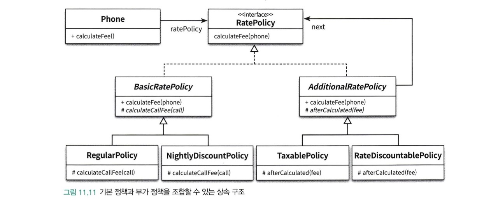
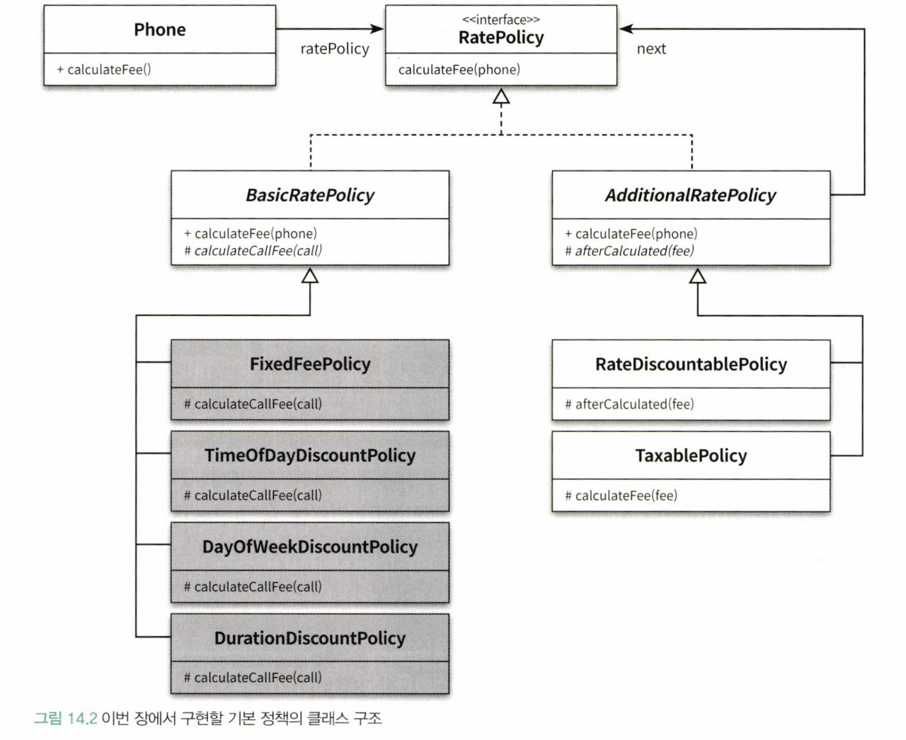
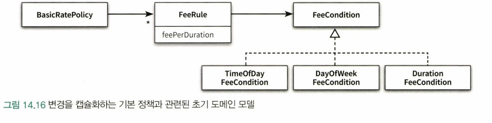

# CHAPTER 14. 일관성 있는 협력

</br>

> 일관성은 설계에 드는 비용을 감소시킨다.  
> 과거의 해결 방안을 반복적으로 사용해서 유사한 기능을 구현하는데  
> 드는 시간과 노력을 대폭 줄일 수 있기 때문이다.  
> 일관성 있는 설계가 가져다 주는 더 큰 이익은 코드가 이해하기 쉬워진다는 것이다.  
> 가능하면 유사한 기능을 구현하기 위해 유사한 협력패턴을 사용하라!

</br>

## 핸드폰 과금 시스템 변경하기

</br>

### 기본 정책 확장

- 고정요금 방식
  - ex) 10초당 18원
- 시간대별 방식
  - ex) 00 ~ 19시 10초당 18원
  - ex) 19 ~ 24시 10초당 15원
- 요일별 방식
  - ex) 평일 10초당 38원
  - ex) 공휴일 10초당 19원
- 구간별 방식
  - ex) 초기 1분 10초당 50원
  - ex) 1분 이후 10초당 20원

</br>

|             조합 가능한 모든 요금 계산서             |
| :--------------------------------------------------: |
|  |

</br>

|         이번 장에서 구현할 기본 정책의 클래스 구조          |
| :---------------------------------------------------------: |
|  |

</br>

```java
public class FixedFeePolicy extends BasicRatePolicy {
    private Money amount;
    private Duration seconds;

    public FixedFeePolicy(Money amount, Duration seconds) {
        this.amount = amount;
        this.seconds = seconds;
    }

    @Override
    protected Money calculateCallFee(Call call) {
        return amount.times(call.getDuration().getSeconds() / seconds.getSeconds());
    }
}
```

> 기존의 RegularPolicy 클래스의 이름을 FixedFeePolicy로 수정

</br>

### 시간대별 방식 구현하기

</br>

> 시간대별 방식에 따라 요금을 계산하기 위해서는 통화 기간을 정해진 시간대별로  
> 나눈 후 각 시간대별로 서로 다른 계산 규칙을 적용해야 한다.
> 또한 시간대별 방식의 통화 요금을 계산하기 위해서는  
> `통화의 시작, 종료시간, 시작일자, 종료일자`도 함께 고려되어야 한다.

</br>

```java
public class DateTimeInterval {
    public static DateTimeInterval of(LocalDateTime from, LocalDateTime to) {
        return new DateTimeInterval(from, to);
    }

    public static DateTimeInterval toMidnight(LocalDateTime from) {
        return new DateTimeInterval(from, LocalDateTime.of(from.toLocalDate(), LocalTime.of(23, 59, 59, 999_999_999)));
    }

    public static DateTimeInterval fromMidnight(LocalDateTime to) {
        return new DateTimeInterval(LocalDateTime.of(to.toLocalDate(), LocalTime.of(0, 0)), to);
    }

    public static DateTimeInterval during(LocalDate date) {
        return new DateTimeInterval(
                LocalDateTime.of(date, LocalTime.of(0, 0)),
                LocalDateTime.of(date, LocalTime.of(23, 59, 59, 999_999_999)));
    }

    private DateTimeInterval(LocalDateTime from, LocalDateTime to) {
        this.from = from;
        this.to = to;
    }

    public Duration duration() {
        return Duration.between(from, to);
    }

    public LocalDateTime getFrom() {
        return from;
    }

    public LocalDateTime getTo() {
        return to;
    }

}
```

</br>

> 시간대별 방식을 구현하는데 있어 핵심은 규칙에 따라 통화 시간을 분할하는 방법을 결정하는 것이다.  
> 이를 위해 기간을 편하게 관리할 수 있는 DateTimeInterval 클래스를 추가  
> DateTimeInterval은 시작 시간과 종료 시간을 인스턴스 변수로 포함하며  
> 객체 생성을 위한 정적 메서드인 of, toMidnight, fromMidnight, during을 제공한다.

</br>

```java
public class Call {
  private DateTimeInterval interval;
  public Call(LocalDateTime from, LocalDateTime to) {
  	this.interval = DateTimeInterval.of(from, to);
  }

  public Duration getDuration() {
  	return interval.duration();
  }

  public LocalDateTime getFrom() {
  	return interval.getFrom();
  }

  public LocalDateTime getTo() {
  	return interval.getTo();
  }

  public DateTimeInterval getInterval() {
  	return interval;
  }

}
```

</br>

> Call 클래스는 이제 DateTimeInterval 타입을 사용하여  
> 통화 기간을 단위로 표현할 수 있게 되었다.

</br>

- 전체 통화 시간을 일자와 시간 기준으로 분할해서 계산하기
  - 통화 기간을 일자별로 분리
  - 일자별로 분리된 기간을 다시 시간대별 규칙에 따라 분리 후 각 기간에 대해 요금 계산

</br>

> 두 작업을 객체 책임으로 할당해 볼 때,  
> 책임을 할당하는 기본 원칙은 책임을 수행하는데 필요한 정보를 가장 잘 알고 있는  
> 정보 전문가에게 할당하는 것이다.  
> 통화 기간에 대해 잘 아는 객체는 call이지만 기간 자체를 처리하는 방법에 대해서는 아니다.  
> 기간을 처리하는 방법에 대한 전문가는 DateTimeInterval이다.  
> `따라서 기간을 일자 단위로 나누는 책임은 DateTimeInterval에게 할당하고`  
> `Call이 DateTimeInterval에게 분할을 요청하도록 협력을 설계하는 것이 적절`할 것이다.

</br>

```java
public class TimeOfDayDiscountPolicy extends BasicRatePolicy {
    private List<LocalTime> starts = new ArrayList<LocalTime>();
    private List<LocalTime> ends = new ArrayList<LocalTime>();
    private List<Duration> durations = new ArrayList<Duration>();
    private List<Money>  amounts = new ArrayList<Money>();

    @Override
    protected Money calculateCallFee(Call call) {
        Money result = Money.ZERO;
        for(DateTimeInterval interval : call.splitByDay()) {
            for(int loop=0; loop < starts.size(); loop++) {
                result.plus(amounts.get(loop).times(Duration.between(from(interval, starts.get(loop)),
                        to(interval, ends.get(loop))).getSeconds() / durations.get(loop).getSeconds()));
            }
        }
        return result;
    }

    private LocalTime from(DateTimeInterval interval, LocalTime from) {
        return interval.getFrom().toLocalTime().isBefore(from) ? from : interval.getFrom().toLocalTime();
    }

    private LocalTime to(DateTimeInterval interval, LocalTime to) {
        return interval.getTo().toLocalTime().isAfter(to) ? to : interval.getTo().toLocalTime();
    }
}
```

</br>

> 단 주의할 점은 여기서 starts, ends, durations, amounts.  
> 같은 규칙에 속하는 요소들이 같은 인덱스에 위치해야한다.

</br>

</br>

```java
public class Call {
	public List<DateTimeInterval> splitByDay() {
		return interval.splitByDay();
	}
}
```

</br>

```java
public class DateTimeInterval {
    public List<DateTimeInterval> splitByDay() {
        if (days() > 0) {
            return split(days());
        }

        return Arrays.asList(this);
    }

    private long days() {
        return Duration.between(from.toLocalDate().atStartOfDay(), to.toLocalDate().atStartOfDay()).toDays();
    }

    private List<DateTimeInterval> split(long days) {
        List<DateTimeInterval> result = new ArrayList<>();
        addFirstDay(result);
        addMiddleDays(result, days);
        addLastDay(result);
        return result;
    }

    private void addFirstDay(List<DateTimeInterval> result) {
        result.add(DateTimeInterval.toMidnight(from));
    }

    private void addMiddleDays(List<DateTimeInterval> result, long days) {
        for(int loop=1; loop < days; loop++) {
            result.add(DateTimeInterval.during(from.toLocalDate().plusDays(loop)));
        }
    }

    private void addLastDay(List<DateTimeInterval> result) {
        result.add(DateTimeInterval.fromMidnight(to));
    }
}
```

</br>

> splitByDay 메서드는 통화 기간을 일자별로 분할해서 반환  
> days 메서드는 from과 to 사이에 포함된 날짜 수를 반환  
> 만약 days 메서드의 반환값이 1보다 크다면 split 메서드를 호출하여  
> 날짜 수만큼 분리한다.
> days가 1이라면 현재의 DateTimeInterval  
> 인스턴스를 리스트에 담아 그대로 반환

</br>

### 요일별 방식 구현하기

</br>

> 요일별 방식은 요일별로 요금 규칙을 다르게 설정할 수 있다.  
> 각 규칙은 요일의 목록, 단위 시간, 단위 요금이라는 3가지 요소로 구성된다.

</br>

```java
public class DayOfWeekDiscountRule {
    private List<DayOfWeek> dayOfWeeks = new ArrayList<>();
    private Duration duration = Duration.ZERO;
    private Money amount = Money.ZERO;

    public DayOfWeekDiscountRule(List<DayOfWeek> dayOfWeeks,
                                 Duration duration, Money  amount) {
        this.dayOfWeeks = dayOfWeeks;
        this.duration = duration;
        this.amount = amount;
    }

    public Money calculate(DateTimeInterval interval) {
        if (dayOfWeeks.contains(interval.getFrom().getDayOfWeek())) {
            return amount.times(interval.duration().getSeconds() / duration.getSeconds());
        }

        return Money.ZERO;
    }
}
```

</br>

```java
public class DayOfWeekDiscountPolicy extends BasicRatePolicy {
    private List<DayOfWeekDiscountRule> rules = new ArrayList<>();

    public DayOfWeekDiscountPolicy(List<DayOfWeekDiscountRule> rules) {
        this.rules = rules;
    }

    @Override
    protected Money calculateCallFee(Call call) {
        Money result = Money.ZERO;
        for(DateTimeInterval interval : call.getInterval().splitByDay()) {
            for(DayOfWeekDiscountRule rule: rules) { result.plus(rule.calculate(interval));
            }
        }
        return result;
    }
}
```

</br>

> 하지만 요일별 방식 역시 통화기간이 여러날에 겹쳐 있을 수 있다.  
> 시간대별 방식과 동일하게 통화기간을 날짜 경계로 분리하고  
> 분리된 각 통화 기간을 요일별로 설정된 요금 정책에 따라 적잘하게 계산해야 한다.

</br>

### 구간별 방식 구현하기

</br>

> 겉으로 보기에는 문제가 없이 잘 구현된 것 같아 보인다.  
> FixedFeePolicy, TimeOfDayDiscountPolicy, DayOfWeekDiscountPolicy  
> 세 클래스는 통화 요금을 정확하게 계산하고 있고 응집도와 결합도 측면에서도 특별히 문제는 없어 보인다.  
> 그러나 이 클래스들을 함께 모아놓고 보면 문제점이 보인다

</br>

- 새로운 정책을 추가하거나 기존 정책을 수정할 때 더 많은 이해도를 요구한다.
- 일단 이해하기가 너무 어렵다.

</br>

## 설계에 일관성 부여하기

</br>

> 설계에 일관성을 부여하기 위한 연습

- 다양한 설계 경험 익히기
- 디자인 패턴을 학습하고 변경이라는 문맥안에 적용해보기
- 협력을 일관성 있게 만들기 위해 다음과 같은 기본 지침을 따르기
  - 변하는 개념을 변하지 않는 개념으로부터 분리
  - 변하는 개념을 캡슐화

</br>

### 조건 로직 대 객체 탐색

</br>

```java
public class ReservationAgency {
    public Reservation reserve(...) {
        for (DiscountCondition condition : movie,getDiscountConditions()) {
            if (condition.getType() == DiscountCondtionType.PERIDOD) {
                // 기간조건
            } else {
                // 회차조건
            }
        }

        if (discountable) {
            switch(movie.getMovieType)) {
                case AMOUNT_DISCOUNT: // 금액 할인 정책
                case PERCENT_DISCOUNT: // 비율 할인 정책
                case NONE_DISCOUNT: // 할인 정책 없음
            }
        } else {
            // 할인 정책이 불가능한 경우
        }
    }
}
```

> 4장에서 절차지향으로 구현했던 ReservationAgency의 기본 구조 정리한 것이다.  
> 이 설계가 나쁜 이유는 변경의 주기가 서로 다른 코드가 한 클래스 안에 뭉쳐있기 때문이고,  
> 새로운 할인 정책이나 할인 조건을 추가하기 위해서는 기존 코드 내부를 수정해야 한다는 것이다.
>
> 객체지향식 접근방법은 조건로직을 객체 사이의 이동으로 옮기는 것이다.

</br>

```java
public class Movie {
    private DiscountPolicy discountPolicy;

    public Money calculteMovieFee(Screening screening) {
        return fee.minus(discountPolicy.calculateDiscountAmount(screening));
    }
}
```

</br>

> Movie를 살펴보면 discountPolicy가  
> 어떤 종류의 정책인지 확인하지 않는다.  
> 단순히 discountPolicy에 필요한 메시질ㄹ 전송할 뿐이다.
> 즉, `할인 정책의 종류를 체크하던 조건문이 dicountPolicy로 객체 이동으로 대체된 것이다.`

</br>

> 다형성은 바로 이런 조건 로직을 객체사이의 이동으로 바꾸기 위해  
> 객체지향이 제공하는 설계 기법이다.

</br>

> 조건 로직을 객체 사이의 이동으로 대체하기 위해서는  
> 커다란 클래스를 더 작은 클래스들로 분리해야한다.  
> 클래스를 분리하기 위한 가장 중요한 기준은 `변경의 이유와 주기이다!`

</br>

> GOF에 의하면 인터페이스에 대해 설계해야 한다고 조언하는데  
> 이것은 결합도가 느슨해질 수 있도록 엔티티 사이의 관계가 추상적인 수준에서  
> 정해져야 한다는 사실을 다르게 표현한 것이다

</br>

### 캡슐화 다시 살펴보기

</br>

> 데이터 은닉은 오직 외부에 공개된 메서드를 통해서만  
> 객체의 내부에 접근할 수 있게 제한하여 객체 내부의 상태 구현을 숨기는 기법이다.

</br>

> 캡슐화란 단순히 데이터를 감추는 것이 아니다.  
> 소프트웨어 안에서 변할 수 있는 모든 `개념`을 감추는 것이다.

</br>

> 캡슐화의 가장 대표적인 예는 객체의 퍼블릭 인터페이스와 구현을 분리하는 것이다.  
> 객체를 구현한 개발자는 필요할 때 객체의 내부 구현을 수정하기를 원한다.  
> 객체와 협력하는 클라이언트의 개발자는 객체이의 인터페이스가 변하지 않기를 원한다.  
> 따라서 자주 변경되는 내부 구현을 안정적인 퍼블릭 인터페이스 뒤로 숨겨야한다.

</br>

- 데이터 캡슐화
  - Movie 클래스의 인스턴스 변수 title의 가시성은 private이기 때문에 외부에서 직접 접근할 수 없다.
  - 이 속성에 접근할 수 있는 유일한 방법은 메서드를 이용하는 것뿐이다. 다시 말해 클래스는 내부에 관리하는 데이터를 캡슐화한다.
- 메서드 캡슐화
  - DiscountPolicy 클래스에서 정의돼 있는 getDiscountAmount 메서드의 가시성은 protected다.
  - 클래스의 외부에서는 이 메서드에 직접 접근할 수 없고 클래스 내부와 서브 클래스에서만 접근이 가능하다.
  - 따라서 클래스 외부에 영향을 미치지 않고 메서드를 수정할 수 있다.
  - 다시 말해 클래스의 내부 행동을 캡슐화하고 있는 것이다.
- 객체 캡슐화 : Movie 클래스는 DiscountPolicy 타입의 인스턴스 변수 discountPolicy를 포함한다.
  - 이 인스턴스 변수는 private 가시성을 가지기 때문에 Movie와 DisvountPolicy 사이의 관계를 변경 하더라도 외부에는 영향을 미치지 않는다.
  - 다시 말해서 객체와 객체 사이의 관계를 캡슐화한다.
- 서브타입 캡슐화
  - Movie는 DiscountPolicy에 대해서는 알고 있지만 AmountDiscountPolicy와 PercentDiscountPolicy에 대해서는 알지 못한다.
  - 그러나 실제로 실행 시점에는 이 클래스들의 인스턴스와 협력할 수 있다.
  - 이것은 파생 클래스인 DiscountPolicy와의 추상적인 관계가 AmountDiscountPolicy와 PercentDiscountPolicy의 존재를 감추고 있기 때문이다.
  - 다시 말해 서브타입의 종류를 캡슐화하고 있는 것이다.

</br>

> 캡슐화란 단지 데이터 은닉이 아니다.  
> 코드 수정으로 인한 파급효과를 제어할 수 있는 모든 기법이 캡슐화의 일종이다.  
> 일반적으로 `데이터 캡슐화`와 `메서드 캡슐화`는 개별 객체에 대한 변경을 관리하기 위해 사용하고  
> `객체 캡슐화`와 `서브타입 캡슐화`는 협력에 참여하는 객체들의 관계에 대한 변경을 관리하기 위해 사용

</br>

> 협력을 일관성 있게 만들기 위해 사용하는 방법은  
> 서브타입 캡슐화와 객체 캡슐화를 조합하는 것이다.  
> 서브타입 캡슐화는 인터페이스 상속을 사용하고,  
> 객체 캡슐화는 합성을 사용한다!

</br>

## 일관성 있는 기본 정책 구현하기

</br>

### 변경 분리하기

</br>

> 일관성 있는 협력을 만들기 위한 첫 단계는 변하는 개념과 변치 않는 개념을 분리하는 것이다

</br>

- 고정요금 방식
  - ex) 10초당 18원
- 시간대별 방식
  - ex) 00 ~ 19시 10초당 18원
  - ex) 19 ~ 24시 10초당 15원
- 요일별 방식
  - ex) 평일 10초당 38원
  - ex) 공휴일 10초당 19원
- 구간별 방식
  - ex) 초기 1분 10초당 50원
  - ex) 1분 이후 10초당 20원

</br>

> 먼저 시간대별, 요일별, 구간별 방식의 공통점은  
> 기본정책을 구성하는 방식이 유사하다

</br>

- 기본 정책은 한 개 이상의 `규칙`으로 구성된다.
- 하나의 `규칙`은 `적용 조건`과 `단위 요금`의 조합이다.

</br>

> 즉 모든 규칙에 적용 조건이 포함된다는 사실은 변하지 않지만  
> 실제 조건의 세부적인 내용이 다르다.
> `변하지 않는 규칙`으로부터 변하는 `적용조건`을 분리해야한다.

</br>

### 변경 캡슐화 하기

</br>

> 협력을 일관성 있게 만들기 위해서는 변경을 캡슐화해서 파급효과를 줄여야 한다.  
> 여기서 변하지 않는 것은 `규칙`이다. 변하는 것은 `적용조건`이다.  
> 따라서 규칙으로부터 적용조건을 분리하여 추상화한 후 시간대별, 요일별, 구간별 방식을 이 추상화의 서브타입으로 만들어야 한다.  
> 그 후에 규칙이 적용조건을 표현하는 추상화를 합성관계로 연결하는 것이 객체의 캡슐화이다.

</br>

|              변경을 캡슐화하는 기본정책과 관련된 초기 도메인 모델              |
| :----------------------------------------------------------------------------: |
|  |

</br>

> FeeRule이 FeeCondition을 합성 관계로 연결하고  
> FeeRule은 오직 FeeCondition에만 의존하고 있다.  
> 따라서 변하는 FeeCondtion의 서브타입은 변하지 않는 FeeRule로부터 캡슐화된다.

</br>

### 추상화 수준에서 협력패턴 구현하기

</br>

```java
public interface FeeCondition {
    List<DateTimeInterval> findTimeIntervals(Call call);
}
```

> FeeCondtion은 findTimeIntervals라는  
> 단하나의 오퍼레이션을 포함하는 간단한 인터페이스  
> 이 오퍼레이션은 인자로 전달된 Call의 통화 기간 중에서  
> `적용 조건`을 만족하는 기간을 구한 후 List로 반환한다.

</br>

```java
public class FeeRule {
    private FeeCondition feeCondition;
    private FeePerDuration feePerDuration;

    public FeeRule(FeeCondition feeCondition, FeePerDuration feePerDuration) {
        this.feeCondition = feeCondition;
        this.feePerDuration = feePerDuration;
    }

    public Money calculateFee(Call call) {
        return feeCondition.findTimeIntervals(call)
                .stream()
                .map(each -> feePerDuration.calculate(each))
                .reduce(Money.ZERO, (first, second) -> first.plus(second));
    }
}
```

</br>

> FeeRule은 feePerDuration(단위 요금)과 FeeCondtion(적용 조건)을  
> 저장하는 두 개의 인스턴스 변수로 구성된다.

</br>

```java
public class FeePerDuration {
    private Money fee;
    private Duration duration;

    public FeePerDuration(Money fee, Duration duration) {
        this.fee = fee;
        this.duration = duration;
    }

    public Money calculate(DateTimeInterval interval) {
        return fee.times(Math.ceil((double)interval.duration().toNanos() / duration.toNanos()));
    }
}
```

</br>

> FeePerDuration 클래스는 `단위 시간당 요금`이라는 개념을 표현하고  
> 이 정보를 이용하여 일정 기간동안의 요금을 계산하는 calculate 메서드를 구현한다.

</br>

```java

public final class BasicRatePolicy implements RatePolicy {
    private List<FeeRule> feeRules = new ArrayList<>();

    public BasicRatePolicy(FeeRule ... feeRules) {
        this.feeRules = Arrays.asList(feeRules);
    }

    @Override
    public Money calculateFee(Phone phone) {
        return phone.getCalls()
                .stream()
                .map(call -> calculate(call))
                .reduce(Money.ZERO, (first, second) -> first.plus(second));
    }

    private Money calculate(Call call) {
        return feeRules
                .stream()
                .map(rule -> rule.calculateFee(call))
                .reduce(Money.ZERO, (first, second) -> first.plus(second));
    }
}
```

</br>

> 이제 BasicRatePolicy가 FeeRule의 컬렉션을 이용하여 전체 통화 요금을 계산하도록 수정할 수 있다.

</br>

> 지금까지 구현한 모든 클래스와 인터페이스는 모두 변하지 않는 추상화에 해당한다.  
> 변하지 않는 것들을 캡슐화-추상화 시키고, 변하는 것들에 대해 하위 타입으로 구현하여  
> 조건문을 객체사이의 이동으로 옮기자!

</br>
