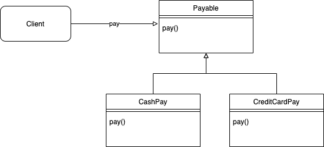
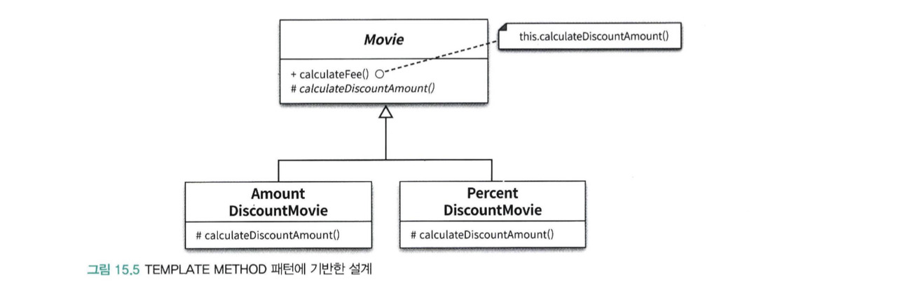
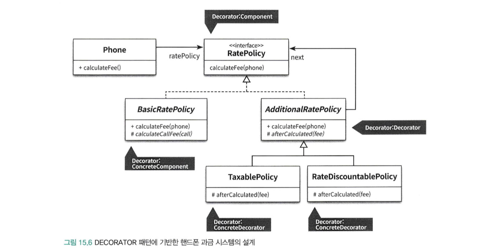
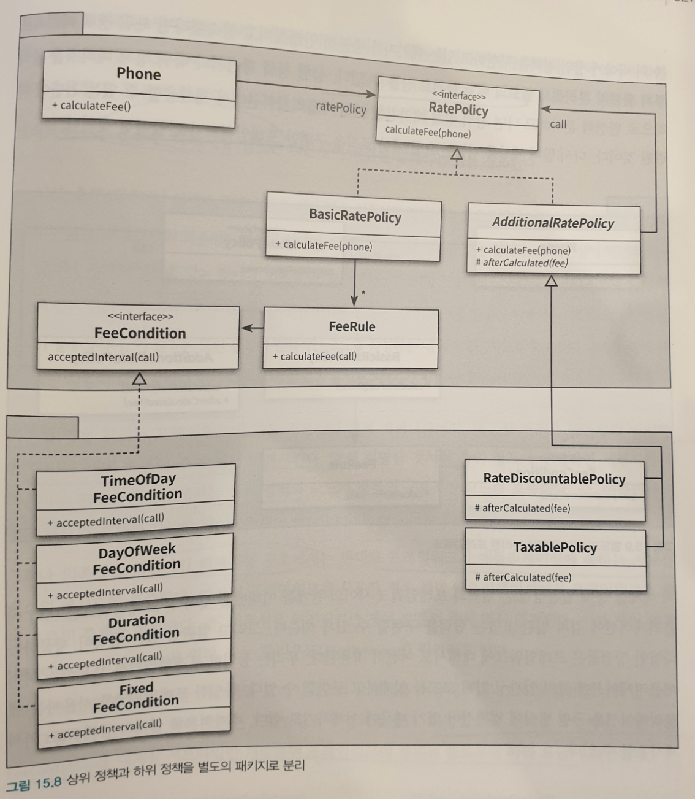

# 디자인 패턴과 프레임워크

 

- 디자인 패턴

> 소프트웨어 설계에서 반복적으로 발생하는 문제에 대해  
> 반복적으로 적용할 수 있는 해결방법
> 디자인 패턴의 목적은 다양한 변경을 다루기 위해  
> 반복적으로 재사용할 수 있는 설계의 묶음
>
> 디자인 패턴은 특정한 변경을 일관성 있게 다룰 수 있는 협력 템블릿을 제공한다.

 

- 프레임워크

> 설계와 코드를 함께 재사용하기 위한 것이다.  
> 프레임워크는 애플리케이션의 아키텍처를 구현 코드의 형태로 제공한다.
>
> 프레임워크는 일관성 있게 다룰 수 있는 확장 가능한 코드 템플릿을 제공한다.

 

## 디자인 패턴과 설계 재사용

 

 

### 소프트웨어 패턴

 

> 패턴에 대해서 논할 때 반복적으로 언급되는 몇가지 핵심적인 특징이 있다.

- 패턴은 반복적으로 발생하는 문제와 해법의 쌍으로 정의된다.
- 패턴을 사용함으로써 이미 알려진 문제와 이에 대한 해법을 문서로 정리할 수 있으며, 이 지식을 다른 사람과 의사소통할 수 있다.
- 패턴은 추상적인 원칙과 실제 코드 작성 사이의 간극을 메워주며 실질적인 코드 작성을 돕는다.
- 패턴의 요점은 패턴이 실무에서 탄생했다는 점이다.

 

- 마틴 파울러의 \<Analysis Pattern>

> 패턴 정의는 하나의 실무 컨텍스트에서 유용하게 사용해왔고 다른 실무 컨텍스트에서도 유용할 것이라고 예상되는 아이디어다.  
> 아이디어라는 용어를 사용하는 이유는 어떤 것도 패턴이 될 수 있기 때문이다.  
> 협력하는 객체그룹이 될 수도 있고, 프로젝트의 조직 원리가 될 수도 있다.  
> 실무 컨텍스트라는 용어는 패턴이 실제 프로젝트의 실무 경험에서 비록됐다는 사실을 반영한다.
> `즉 패턴은 개발자들이 다른 컨텍스트에서 유용할 것이라고 생각하는 어떤 것이다.`

 

### 패턴 분류

 

- 디자인 패턴(Design Pattern)
  - 특정 상황 내에서 일반적인 설계 문제를 해결하며 협력하는 컴포넌트들 사이에서 반복적으로 발생하는 구조를 서술한다
  - 특정한 설계문제를 해결하는 것을 목적으로 함
  - 프로그래밍 언어나 패러다임에 독립적이다
- 아키텍처 패턴 (Architecture Pattern)
  - 소프트웨어의 전체적인 구조를 결정하기 위해 사용
  - 미리 정의된 서브시스템들을 제공하고 서브시스템들의 책임, 관계를 조직화하는 규칙과 가이드를 제공한다
- 분석 패턴(Analysis Pattern)
  - 도메인 내의 개념적인 문제를 해결하는 데 초점을 맞춘다
  - 업무 모델링 시에 발견되는 공통적인 구조를 표현하는 개념들의 집합
- 이디엄(Idiom)
  - 특정 프로그래밍 언어에만 국한된 패턴이다
  - 주어진 언어의 기능/특성을 이용해 컴포넌트 간의 특정 측면을 구현하는 방법을 서술
    - C++에서는 객체가 스스로 자신을 참조하는 객체들의 개수를 카운트 해서 더 이상 자신이 참조되지 않으면 스스로를 삭제하는 COUNT POINTER라는 이디엄이 있다.
    - 하지만 JVM기반의 언어에서는 참조 되지 않은 객체들은 가비지 컬렉터에 의해 자동으로 삭제되기에 COUNT POINTER 이디엄은 유용하지 않다.

 

### 패턴과 책임-주도 설계

 

> 객체지향 설계에서 가장 중요한 일은 올바른 책임을 올바른 객체에게 할당하고  
> 객체간의 유연한 협력 관계를 구축하는 일이다.

 

> 패턴을 따르면 특정한 상황에 적용할 수 있는 설계를 쉽고 빠르게 떠올릴 수 있다는 사실이다.  
> 특정한 상황에 적용 가능한 패턴을 잘 알고 있다면 책임 주도 설계의 절차를 하나하나 따르지 않고도  
> 시스템 안에 구현할 객체들의 역할과 책임, 협력 관계를 빠르고 손쉽게 구성 가능하다.

 

### 캡슐화와 디자인 패턴

 

|               Strategy Pattern               |
| :------------------------------------------: |
|  |

 

> 알고리즘의 변경을 캡슐화하는 것이고 이를 구현하기 위해 합성을 사용
> 즉 알고리즘을 동적으로 교체할 수 있는 역할과 책임의 집합을 제공한다.

 

|            Template method            |
| :-----------------------------------: |
|  |

 

> 변하지 않는 부분은 부모 클래스로, 변하는 부분은 자식 클래스로 분리하여  
> 변경을 캡슐화 한다. 알고리즘을 캡슐화 하기 위해 합성 관계가 아닌  
> 상속관계를 사용하는 것을 TEMPLATE METHOD 패턴이라고 부른다.
>
> 즉, 부모 클래스가 알고리즘의 기본 구조를 정의하고  
> 궤적인 내용은 자식 클래스에서 정의하게 하여 변경을 캡슐화하는 패턴

 

|                Decorator                |
| :-------------------------------------: |
|  |

 

> Decorator 패턴은 객체의 행동을 동적으로 추가할 수 있게 해주는 패턴으로서  
> 기본적으로 객체의 행동을 결합하기 위해 객체합성을 사용  
> Decorator 패턴은 선택적인 행동의 개수와 순서에 대한 변경을 캡슐화 할 수 있다.

 

- 디자인패턴에서 중요한 것은 패턴의 구현 방법이나 구조가 아니라, 어떤 디자인 패턴이 어떤 변경을 캡슐화 하는지를 이해하는 것이 중요하다!

 

## 프레임워크와 코드 재사용

 

 

### 코드 재사용 대 설계 재사용

 

> 재사용 관점에서 가장 이상적인 형태의 재사용 방법은 설계 재사용과  
> 코드 재사용을 적절한 수준으로 조합하는 것이다.  
> 코드 재사용만을 강조하는 컴포넌트는 실패했다.  
> 추상적인 수준에서의 설계 재사용을 강조하는  
> 디자인패턴은 재사용을 위해 매번 유사한 코드를 작성해야한다.

 

- 프레임워크란
  - 추상 클래스나 인터페이스를 정의하고 인스턴스 사이의 상호작용을 통해 시스템 전체 혹은 일부를 구현해 놓은 재사용 가능한 설계
  - 애플리케이션 개발자가 현재의 요구사항에 맞게 커스터마이징할 수 있는 application skeleton (설계와 코드 재사용)

 

> 프레임워크는 코드를 재사용함으로써 설계 아이디어를 재사용한다.  
> 프레임워크는 애플리케이션의 아키텍처를 제공하며 문제 해결에 필요한 설계 결정과 이에 필요한 기반 코드를 함께 포함한다.  
> 애플리케이션을 확장할 수 있도록 부분적으로 구현된 추상 클래스와 인터페이스 집합뿐만 아니라 추가적인 작업 없이도 재사용 가능한 다양한 종류의 컴포넌트도 함께 제공한다

 

### 상위 정책과 하위 정책으로 패키지 분리하기

 

> 의존성 역전 원칙으로, 구체 클래스들은 상위 클래스에 의존하지만 그 반대는 아니다.  
> 상위 정책은 상대적으로 변경에 안정적이지만, 세부사항은 자주 변경된다.  
> 따라서 상위정책이 세부사항보다 더 다양한 상황에서 재사용할 수 잇어야한다.
>
> 프레임워크는 여러 애플르케이션에 걸쳐 재사용 가능해야하기 때문에,  
> 변하는 것과 변하지 않는 것을 다른 주기로 배포할 수 잇도록,  
> 배포 단위를 분리해야한다.

 

|              상위 정책과 하위 정책을 별도의 패키지로 분리               |
| :---------------------------------------------------------------------: |
|  |

 

> 중요한 것은 패키지의 의존성 방향이다.  
> 세부사항을 구현한 패키지는 항상 상위 정책을 구현한 패키지에 의존해야한다.  
> 상위 정책을 구현하고 있는 패키지를 다른 애플리케이션에 재사용할 수 있다.

 

### 제어 역전 원리

 

> 의존성 역전 원리는 전통적인 설계 방법과 객체지향을 구분하는 가장 핵심적인 원리다.  
> 의존성 역전 원리에 따라 구축되지 않은 시스템은 협력 흐름을 재사용할 수도 없으며 변경에 유연하게 대처할 수도 없다.
>
> 시스템이 진화하는 방향에는 항상 의존성 역전 원리를 따르는 설계가 존재해야 한다.  
> 만약 요구사항이 빠르게 진화하는 코드에서 의존성 역전 원리가 적절하게 지켜지지 않고 있다면 그곳에는 변경을 적절하게 수용할 수 없는 하향식 코드만 남을 뿐이다.
>
> 프레임워크에서는 일반적인 해결책만 제공하고 애플리케이션에 따라 달라질 수 있는 특정한 동작은 비워둔다  
> 그리고 이렇게 완성되지 않은 채로 남겨진 동작을 훅(Hook) 이라고 부른다  
> 훅은 프레임워크 코드에서 호출하는 프레임워크의 특정 부분이다. 재정의된 훅은 제어 역전 원리에 따라 프레임워크가 원하는 시점에 호출 된다.
>
> 여기서 협력을 제어하는 것은 프레임워크이다.
>
> 이 말 자체가 제어 역전 원리이다.  
> 전통적인 방식에서는 개발자가 개발한 코드를 실행하기 위해서는 개발자가 직접 객체를 생성해서 메시지를 객체에 날려야 했다.  
> 하지만 프레임워크에서는 프레임워크 내의 코드가 개발자가 개발한 코드를 실행한다.
>
> 이러한 제어의 역전이 프레임워크의 핵심 개념이자 코드의 재사용을 가능하게 하는 힘이다.

 
