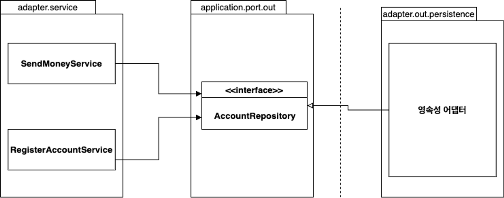
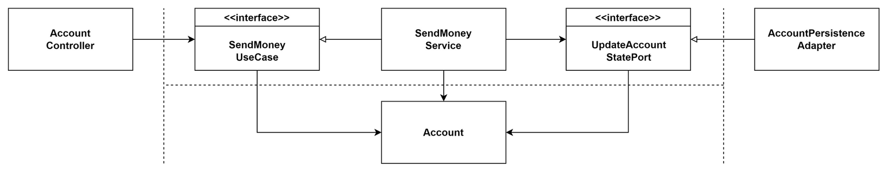

- [01. 계층형 아키텍처의 문제는 무엇일까?](#01-계층형-아키텍처의-문제는-무엇일까)
	- [계층형 아키텍처는 데이터베이스 주도 설계를 유도한다](#계층형-아키텍처는-데이터베이스-주도-설계를-유도한다)
	- [지름길을 택하기 쉬워진다](#지름길을-택하기-쉬워진다)
	- [테스트하기 어려워진다](#테스트하기-어려워진다)
	- [유스케이스를 숨긴다](#유스케이스를-숨긴다)
	- [동시 작업이 어려워진다](#동시-작업이-어려워진다)
- [02. 의존성 역전하기](#02-의존성-역전하기)
	- [단일 책임원칙](#단일-책임원칙)
	- [의존성 역전 원칙](#의존성-역전-원칙)
	- [클린 아키텍처](#클린-아키텍처)
	- [헥사고날 아키텍처](#헥사고날-아키텍처)
	- [유지보수 가능한 소포트웨어를 만드는데 어떻게 도움이 될까?](#유지보수-가능한-소포트웨어를-만드는데-어떻게-도움이-될까)
- [03. 코드 구성하기](#03-코드-구성하기)
	- [아키텍처적으로 표현력 있는 패키지 구조](#아키텍처적으로-표현력-있는-패키지-구조)
	- [의존성 주입의 역할](#의존성-주입의-역할)
- [04. 유스케이스 구현하기](#04-유스케이스-구현하기)
	- [유스케이스 둘러보기](#유스케이스-둘러보기)
	- [입력 유효성 검증](#입력-유효성-검증)
	- [생성자의 힘](#생성자의-힘)
	- [유스케이스마다 다른 입력 모델](#유스케이스마다-다른-입력-모델)
	- [비즈니스 규칙 검증하기](#비즈니스-규칙-검증하기)
	- [풍부한 도메인 모델 vs 빈약한 도메인 모델](#풍부한-도메인-모델-vs-빈약한-도메인-모델)
	- [읽기 전용 유스케이스는 어떨까?](#읽기-전용-유스케이스는-어떨까)
	- [유지보수 가능한 소프트웨어를 만드는데 어떻게 도움을 줄까?](#유지보수-가능한-소프트웨어를-만드는데-어떻게-도움을-줄까)
- [05. 웹 어댑터 구현하기](#05-웹-어댑터-구현하기)
	- [05 - 의존성 역전 원칙](#05---의존성-역전-원칙)
	- [웹 어댑터의 책임](#웹-어댑터의-책임)
	- [컨트롤러 나누기](#컨트롤러-나누기)
	- [유지보수 가능한 소프트웨어를 만드는데 어떻게 도움이 될까?](#유지보수-가능한-소프트웨어를-만드는데-어떻게-도움이-될까)
- [06. 영속성 어댑터 구현하기](#06-영속성-어댑터-구현하기)
	- [의존성 역전](#의존성-역전)
	- [영속성 어댑터의 책임](#영속성-어댑터의-책임)
	- [포트 인터페이스 나누기](#포트-인터페이스-나누기)
	- [영속성 어댑터 나누기](#영속성-어댑터-나누기)
	- [스프링 데이터 JPA 예제](#스프링-데이터-jpa-예제)
	- [데이터 베이스 트랜잭션은 어떻게 해야 할까?](#데이터-베이스-트랜잭션은-어떻게-해야-할까)
	- [유지보수 가능한 소프트웨어를 만드는데 어떻게 도움이 될까? - 6장](#유지보수-가능한-소프트웨어를-만드는데-어떻게-도움이-될까---6장)
- [07. 아키텍처 요소 테스트 하기](#07-아키텍처-요소-테스트-하기)
	- [테스트 피라미드](#테스트-피라미드)
	- [단위 테스트로 도메인 엔티티 테스트하기](#단위-테스트로-도메인-엔티티-테스트하기)
	- [단위 테스트로 유스케이스 테스트하기](#단위-테스트로-유스케이스-테스트하기)
	- [통합 테스트로 웹 어댑터 테스트하기](#통합-테스트로-웹-어댑터-테스트하기)
	- [통합 테스트로 영속성 어댑터 테스트하기](#통합-테스트로-영속성-어댑터-테스트하기)
	- [시스템 테스트로 주요 경로 테스트하기](#시스템-테스트로-주요-경로-테스트하기)
	- [얼마만큼의 테스트가 충분할까?](#얼마만큼의-테스트가-충분할까)
	- [유지보수 가능한 소프트웨어를 만드는데 어떻게 도움이 될까? - 7장](#유지보수-가능한-소프트웨어를-만드는데-어떻게-도움이-될까---7장)
- [08. 경계간 매핑하기](#08-경계간-매핑하기)
	- [매핑하지 않기 전략](#매핑하지-않기-전략)
	- [양방향 매핑 전략](#양방향-매핑-전략)
		- [장점](#장점)
		- [단점](#단점)
	- [완전 매핑 전략](#완전-매핑-전략)
	- [단방향 매핑 전략](#단방향-매핑-전략)
	- [언제 어떤 매핑 전략을 사용할 것인가?](#언제-어떤-매핑-전략을-사용할-것인가)
	- [유지보수 가능한 소프트웨어를 만드는데 어떻게 도움이 될까? - 8장](#유지보수-가능한-소프트웨어를-만드는데-어떻게-도움이-될까---8장)
- [09. 애플리케이션 조립하기](#09-애플리케이션-조립하기)
	- [왜 조립까지 신경써야 할까?](#왜-조립까지-신경써야-할까)
	- [평범한 코드로 조립하기](#평범한-코드로-조립하기)
	- [스프링의 클래스패스 스캐닝으로 조립하기](#스프링의-클래스패스-스캐닝으로-조립하기)
	- [스프링의 자바 컨피그로 조립하기](#스프링의-자바-컨피그로-조립하기)
	- [유지보수 가능한 소프트웨어를 만드는 데 어떻게 도움이 될까? - 9장](#유지보수-가능한-소프트웨어를-만드는-데-어떻게-도움이-될까---9장)
- [10. 아키텍처 경계 강제하기](#10-아키텍처-경계-강제하기)
	- [경계와 의존성](#경계와-의존성)
	- [접근 제한자](#접근-제한자)
	- [컴파일 후 체크](#컴파일-후-체크)
	- [빌드 아티팩트](#빌드-아티팩트)
	- [유지보수 가능한 소프트웨어를 만드는 데 어떻게 도움이 될까? - 10장](#유지보수-가능한-소프트웨어를-만드는-데-어떻게-도움이-될까---10장)
- [11. 의식적으로 지름길 사용하기](#11-의식적으로-지름길-사용하기)
	- [왜 지름길은 깨진 창문 같을까?](#왜-지름길은-깨진-창문-같을까)
	- [깨끗한 상태로 시작할 책임](#깨끗한-상태로-시작할-책임)
	- [유스케이스 간 모델 공유하기](#유스케이스-간-모델-공유하기)
	- [도메인 엔티티를 입출력 모델로 사용하기](#도메인-엔티티를-입출력-모델로-사용하기)
	- [인커밍 포트 건너뛰기](#인커밍-포트-건너뛰기)
	- [애플리케이션 서비스 건너뛰기](#애플리케이션-서비스-건너뛰기)
	- [유지보수 가능한 소프트웨어를 만드는 데 어떻게 도움이 될까? - 11장](#유지보수-가능한-소프트웨어를-만드는-데-어떻게-도움이-될까---11장)
- [12. 아키텍처 스타일 정하기](#12-아키텍처-스타일-정하기)

</br>

## 01. 계층형 아키텍처의 문제는 무엇일까?

</br>

|              Layered Architecture              |
| :--------------------------------------------: |
|  |

</br>

> 해당 그림은 상위 수준 관점에서 일반적인 3계층 아키텍처를 표현한 그림이다.

- 웹계층에서 요청을 받은 후
- 도메인 혹은 비즈니스 계층에 있는 서비스로 요청을 보낸다.
- 이후 서비스에서는 필요한 비즈니스 로직을 수행하고 도메인 엔티티의 현재 상태를 조회하거나 변경하기 위해 영속성 계층의 컴포넌트를 호출한다.

</br>

> 사실 잘 만들어진 계층형 아키텍처는 선택의 폭을 넓히고 변화하는 요구사항과  
> 외부 요인에 빠르게 적응할 수 있게 해준다.  
> 하지만, 계층형 아키텍처는 코두에 나쁜 습관들이 스며들기 쉽게 만들고  
> 시간이 흐를 수록 소프트웨어를 점점 더 변경하기 어렵게 만든다.

</br>

### 계층형 아키텍처는 데이터베이스 주도 설계를 유도한다

</br>

> 우리가 만드는 대부분의 애플리케이션은 비즈니스를 관장하는  
> 규칙이나 정책을 반영한 모델을 만들어서  
> 사용자가 이러한 규칙과 정책을 더욱 편리하게 활용할 수 있게 한다.
> 이때 우리는 상태가 아니라 행동을 중심으로 모델링 한다.  
> 어떤 애플리케이션이든 상태가 중요한 요소이긴 하지만  
> 행동이 상태를 바꾸는 주체이기 때문에 행동이 비즈니스를 이끌어간다.

</br>

> 우리는 데이터베이스의 구조를 먼저 생각하고 이를 토대로 도메인 로직을 구현했을 것이다.  
> 전통적 계층형 아키텍처에서는 의존성의 방향에 따라 자연스럽게 구현한 것이다.  
> 하지만 비즈니스 관점에서는 맞지 않다.  
> 우선적으로 도메인 로직을 만든 후 도메인 로직이 맞다는 것을 확인한 후에  
> 이른 기반으로 영속성 계층과 웹 계층을 만들어야한다.

</br>

|               도메인 계층에서 데이터베이스 엔티티 사용은 영속성 계층과 강한 결합을 유발               |
| :---------------------------------------------------------------------------------------------------: |
|  |

</br>

> ORM에 의해 관리되는 엔티티들은 일반적으로 영속성 계층에 둔다.  
> 계층은 아래 방향으로만 접근 가능하고 도메인 계층에서 이러한 엔티티에 접근 가능하다.
>
> 하지만 이 경우 영속성 계층과 도메인 계층에 강한 결합이 생긴다.  
> 마치 서비스가 영속성 모델을 비즈니스 모델처럼 사용하게 되고  
> 이런 엔티티 클래스에서는 도메인 로직뿐만 아니라  
> 즉시 로딩, 지연로딩 트랜잭션 등등 영속성 계층과 관련된 작업들을 해야만한다.
>
> 영속성 코드가 사실상 도메인 코드에 녹아들어가서 둘 중 하나만 바꾸는 것이 어려워지고  
> 유연하고 선택의 폭을 넓혀준다던 계층형 아키텍처의 목표와 정확히 반대되는 상황이다.

</br>

### 지름길을 택하기 쉬워진다

</br>

- 계층형 아키텍처에서 적용되는 유일한 규칙은, 특정 계층에서 같은 계층에 있는 컴포넌트나 아래에 있는 계층에만 접근 가능하다는 것이다.

</br>

> 따라서 만약 상위 계층에 위치한 컴포넌트에 접근해야 한다면 간단하게 컴포넌트를 계층 아래로 내려버리면 된다...

|              영속성 계층에서 모든 것에 접근 가능하기 때문에 시간이 지나면서 점점 비대해진다              |
| :------------------------------------------------------------------------------------------------------: |
|  |

</br>

> 영속성 계층은 컴포넌트를 아래 계층으로 내릴 수록 비대해진다.  
> 결국 어떤 계층에서도 속하지 않을 것처럼 보이는  
> 헬퍼 컴포넌트나 유틸리티 컴포넌트들이 이처럼 아래 계층으래 내릴 가능성이 큰 후보다.
>
> 아키텍처의 지름길 모드를 끄고싶다면  
> 적어도 추가적인 아키텍처 규칙을 강제하지 않는 이상 최선의 선택이 아니다.  
> 여기서 강제한다는 의미는 해당 규칙이 깨졌을 때 빌드가 실패하도록 만드는 규칙을 의미한다.

</br>

### 테스트하기 어려워진다

</br>

|            도메인 계층을 건너뛰는 것은 도멩니 로직을 코드 여기저기에 흩어지게 만든다             |
| :----------------------------------------------------------------------------------------------: |
|  |

</br>

> 계층형 아키텍처를 사용할 때 일반적으로 나타나는 변화의 형태는 계층을 건너뛰는 것이다.  
> 엔티티의 필드를 하나만 조작하면 되는 경우에  
> 바로 웹계층에서 바로 영속성 계층에 접근하면 도메인 계층을 건드릴 필요가 없지 않을까?

- 첫 번째 문제는 단하나의 필드를 조작하는 것에 불과하더라도 도메인 로직을 웹계층에서 구현한다는 것이다.
  - 만약 유스케이스가 확장된다면 더 많은 도메인 로직을 웹계층에 추가해서 애플리케이션 전반에 걸쳐 책임이 섞이고 핵심 도메인 로직들이 퍼져나갈 확률이 높다.
- 두 번째 문제는 웹 계층 테스트에서 도메인 계층 뿐 아니라 영속성 게층도 모킹해야 한다는 것이다.
  - 실제 테스트보다 테스트를 설정하는 것이 더 복잡해질 것이다.

</br>

### 유스케이스를 숨긴다

</br>

|              넓은 서비스는 코드 상에서 특정 유스케이스를 찾는 것을 어렵게 만든다              |
| :-------------------------------------------------------------------------------------------: |
|  |

</br>

> 우리가 기능을 추가하거나 변경할 적절한 위치를 찾는 일이 빈번하기 때문에  
> 아키텍처는 코드를 빠르게 탐색하는데 도움이 돼야 한다.
>
> 계층형 아키텍처는 도메인 서비스의 너비에 관한 규칙을 강제하지 않는다.  
> 그렇기 때문에 시간이 지나면 그림처럼 여러개의 유스케이스를 담당하는 아주 넓은 서비스가 만들어진다.
>
> 좁은 도메인 서비스가 유스케이스 하나만 담당하게 한다면 이런 작업들이 수월해질 것이다.  
> UserService에서 등록 유스케이스를 찾는 대신  
> RegisterUserService를 바로 열어서 작업을 시작하는 것처럼 말이다!

</br>

### 동시 작업이 어려워진다

> 계층형 아키텍처는 동시작업면에서 도움이 되지 않는다.  
> 개발자가 3명 있다고 가정하고, 웹, 도메인, 영속성 이런식으로 기능을 추가할 수 없다.  
> 모든 것이 영속성 계층위에 만들어지기 때문에 영속성 계층을 개발해야하고,  
> 그다음에 도메인 계층을, 그리고 마지막으로 웹 계층을 만들어야만 한다.

</br>

## 02. 의존성 역전하기

</br>

### 단일 책임원칙

</br>

- 하나의 컴포넌트는 오로지 한 가지 일만 해야 하고, 그것을 올바르게 수행해야 한다.

</br>

> 여기서 말하는 한 가지 일만 하는 것의 실제 의미는

- 컴포넌트를 변경하는 이유는 오직 하나뿐이어야 한다.

</br>

> 즉 컴포넌트를 변경할 이유가 오로지 한 가지라면 해당 컴포넌트는 딱 한 가지 일만 하게 된다.  
> 하지만 이보다 더 중요한 것은 변경할 이유가 오직 한 가지라는 것이다.
>
> 만약 우리가 변경할 이유가 한 가지라면 우리가 어떤 다른 이유로 소프트웨어를 변경 하더라도  
> 이 컴포넌트에 대해서 전혀 신경 쓸 필요가 없다.  
> 소포트웨어가 변경되더라도 여전히 우리가 기대한 대로 동작할 것이기 때문이다.

</br>

|            어떤 컴포넌트의 의존성 각각은 이 컴포넌트를 변경하는 이유 하나씩에 해당한다.            |
| :------------------------------------------------------------------------------------------------: |
|  |

</br>

> 그림 A는 여러 컴포넌트에 의존하는 반면 E는 의존하는 것이 전혀 없다.  
> E를 변경하는 이유는 새로운 요구사항에 의해 E의 기능을 바꿔야할 때 뿐이다.  
> 하지만 A의 경우 모든 컴포넌트를 의존하기 때문에  
> 다른 어떤 컴포넌트가 바뀌든 함께 바뀌어야 한다.
>
> 많은 코드들이 단일 책임 원칙을 위반하기 때문에 시간이 갈수록 변경하기가 더 어려워진다.  
> 시간이 지날 수록 변경할 더 많은 이유가 쌓여간다.  
> 변경할 이유가 많이 쌓인 후에는 한 컴포넌트를 바꾸는 것이 다른 컴포넌트가 실패하는 원인으로 작용한다.

</br>

### 의존성 역전 원칙

</br>

> 계층형 아키텍처에서 계층간 의존성은 항상 다음계층인 아래 방향을 가리킨다.  
> 단일 책임 원칙을 고수준에서 적용할 때 상위 계층들이 하위 계층들에 비해 변경할 이유가 더 많다.
>
> 그러므로 영속성 계층에 대한 도메인 계층의 의존성 때문에 영속성 계층을 변경할 때  
> 잠재적으로 상위 계층을 변경해야 한다.  
> 도메인 코드는 애플리케이션에서 가장 중요한 코드이며 영속성 코드가 바뀐다고 해서  
> 도메인 코드까지 바꾸고 싶지 않다. 이 경우 어떻게 의존성을 제거 할 수 있을까?

</br>

- DIP : 코드상의 어떤 의존성이든 그 방향을 바꿀 수 있다.

</br>

> 사실 의존성의 양쪽 코드를 모두 제어할 수 있을때만 의존성을 역전시킬 수 있다.

|            도메인 계층에 인터페이스를 도입함으로써 의존성을 역전시킬 수 있다            |
| :-------------------------------------------------------------------------------------: |
|  |

</br>

> 엔티티는 도메인 객체를 표현하고, 이 도메인 코드는 이 엔티티들의 상태를 변경하는 일을 중심으로 한다.  
> 그래서 먼저 엔티티를 도메인 계층으로 올린다.  
> 그러나 이제 영속성 계층의 레포지토리가 도메인 계층에 있는 엔티티에 의존하기 때문에  
> 두 계층 사이에 순환 의존성이 생긴다.  
> 이 부분이 바로 DIP를 적용하는 부분이다.  
> 도메인 계층에 레포지토리에 대한 인터페이스를 만들고  
> 실제 레포지토리는 영속성 계층에서 구현하게 하는 것이다.

</br>

### 클린 아키텍처

</br>

> 클린 아키텍체에서는 설계가 비즈니스 규칙의 테스트를 용이하게 하고, 비즈니스 규칙은 프레임워크, 데이터베이스, UI 기술, 그 밖의 외부 애플리케이션이나 인터페이스로부터 독립적일 수 있다는 걸 의미한다.
> 이것은 도메인 코드가 바깥으로 향하는 어떤 의존성도 없어야 함을 의미한다.
> 대신 의존성 역전 원칙의 도움으로 모든 의존성이 도메인 코드를 향하고 있다.

|                    clean architecture                    |
| :------------------------------------------------------: |
|  |

</br>

> 이 아키텍처 코어에는 주변 유스케이스에서 접근하는 도메인 엔티티들이 있다.  
> 유스케이스는 서비스라고 불렸던 것들인데, 단일 책임을 갖기 위해 조금 더 세분화돼 있다.  
> 이를 통해 넓은 서비스 문제를 피할 수 있다.
>
> 도메인 코드에서는 어떤 영속성 프레임 워크나 UI 프레임 워크가 사용되는지 알 수 없기 때문에  
> 특정 프레임워크에 특화된 코드를 가질 수 없고 비즈니스 규칙에 집중할 수 있다.  
> 그래서 도메인 코드를 자유롭게 모델링 할 수 있다.
>
> 하지만 클린아키텍처는 대가가 따른다. 도메인 계층이 영속성이나 UI같은 외부 계층과 분리 되어야하므로  
> 애플리케이션의 엔티티에 대한 모델을 각 계층에서 유지보수해야 한다.

</br>

> JPA를 사용한다 했을 때 엔티티클래스를 사용하는데  
> 이 엔티티클래스를 영속성 계층과 도메인 계층에서 함께 사용해서는 안된다.  
> 이는 도메인 계층과 다른 계층들 사이에서도 마찬가지이다.
>
> 하지만 이와같은 형태가 더 바람직하다. 예를 들어 JPA에서는 엔티티 클래스에  
> 기본생성자를 강제한다. 하지만 이것이 도메인 계층에서 알아야할 로직인가..?

</br>

### 헥사고날 아키텍처

</br>

|                     헥사고날 아키텍처                      |
| :--------------------------------------------------------: |
|  |

</br>

> 육각형 안에서 도메인 엔티티와 이와 상호작용하는 유스케이스가 있다.  
> 육각형 바깥에는 애플리케이션과 상호작용하는 다양한 어댑터들이 있다.
>
> 여기서 왼쪽에 있는 어댑터들은 애플리케이션을 주도하는 어댑터이며  
> 오른쪽에 있는 어댑터들은 애플리케이션에 의해 주도되는 어댑터들이다.
>
> 애플리케이션과 어댑터들간의 통신이 가능하려면 애플리케이션 코어가 각각의 포트를 제공해야 한다.  
> 주도하는 어댑터에게는 그러한 포트가 코어에 있는 유스케이스 클래스들에 의해 구현되고 호출되는 인터페이스가 될 것이고  
> 주도되는 어댑터에게는 그러한 포트가 어댑터에 의해 구현되고 코어에 의해 호출되는 인터페이스가 될 것이다.

</br>

### 유지보수 가능한 소포트웨어를 만드는데 어떻게 도움이 될까?

</br>

> 클린 아키텍처, 육각형 아키텍처, 혹은 포트와 어댑터 아키텍처 중 무엇으로 불리든 의존성을 역전시켜  
> 도메인 코드가 다른 바깥쪽 코드에 의존하지 않게 함으로써 영속성과 UI에 특화된 모든 문제로부터  
> 도메인 로직의 결합을 제거하고 코드를 변경할 이유의 수를 줄일 수 있다.

</br>

## 03. 코드 구성하기

</br>

### 아키텍처적으로 표현력 있는 패키지 구조

```text
- buckpal
  - account
    - adpater
      - in
        - web
          - AccountController
      - out
        - persistence
          - AccountPersistenceAdapter
          - SpringDataAccountRepository
    - domain
      - Account
      - Activity
    - application
      - SendMoneyService
      - port
        - in
          - SendMoneyUseCase
        - out
          - LoadAccountPort
          - UpdateAccountStatePort

```

> 육각형 아키텍처에서 구족적으로 핵심적인 요소는  
> 엔티티, 유스케이스, 인커밍/아웃고잉 포트, 인커밍/아웃고잉 어댑터이다.
>
> 구조의 각 요소들은 패키지 하나씩에 직접 매핑된다.  
> 최상위에는 Account와 관련된 유스케이스를  
> 구현한 모듈임을 나타내는 account 패키지가 있다.
>
> 그다음 레벨에는 도메인 모델이 속한 domain 패키지가 있다.  
> application 패키지는 도메인 모델을 둘러 싼 서비스 계층을 포함한다.  
> SendMoneyService는 인커밍 포트 인터페이스인 SendMoneyUseCase를 구현하고  
> 아웃고인 포트 인터페이스이자 영속성 어댑터에 의해 구현된  
> LoadAccountPort와 UpdateAccountStatePort를 사용한다.
>
> adapter 패키지는 애플리케이션 계층의 인커밍 포트를 호출하는 인커밍 어댑터와  
> 애플리케이션 계층의 아웃고잉 포트에 대한 구현을 제공하는 아웃고잉 어댑터를 포함한다.  
> BuckPal 예제의 경우 각각의 하위 패키지를 가진 web 어댑터와 persistence 어댑터로 이뤈진 간단한 애플리케이션이 된다.
>
> 여기서 패키지가 많은데 모든 것을 public으로 만들어서 패키지 간의 접근을 허용해야 한다는 것을 의미하는 것일까?  
> 적어도 어댑터 패키지에 대해서는 그렇지 않다.  
> 이 패키지에 들어 있는 모든 클래스들은 application 패키지 내에 있는 포트 인터페이스를 통하지 않고는  
> 바깥에선 호출되지 않기 때문에 package-private 수준으로 둬도 된다.  
> 그러므로 애플리케이션 계층에서 어댑터 클래스로 향하는 우발적인 의존성은 있을 수 없다.
>
> 하지만 application 패키지와 domain 패키지 내의 일부 클래스들은 public으로 지정해야 한다.  
> 의도적으로 어댑터에서 접근 가능해야 하는 포트들은 public이어야 한다.  
> 도메인 클래스들은 서비스, 그리고 잠재적으로는 어댑터에서도 접근 가능하도록 public이어야 한다.  
> 서비스는 인커밍 포트 인터페이스 뒤에 숨겨질 수 있기 때문에 public일 필요가 없다.
>
> 어댑터 패키지를 자체 패키지로 이동시키면 하나의 어댑터를 다른 구현으로 쉽게 교체할 수 있다.  
> 예를 들어 특정 데이터베이스가 적절하지 않아 키-밸류 데이터베이스로 개발을 시작했는데  
> SQL 데이터 베이스로 교체해야한다고 가정해보자.  
> 간단하게 관련 아웃고잉 포트들만 새로운 어댑터 패키지에 구현하고 기존 패키지를 지우면 된다.

</br>

### 의존성 주입의 역할

</br>

> 클린 아키텍처의 가장 본질적인 요건은 애플리케이션 계층이  
> 인커밍/아웃고잉 어댑터에 의존성을 갖지 않는다는 것이다.
>
> 웹어댑터와 같이 인커밍 어댑터에 대해서는 그렇게 하기가 쉽다.  
> 제어 흐름 방향이 어댑터와 도메인 코드 간으 의존성 방향과 같은 방향이기 때문이다  
> 어댑터는 그냥 애플리케이션 계층에 위치한 서비스를 호출할 뿐이다.
>
> 하지만 영속성 어댑터와 같이 아웃고잉 어댑터에 대해서는 제어 흐름의 반대 방향으로  
> 의존성을 돌리기 위해 의존성 역전 원칙을 이용해야 한다.
>
> 그런데 포트 인터페이스를 구현한 실제 객체를 누가 애플리케이션 계층에 제공해야 할까?  
> 포트를 애플리케이션 계층 안에서 수동으로 초기화 한다면 애플리케이션 계층에 어댑터에 대한 의존성을 추가해야한다.
>
> 이 부분에서 의존성 주입을 활용할 수 있다.
> 모든 계층에 의존성을 가진 중립적인 컴포넌트를 하나 도입한느 것이다.  
> 이 컴포넌트는 아키텍처를 구성하는 대부분의 클래스를 초기화하는 역할을 갖는다.

</br>

</br>

## 04. 유스케이스 구현하기

</br>

### 유스케이스 둘러보기

</br>

> 먼저 유스케이스가 실제로 무슨일을 하는지 살펴보자.  
> 일반적으로 유스케이스는 다음과 같은 단계를 따른다.

</br>

- 1.  입력을 받는다
- 2.  비즈니스 규칙을 검증한다.
- 3.  모델 상태를 조작한다.
- 4.  출력을 반환한다.

</br>

> 유스케이스는 인커밍 어댑태로부터 입력을 받는다.  
> 이 단계를 왜 `입력 유효성 검증`으로 부르지 않는지 의아할 수도 있다.  
> 책에서는 유스케이스 코드가 도메인 로직에만 신경 써야 하고 입력 유효성 검증으로 오염되면 안된다고 말한다.  
> 그래서 입력 유효성 검증은 곧 살펴볼 다른 곳에서 처리한다.
>
> 그러마 유스케이스는 비즈니스 규칙을 검증할 책임이 있다.  
> 그리고 도메인 엔티티와 이 책임을 공유한다.
> 책의 후반에서 입력 유효성 검증과 비즈니스 규칙 검증의 차이점에 대해 말한다.

</br>

> 비즈니스 규칙을 충족하면 유스케이스는 입력 기반으로 어떤 방법으로든 모델의 상태를 변경한다.  
> 일반적으로 도메인 객체의 상태를 바꾸고 영속성 어댑터를 통해 구현된 포트로 이 상태를 전달해서 저장할 수 있게 한다.  
> 유스케이스는 또 다른 아웃고잉 어댑터를 호출할 수도 있다.
> 즉,

- 비즈니스 규칙 충족
- 유스케이스가 입력 기반으로 모델 상태 변경
- 도메인 객체 상태를 변경 후 영속성 어댑터로 구현된 포트로 상태 저장
- 마지막 단계에서 아웃고잉 어댑터에서 온 출력 값을, 유스케이스를 호출한 어댑터로 반환할 출력 객체로 변환

</br>

> 이 단계들을 염두에 두고 `송금하기` 유스케이스를 구현해보자

```java
package buckpal.cleanarchitecture.account.application.service;

import org.springframework.transaction.annotation.Transactional;

import buckpal.cleanarchitecture.account.application.port.in.SendMoneyCommand;
import buckpal.cleanarchitecture.account.application.port.in.SendMoneyUseCase;
import buckpal.cleanarchitecture.account.application.port.out.AccountLock;
import buckpal.cleanarchitecture.account.application.port.out.LoadAccountPort;
import buckpal.cleanarchitecture.account.application.port.out.UpdateAccountStatePort;
import lombok.RequiredArgsConstructor;

@RequiredArgsConstructor
@Transactional
public class SendMoneyService implements SendMoneyUseCase {

	private final LoadAccountPort loadAccountPort;

	private final AccountLock accountLock;

	private final UpdateAccountStatePort updateAccountStatePort;

	@Override
	public boolean sendMoney(SendMoneyCommand command) {
		// TODO : 비즈니스 규칙 검증
		// TODO : 모델 상태 조작
		// TODO : 출력값 반환

		return false;
	}
}
```

| 하나의 서비스가 하나의 유스케이스를 구현하고, 도메인 모델을 변경하고 상태를 저장하기 위해 아웃고잉 포트를 호출한다 |
| :----------------------------------------------------------------------------------------------------------------: |
|                                                                              |

</br>

- 서비스는 인커밍 포트 인터페이스인 SendMoneyUseCase를 구현한다.
- 계좌를 불러오기 위해 아웃고잉 포트 인터페이스인 LoadAccountPort를 호출한다.
- 그리고 데이터베이스의 계좌 상태를 업데이트 하기 위해 UpdateAccountStatePort를 호출한다.

> 앞의 코드에서 // TODO로 남겨둔 부분을 살펴보자

</br>

### 입력 유효성 검증

</br>

> 호출하는 어댑터가 유스케이스에 입력을 전달하기 전에 입력 유효성을 검증하면 어떨까?  
> 과연 유스케이스에서 필요로 하는 것을 호출자가 모두 검증했다고 믿을 수 있을까?  
> 또, 유스케이스는 하나 이상의 어댑터에서 호출될 텐데, 그러면 유효성 검증을 각 어댑터에서 모두 구현해야 한다.  
> 그럼 그 과정에서 실수할 수도 있고, 유효성 검증을 해야한다는 사실을 잊어버릴 수도 있다.
>
> 애플리케이션 계층에서 입력 유효성을 검증해야 하는 이유는  
> 그렇지 않을 경우 애플리케이션 코어의 바깥쪽으로 부터 유효하지 않은 입력값을 받게 되고, 모델의 상태를 해칠 수 있기 때문이다.
>
> 유스케이스 클래스가 아니라면 도대체 어디에서 입력 유효성을 검증해야 할까?
>
> 입력 모델이 이 문제를 다루도록 해보자.  
> `송금 하기` 유스케이스에서 입력 모델은 예제 코드에서 본 SendMoneyCommand 클래스다.  
> 더 정확히 말하자면 생성자 내에서 입력 유효성을 검증할 것이다.

</br>

```java
package buckpal.cleanarchitecture.account.application.port.in;

import static buckpal.cleanarchitecture.account.domain.Account.*;

import buckpal.cleanarchitecture.account.domain.Money;
import lombok.Getter;

@Getter
public class SendMoneyCommand {

	private final AccountId sourceAccountId;

	private final AccountId targetAccountId;

	private final Money money;

	public SendMoneyCommand(AccountId sourceAccountId,
		AccountId targetAccountId, Money money) {
		this.sourceAccountId = sourceAccountId;
		this.targetAccountId = targetAccountId;
		this.money = money;
	}
}
```

</br>

> 송금을 위해서는 출금 계좌와 입금 계좌의 ID, 송금할 금액이 필요하다.  
> 모든 파라미터가 null이 되어서는 안되고, 송금액은 0보다 커야 한다.  
> 이러한 조건 중 하나라도 위배되면 객체를 생성할 때 예외를 던져서 객체 생성을 막으면 된다.
>
> SendMoneyCommand의 필드에 final을 지정해 불변 필드로 만들었다.  
> 일단 생성에 성공하고 나면 상태는 유효하고 이후에 잘못된 상태로 변경할 수 없다는 사실을 보장할 수 있다.
>
> SendMoneyCommand는 유스케이스 API의 일부이기 때문에 인커밍 포트 패키지에 위치한다.  
> 그러므로 유효성 검증이 애플리케이션의 코어에 남아있지만 유스케이스 코드를 오염시키지 않는다.
>
> 그런데 이런 귀찮은 작업들을 대신해 줄 수 있는 도구가 이미 있는데  
> 굳이 모든 유효성 검증을 직접 구현해야할까?  
> 자바 세계에서는 Bean Validation API가 이러한 작업을 위한 사실상의 표준 라이브러리다.  
> 이 API를 이용하면 필요한 유효성 규칙들을 필드의 애너테이션으로 표현할 수 있다.

</br>

- SelfValidating 구현

```java
package buckpal.cleanarchitecture.common;

import java.util.Set;

import javax.validation.ConstraintViolation;
import javax.validation.ConstraintViolationException;
import javax.validation.Validation;
import javax.validation.Validator;
import javax.validation.ValidatorFactory;

public abstract class SelfValidating<T> {

	private Validator validator;

	public SelfValidating() {
		ValidatorFactory factory = Validation.buildDefaultValidatorFactory();
		validator = factory.getValidator();
	}

	protected void validateSelf() {
		Set<ConstraintViolation<T>> violations = validator.validate((T)this);
		if (!violations.isEmpty()) {
			throw new ConstraintViolationException(violations);
		}
	}
}

```

> SelfValidating 추상 클래스는 validateSelf()를 제공한다.  
> 그 후 생성자 코드의 마지막 문장에서 이 메서드를 호출한다.  
> 이 메서드가 필드에 지정된 Bean Validation 애너테이션을 검증하고,  
> 유효성 검증 규칙을 위반한 경우 예외를 던진다.  
> Bean Validation 검증 규칙을 표현하기에 충분하지 않다면 송금액이 0보다 큰지 검사했던 것처럼 직접 구현할 수 있다.

</br>

- SendMoneyCommand, Bean Validation을 통해서

```java
package buckpal.cleanarchitecture.account.application.port.in;

import static buckpal.cleanarchitecture.account.domain.Account.*;

import javax.validation.constraints.NotNull;

import buckpal.cleanarchitecture.account.domain.Money;
import buckpal.cleanarchitecture.common.SelfValidating;
import lombok.Getter;

@Getter
public class SendMoneyCommand extends SelfValidating<SendMoneyCommand> {

	@NotNull
	private final AccountId sourceAccountId;

	@NotNull
	private final AccountId targetAccountId;

	@NotNull
	private final Money money;

	public SendMoneyCommand(AccountId sourceAccountId,
		AccountId targetAccountId, Money money) {
		this.sourceAccountId = sourceAccountId;
		this.targetAccountId = targetAccountId;
		this.money = money;
		this.validateSelf();
	}
}

```

> 입력 모델에 있는 유효성 검증 코드를 통해 유스케이스 구현체 주위에 사실상 오류 방지 계층을 만들었다.  
> 여기서 말하는 계층은 하위 계층을 호출하는 계층형 아키텍처에서의 계층이 아니라  
> 잘못된 입력을 호출자에게 돌려주는 유스케이스 보호막을 의미한다.

</br>

### 생성자의 힘

</br>

> 앞에서 살펴본 입력 모델인 SendMoneyCommand는 생성자에 많은 책임을 지우고 있다.  
> 클래스가 불변이기 때문에 생성자의 리스트에는 클래스의 각 속성에 해당하는 파라미터들이 포함돼 있다.  
> 그 뿐만 아니라 생성자가 파라미터의 유효성 검증까지 하고 있기때문에 유효하지 않은 상태의 객체를 만드는 것은 불가능 하다.
>
> 예제 코드의 생성자엔 3개의 파라미터만 있는데 더 많으면 어떻게 할까?  
> 빌더 패턴을 활용하면 더 편하게 사용할 수 있을까?  
> 긴 파라미터 리스트를 받아야하는 생성자를 private으로 만들고  
> 빌더의 build() 메서드 내부에 생성자 호출을 숨길 수 있다.  
> 그러면 파라미터가 20개인 생성자를 호출하는 대신 다음과 같이 객체를 만들 수 있을 것이다.

```java
new SendCommandBuilder()
  .sourceAccountId(new AccountId(41L))
  .targetAccountId(new AccountId(42L))
  // ... 다른 필드
  .build()
```

> 유효성 검증 로직은 생성자에 그대로 둬서 빌더가 유효하지 않은 상태의 객체를 생성하지 못하도록 막을 수 있다.
>
> 그렇다면 SendMoneyCommandBuilder에 필드를 계속 추가해야할 상황을 생각해보자.  
> 먼저 생성자와 빌더에 새로운 필드를 추가한다.  
> 그 후 빌더를 호출하는 코드에 새로운 필드를 추가하는 것을 잊고 만다...
>
> 컴파일러는 이처럼 유효하지 않은 상태의 불변 객체를 만들려는 시도에 대해서 경고하지 못한다.  
> 물론 런타임에 유효성 검증 로직이 동작해서 예외를 던지긴 하지만 말이다.

</br>

- 내생각
  - 사실 결정적으로 내가 빌더를 사용하지 않는 이유..
  - 객체를 생성하는 시점에 컴파일 타임에 null pointer exception에 항상 노출 되어 있다.

</br>

### 유스케이스마다 다른 입력 모델

</br>

> 각기 다른 유스케이스에 동일한 입력 모델을 사용하고 싶은 생각이 들 때가 있다.  
> `계좌 등록하기`와 `계좌 정보 업데이트 하기`라는 두 가지 유스케이스를 보자.  
> 둘 모두 거의 똑같은 계좌 상세 정보가 필요하다.
>
> 차이점은 계좌 정보 업데이트하기 유스케이스는 업데이트할 계좌를 특정하기 위해 계좌 ID 정보를 필요로 하고  
> 계좌 등록하기 유스케이스는 계좌를 귀속시킬 소유자의 ID 정보를 필요로 한다는 것이다.
>
> 따라서 두 유스케이스에서 같은 입력 모델을 공유할 경우 계좌 정보 업데이트하기에서는 소유자 ID에  
> 계좌 등록하기에서는 계좌 ID에 null 값을 허용해야 한다.

</br>

> 불변 커맨드 객체의 필드에 대해서 null을 유효한 상태로 받아들이는 것은 그자체로 code smell이다.  
> 하지만 더 문제가 되는 부분은 이제 입력 유효성을 어떻게 검증하는 것이다.  
> 등록 유스케이스와 업데이트 유스케이스는 서로 다른 유효성 검증로직이 필요하다.  
> 아마도 유스케이스에 커스텀 검증 로직을 넣어야할 테고, 이는 비즈니스 코드를 입력 유효성 검증과 관련된 관심사로 오염된다.

</br>

> 또, 만약 `계좌 등록하기` 유스케이스에서 계좌 ID 필드에 우연히 null 값이 아닌 값이 들어오면 어떻게 할까?  
> 에러를 던질까? 그냥 무시할까?
>
> 각 유스케이스 전용 입력 모델은 유스케이스를 더 명확하게 만들고  
> 다른 유스케이스와의 결합도 제거해서 불필요한 부수효과를 발생하지 않게 한다.  
> 물론 비용이 안드는 것은 아니지만 들어오는 데이터를 각 유스케이스에 해당하는 입력 모델에 매핑해야 하기 때문이다.

</br>

### 비즈니스 규칙 검증하기

</br>

> 입력 유효성 검증은 유스케이스 로직의 일부가 아닌 반면, 비즈니스 규칙 검증은 분명히 유스케이스 로직의 일부다.  
> 그러면 언제 입력 유효성을 검증하고 언제 비즈니스 규칙을 검증해야 할까?
>
> 둘의 실용적인 구분점은 비즈니스 규칙을 검증하는 것은 도메인 모델의 현재 상태에 접근해야하는 반면  
> 입력 유효성 검증은 그럴 필요가 없다는 것이다.  
> 입력 유효성을 검증하는 일은 @NotNull 애너테이션을 붙인 것처럼 선언적으로 구현할 수 있지만  
> 비즈니스 규칙을 검증하는 일은 조금 더 맥락이 필요하다.
>
> `출금 계좌는 초과 출금되어서는 안된다`라는 규칙을 보자.  
> 정의에 따르면 이 규칙은 출금 계좌와 입근 계좌가 존재하는지 확인하기 위해 모델의 현재 상태에 접근해야함으로 비즈니스 규칙이다.
>
> 반대로 `송금되는 금액은 0보다 커야한다`는 규칙은 모델에 접근하지 않고도 검증 될 수 있다.  
> 그러므로 입력 유효성 검증으로 구현할 수 있다.

</br>

- 입력 유효성 검증과 비즈니스 규칙 검증의 차이는 모델의 상태에 접근하는지의 여부!

</br>

```java
package buckpal.cleanarchitecture.account.domain;

import java.time.LocalDateTime;

import lombok.AccessLevel;
import lombok.AllArgsConstructor;
import lombok.Getter;
import lombok.Value;

@AllArgsConstructor(access = AccessLevel.PRIVATE)
public class Account {

  //...

	public boolean withdraw(Money money, AccountId targetAccountId){
		if(!mayWithdraw(money)){
			return false;
		}

		Activity withdrawal = new Activity(
			this.id,
			this.id,
			targetAccountId,
			LocalDateTime.now(),
			money
		);

		this.activityWindow.addActivity(withdrawal);
		return true;
	}

	private boolean mayWithdraw(Money money){
		return Money.add(
				this.calculateBalance(),
				money.negate()
			).isPositive();
	}
}
```

- 비즈니스 규칙을 검증하는 가장 좋은 방법은 비즈니스 규칙을 도메인 엔티티에 넣는 것이다.

</br>

> 만약 도메인 엔티티에서 비즈니스 규칙을 검증하기 애매하다면 유스케이스코드에서 도메인 엔티티를 사용하기 전에 해도 된다.

</br>

### 풍부한 도메인 모델 vs 빈약한 도메인 모델

</br>

> 풍부한 도메인 모델에서는 애플리케이션의 코어에 있는 엔티티에서 가능한 많은 도메인 로직이 구현된다.  
> 엔티티들은 상태를 변경하는 메서드를 제공하고, 비즈니스 규칙에 맞는 유효한 변경만을 허용한다.
>
> 유스케이스는 도메인 모델의 진입점으로 동작한다.  
> 이어서 유스케이스는 사용자의 의도만을 표현하면서 이 의도를 실제 작업을 수행하는 체계화된 도메인 엔티티 메서드 호출로 변환한다.  
> `많은 비즈니스 규칙이 유스케이스 구현체 대신 엔티티에 위치한다.`
>
> 빈약한 도메인 모델에서는 엔티티가 얇다.  
> 상태를 표현하는 필드와 값을 읽고 바꾸기 위한 getter, setter 메서드만 포함하고 어떤 도메인 로직도 가지고 있지 않다.  
> 이말은 즉슨 도메인로직이 엔티티 클래스 내부가 아니라 유스케이스 클래스에 구현돼 있다는 것이다.  
> 비즈니스 규칙을 검증하고 엔티티의 상태를 바꾸고, 데이터베이스 저장을 담당하는 아웃고잉 포트에 엔티티를 전달할 책임 역시 유스케이스 클래스에 있다.

</br>

### 읽기 전용 유스케이스는 어떨까?

</br>

> 계좌 잔고 보여주기 라고 부를 수 있는 특정 유스케이스를 구현하기 위해 요청한 데이터가 필요할 수도 있다.  
> 만약 전체 프로젝트의 맥락에서 이러한 작업이 유스케이스로 분류된다면 어떻게든 다른 유스케이스와 비슷한 방식으로 구현해야 한다.
>
> 하지만 애플리케이션 코어의 관점에서는 이 작업은 간단한 데이터 쿼리이다.  
> 그렇기에 프로젝트 맥락에서 유스케이스로 간주되지 않으면 실제 유스케이스와 구분하기 위해 쿼리로 구현할 수 있다.
> 이 책의 아키텍처 스타일에서 이를 구현하는 한 가지 방법은 쿼리를 위한 인커밍 전용 포트를 만들고  
> 이를 쿼리 서비스에 구현하는 것이다.

</br>

```java
package buckpal.cleanarchitecture.account.application.port.in;

import static buckpal.cleanarchitecture.account.domain.Account.*;

import buckpal.cleanarchitecture.account.domain.Money;

public interface GetAccountBalanceQuery {

	Money getAccountBalance(AccountId accountId);

}

```

</br>

```java
package buckpal.cleanarchitecture.account.application.service;

import static buckpal.cleanarchitecture.account.domain.Account.*;

import java.time.LocalDateTime;

import buckpal.cleanarchitecture.account.application.port.in.GetAccountBalanceQuery;
import buckpal.cleanarchitecture.account.application.port.out.LoadAccountPort;
import buckpal.cleanarchitecture.account.domain.Money;
import lombok.RequiredArgsConstructor;

@RequiredArgsConstructor
public class GetAccountBalanceService implements GetAccountBalanceQuery {

	private final LoadAccountPort loadAccountPort;

	@Override
	public Money getAccountBalance(AccountId accountId) {
		return loadAccountPort.loadAccount(accountId, LocalDateTime.now())
			.calculateBalance();
	}
}

```

</br>

> 쿼리 서비스는 유스케이스 서비스와 동일한 방식으로 동작한다.  
> GetAccountBalanceQuery라는 인커밍 포트를 구현하고  
> 데이터베이스로부터 실제로 데이터를 로드하기 위해 LoadAccountPort라는 아웃고잉 포트를 호출한다.
>
> 이처럼 읽기 전용 쿼리는 쓰기가 가능한 유스케이스와ㅏ 코드 상에서 명확하게 구분된다.  
> 이런 방식은 CQS나 CQRS같은 개념과 잘 맞다.

</br>

### 유지보수 가능한 소프트웨어를 만드는데 어떻게 도움을 줄까?

</br>

> 이책의 아키텍처는 도메인 로직을 내 마음대로 구현할 수 있도록 허용하지만,  
> 입출력 모델을 독립적으로 모델링한다면 원치않는 부수효과를 피할 수 있다.
>
> 물론 유스케이스 간에 모델을 공유하는 것보다 더 많은 작업이 필요하고  
> 각 유스케이스마다 별도의 모델을 만들어야 하고, 이 모델과 엔티티를 매핑해야 한다.
>
> 그러나 유스케이스별로 모델을 만들면 유스케이스를 명확하게 이해할 수 있고  
> 장기적으로 유지보수하기도 쉽다.  
> 꼼꼼한 입력 유효성 검증, 유스케이스별 입출력 모델은 지속 가능한 코드를 만드는데 도움이 될 것이다.

</br>

## 05. 웹 어댑터 구현하기

</br>

### 05 - 의존성 역전 원칙

</br>

| 인커밍 어댑터는 애플리케이션 서비스에 의해 구현된 인터페이스인 전용 포트를 통해 애플리케이션 계층과 통신 |
| :------------------------------------------------------------------------------------------------------: |
|                                                                         |

</br>

> 웹 어댑터는 `주도하는` 혹은 `인커밍` 어댑터다.  
> 외부로부터 요청을 받아 애플리케이션 코어를 호출하고 무슨 일을 해야할 지 알려준다.  
> 이때 제어 흐름은 웹 어댑터에 있는 컨트롤러에서 애플리케이션 계층에 있는 서비스로 흐른다.

</br>

> 그리고 애플리케이션 계층은 웹 어댑터가 통신할 수 있는 특정 포트를 제공한다.  
> 서비스는 이 포트를 구현하고, 웹 어댑터는 이 포트를 호출할 수 있다.
>
> 즉, 제어의 흐름이 왼쪽에서 오른쪽으로 흐르기 때문에  
> 웹 어댑터가 유스케이스를 직접 호출할 수 있다.  
> 의존성 역전 원칙이 적용된 것을 확인 할 수 있다!

</br>

> 그럼 왜 어댑터와 유스케이스 사이에 또 다른 간접 계층을 넣어야 할까?  
> 애플리케이션 코어가 외부 세계와 통신할 수 있는 곳에 대한 명세가 있는 포트이기 때문이다.  
> 포트를 적절한 곳에 위치시키면 외부와 어떤 통신이 일어나고 있는지 정확히 알 수 있고,  
> 이는 레거시 코드를 다루는 유지보수 엔지니어에게 무척 소중한 정보다.

</br>

> 웹 어댑터는 데이터를 어떻게 사용자의 브라우저로 전송하는 것일까?  
> 이 시나리오에서는 반드시 포트가 필요하다.  
> 이 포트는 웹 어댑터에서 구현하고 애플리케이션 코어에서 호출해야 한다.

</br>

|                  outgoing port                   |
| :----------------------------------------------: |
|  |

</br>

> 만약 애플리케이션이 웹 어댑터에 능동적으로 알림을 줘야 한다면  
> 올바를 방향으로 유지하기 위해 아웃고잉 포트를 통과해야한다.
>
> 엄밀히 말하자면 이 포트는 아웃고잉 포트이기 때문에 이제 웹 어댑터는  
> 인커밍 어댑터인 동시에 아웃고잉 어댑터가 된다.

</br>

### 웹 어댑터의 책임

</br>

1. HTTP 요청을 자바 객체로 매핑
2. 권한 검사
3. 입력 유효성 검증
4. 입력을 유스케이스의 입력 모델로 매핑
5. 유스케이스 호출
6. 유스케이스의 출력을 HTTP로 매핑
7. HTTP 응답을 반환

</br>

> 여기서 말하는 입력 유효성 검증은 웹어댑터의 입력 모델을  
> 유스케이스의 입력 모델로 변환할 수 있다는 것을 검증해야 한다.
>
> 즉, 유스케이스 입력 모델과 구조나 의미가 다를 수 있기에 다른 유효성 검증을 해야하고  
> 유스케이스 입력 모델에서 했던 유효성 검증을 똑같이 웹 어댑터에서도 구현해야하는 것은 아니다.

</br>

> 웹 어댑터의 책임이 많기는 하지만 이러한 책임들은 애플리케이션 계층이 신경쓰면 안되는 것들이다.  
> HTTP와 관련된 것은 애플리케이션 계층으로 침투하면 안 된다.  
> 우리가 바깥 계층에서 HTTP를 다루고 있다는 것을 애플리케이션 코어가 알게 되면  
> HTTP를 사용하지 않는 또 다른 인커밍 어댑터의 요청에 대해  
> 동일한 도메인 로직을 수행할 수 있는 선택지를 잃게 된다!

</br>

### 컨트롤러 나누기

```java
package buckpal.cleanarchitecture.account.adapter;

import org.springframework.web.bind.annotation.GetMapping;
import org.springframework.web.bind.annotation.PathVariable;
import org.springframework.web.bind.annotation.PostMapping;
import org.springframework.web.bind.annotation.RequestBody;
import org.springframework.web.bind.annotation.RestController;

import buckpal.cleanarchitecture.account.application.port.in.GetAccountBalanceQuery;
import lombok.RequiredArgsConstructor;

@RestController("/accounts")
@RequiredArgsConstructor
public class AccountController {

	private final GetAccountBalanceQuery getAccountBalanceQuery;

	private final ListAccountsQuery listAccountsQuery;

	private final LoadAccountQuery loadAccountQuery;

	@GetMapping
	public List<AccountResource> listAccounts(){
		...
	}

	@GetMapping("/{accountId}")
	public AccountResource getAccount(@PathVariable("accountId") Long accountId){
		...
	}

	@GetMapping("/{accountId}/balance")
	public long getAccountBalance(@PathVariable("accountId") Long accountId){
		...
	}

	@PostMapping
	public AccountResource createAccount(@RequestBody AccountResource account){
		...
	}

	@PostMapping("/send/{sourceAccountId}/{targetAccountId}/{amount}")
	public void sendMoney
		(
			@PathVariable("sourceAccountId") Long sourceAccountId,
			@PathVariable("targetAccountId") Long targetAccountId,
			@PathVariable("amount") Long amount
		)
	{
		...
	}
}

```

> 우리가 자주 사용하는 방식은 AccountController를  
> 하나 만들어서 계좌와 관련된 모든 요청을 받는 것이다.

</br>

- 이 방식의 단점
  - 클래스마다 코드는 적을 수록 좋다.
    - 아무리 메서드로 깔끔하게 분리해도 파악하기 쉽지 않다.
  - 테스트 코드도 같이 길어진다.
    - 컨트롤러에 코드가 많으면 그에 해당하는 테스트 코드도 많아진다.
    - 또한 테스트 코드는 더 추상적이기 때문에 프로덕션 코드에 비해 파악하기 어렵다.
  - 모든 연산을 단일 컨트롤러에 넣는 것은 데이터 구조의 재활용을 촉진한다.

> 그래서 책의 저자는 각 연산에 대해 가급적이면 별도의 패키지 안에  
> 별도의 컨트롤러를 만드는 방식을 선호한다.
>
> 또한, 메서드와 클래스명은 유스케이스를 최대한 반영해서 지어야 한다.

</br>

- 개선하기

```java
package buckpal.cleanarchitecture.account.adapter;

import static buckpal.cleanarchitecture.account.domain.Account.*;

import org.springframework.web.bind.annotation.PathVariable;
import org.springframework.web.bind.annotation.PostMapping;
import org.springframework.web.bind.annotation.RestController;

import buckpal.cleanarchitecture.account.application.port.in.SendMoneyCommand;
import buckpal.cleanarchitecture.account.application.port.in.SendMoneyUseCase;
import buckpal.cleanarchitecture.account.domain.Money;
import lombok.RequiredArgsConstructor;

@RestController
@RequiredArgsConstructor
public class SendMoneyController {

	private final SendMoneyUseCase sendMoneyUseCase;

	@PostMapping("/accounts/send/{sourceAccountId}/{targetAccountId}/{amount}")
	public void sendMoney(
		@PathVariable("sourceAccountId") Long sourceAccountId,
		@PathVariable("targetAccountId") Long targetAccountId,
		@PathVariable("amount") Long amount
	) {
		SendMoneyCommand command = new SendMoneyCommand(
			new AccountId(sourceAccountId),
			new AccountId(targetAccountId),
			Money.of(amount)
		);

		sendMoneyUseCase.sendMoney(command);
	}

}

```

> 또한 각 컨트롤러가 CreateAccountResource나 UpdateAccountResource 같은 컨트롤러  
> 자체의 모델을 가지고 있거나, 앞의 예제 코드처럼 원시 값을 받아도 된다.
>
> 이러한 전용 모델 클래스들은 컨트롤러의 패키지에 대해 Private으로 선언할 수 있기 때문에  
> 실수로 다른 곳에서 재사용될 일이 없다.
>
> 컨트롤러끼리는 모델을 공유할 수 있지만 다른 패키지에 있는 덕분에  
> 공유해서 사용하기 전에 다시 한 번 생각해 볼 수 있고,  
> 다시 생각해봤을 때, 필드의 절반은 사실 필요 없다는 걸 깨달아서  
> 결국 컨트롤러에 맞는 모델을 새로 만들게 될 확률이 높다
>
> 또, 컨트롤러명과 서비스명에 대해서도 잘 생각해봐야 한다.  
> 예를 들어, CreateAccount보다는 RegisterAccount가 더 나은 이름같지 않은가?
>
> 는 저자의 네이밍 성향인 것같고, 부분 공감하기도, 부분 공감하지 못하기도 하니  
> 네이밍은 유스케이스에 맞춰서 고민해보되, CRUD가 명확하다면 CRUD를 사용해보자!
>
> `이렇게 나누는 스타일의 또 다른 장점은 서로 다른 연산에 대한 동시 작업이 쉬워진다!`

### 유지보수 가능한 소프트웨어를 만드는데 어떻게 도움이 될까?

</br>

> 애플리케이션의 웹 어댑터를 구현 할 때 HTTP 요청을  
> 애플리케이션의 유스케이스에 대한 메서드 호출로 변환하고  
> 결과를 다시 HTTP로 변환하고 어떤 도메인 로직도 수행하지 않는  
> 어댑터를 만들고 있다는 것을 염두해야한다.
>
> 반면 애플리케이션 계층은 HTTP에 대한  
> 상세 정보를 노출 시키지 않도록 HTTP와 관련된 작업을 해서는 안된다.

</br>

## 06. 영속성 어댑터 구현하기

</br>

> 전통적인 계층형 아키텍처는 모든 것이 영속성 계층에 의존하게 되어 `데이터베이스 주도 설계`가 된다.  
> 이러한 의존성을 역전시키기 위해 영속성 계층을 애플리케이션 계층의 플러그인으로 만드는 방법이다.

</br>

### 의존성 역전

</br>

> 영속성 계층 대신 애플리케이션 서비스에 영속성 기능을 제공하는 영속성 어댑터를 만들자.

|            코어의 서비스가 영속성 어댑터에 접근하기 위해 포트를 사용한다            |
| :---------------------------------------------------------------------------------: |
|  |

</br>

- 애플리케이션 서비스에서는 영속성 기능을 사용하기 위해 포트 인터페이스를 호출한다.
  - 이 포트는 실제로 영속성 작업을 수행하고 데이터베이스와 통신할 책임을 가진 영속성 어댑터 클래스에 의해 구현된다
- 육각형 아키텍처에서 영속성 어댑터는 ‘주도되는' 혹은 ‘아웃고잉’ 어댑터다. 애플리케이션에 의해 호출될 뿐 애플리케이션을 호출하지 않는다.
- 포트는 사실상 애플리케이션 서비스와 영속성 코드 사이의 간접적인 계층이다. 영속성 문제에 신경 쓰지않고 도메인 코드를 개발하고 영속성 계층에 대한 코드 의존성을 없애기 위해 이러한 간접 계층을 추가하고 있다. 영속성 코드를 리팩토링하더라도 코어 코드를 변경하는 결과로 이어지지 않는다.
- 런타임시에도 의존성은 애플리케이션 코어에서 영속성 어댑터로 향한다. 영속성 계층의 코드를 변경하는 중에 버그가 생기면 애플리케이션 코어의 기능은 망가질 것이다. 하지만 포트가 계약을 만족하는 한 코어에 영향을 미치지않으면서 영속성 코드를 수정할 수 있다.

</br>

### 영속성 어댑터의 책임

</br>

1. 입력을 받는다.
   - 포트 인터페이스를 통해 입력을 받는다.
   - 입력 모델은 인터페이스가 지정한 도메인 엔티티나 특정 데이터베이스 연산 적용 객체가 된다.
2. 입력을 데이터베이스 포맷으로 매핑한다.
   - 데이터베이스를 쿼리하거나 변경하는 데 사용할 수 있는 포맷으로 입력 모델을 매핑한다.
   - 일반적으로 JPA를 사용하기 때문에 입력 모델을 JPA 엔티티로 매핑하는 것이 들이는 노력에 비해 얻는 것이 많지 않은 일이 될 수 있다.
3. 입력을 데이터베이스로 보낸다.
4. 데이터베이스 출력을 애플리케이션 포맷으로 매핑한다.
5. 출력을 반환한다.
   - 출력 모델은 영속성 어댑터가 아니라 애플리케이션 코어에 위치한다.

</br>

### 포트 인터페이스 나누기

</br>

|                 포트 인터페이스 나누기                  |
| :-----------------------------------------------------: |
|  |

> 데이터베이스 연산을 정의하고 있는 인터페이스는 보통 특정 엔티티가 필요로 하는 모든 데이터베이스 연산을  
> 하나의 리포지토리 인터페이스에 넣어 두는 것이 일반적인 방법이다.
>
> 하나의 아웃고잉 포트 인터페이스에 모든 데이터베이스 연산을 모아두면 모든 서비스가 실제로는 필요하지 않은 메서드에 의존하게 된다.

</br>

- 각 서비스가 단 하나의 메서드만 사용하더라도 ‘넓은' 포트 인터페이스에 의존성을 가지게 된다.
- 필요하지 않은 메서드에 생긴 의존성은 코드를 이해하거나 테스트하기에 어렵게 만든다.
  - 서비스의 단위 테스트를 작성할 때 Repository의 일부 메서드만 모킹하게 된다.

</br>

| 인터페이스 분리 원칙을 적용하여 불필요한 의존성을 제거하고 기존 의존성을 눈에 더 잘 띄게 만들 수 있다. |
| :----------------------------------------------------------------------------------------------------: |
|                                                                               |

- 이제 각 서비스는 실제로 필요한 메서드에만 의존한다. 나아가 포트의 이름이 포트의 역할을 명확하게 잘 표현하고 있다. 테스트에서는 어떤 메서드를 모킹할지 고민할 필요가 없다. 대부분의 경우 포트당 하나의 메서드만 있기 때문이다.
- 이렇게 매우 좁은 포트를 만드는 것은 코딩을 플러그 앤드 플레이(plug-and-play) 경험으로 만든다. 서비스 코드를 짤 때는 필요한 포트에 그저 ‘꽂기만' 하면 된다. 운반할 다른 화물이 없는 것이다.
- 물론 모든 상황에 ‘포트 하나당 하나의 메서드'를 적용하지는 못한다. 응집성이 높고 함께 사용될 때가 많기 때문에 하나의 인터페이스에 묶고 싶은 데이터베이스 연산들이 있을 수 있다.

</br>

### 영속성 어댑터 나누기

</br>

| 하나의 애그리거트당 하나의 영속성 어댑터를 만들어서 여러개의 영속성 어댑터를 만들 수도 있다. |
| :------------------------------------------------------------------------------------------: |
|                                                         |

</br>

- 영속성 어댑터들은 각 영속성 기능을 이용하는 도메인 경계를 따라 자동으로 나눠진다.
- JPA 어댑터와 평이한 SQL 어댑터 하나를 만들고 각각이 영속성 포트의 일부분을 구현하면 된다.
- 도메인 코드는 영속성 포트에 의해 정의된 명세를 어떤 클래스가 충족시키는지에 관심없다. 모든 포트가 구현되어 있기만하면 영속성 계층에서 하고 싶은 어떤 작업이든 해도 된다.
- `애그리거트당 하나의 영속성 어댑터` 접근 방식 또한 나중에 여러 개의 바운디드 컨텍스트의 영속성 요구사항을 분리하기 위한 토대가 된다.

</br>

> 앞으로 구현할 biiling 유스케이스를 책임지는 바운디드 컨텍스트이다.

</br>

|                   billing bounded context                   |
| :---------------------------------------------------------: |
|    |
|  |

> 바운디드 컨텍스트 간의 경계를 명확히 구분하고 싶다면 각 바운디드 컨텍스트가 영속성 어댑터를 가지고 있어야 한다.

</br>

- 각 바운디드 컨텍스트는 영속성 어댑터를 하나씩(하나 이상일 수도 있다) 가지고 있다.
- `바운디드 컨텍스트`라는 표현은 경계를 암시한다.
- account 맥락의 서비스는 billing 맥락의 영속성 어댑터에 접근하지 않고 반대도 마찬가지다.
- 어떤 맥락이 다른 맥락에 있는 무언가를 필요로 한다면 전용 인커밍 포트를 통해 접근해야 한다.

### 스프링 데이터 JPA 예제

</br>

- Account.java

```java
package buckpal.cleanarchitecture.account.domain;

import java.time.LocalDateTime;

import lombok.AccessLevel;
import lombok.AllArgsConstructor;
import lombok.Getter;
import lombok.Value;

@AllArgsConstructor(access = AccessLevel.PRIVATE)
public class Account {

	@Getter
	private final AccountId id;

	@Getter
	private final Money baselineBalance;

	@Getter
	private final ActivityWindow activityWindow;

	public static Account withoutId(
		Money baselineBalance,
		ActivityWindow activityWindow) {
		return new Account(null, baselineBalance, activityWindow);
	}

	public static Account withId(
		AccountId accountId,
		Money baselineBalance,
		ActivityWindow activityWindow) {
		return new Account(accountId, baselineBalance, activityWindow);
	}

	public Money calculateBalance() {
		return Money.add(
			this.baselineBalance,
			this.activityWindow.calculateBalance(this.id)
		);
	}

	public boolean withdraw(Money money, AccountId targetAccountId) {
		if (!mayWithdraw(money)) {
			return false;
		}

		Activity withdrawal = new Activity(
			this.id,
			this.id,
			targetAccountId,
			LocalDateTime.now(),
			money
		);

		this.activityWindow.addActivity(withdrawal);
		return true;
	}

	public boolean deposit(Money money, AccountId sourceAccountId) {
		Activity deposit = new Activity(
			this.id,
			sourceAccountId,
			this.id,
			LocalDateTime.now(),
			money);
		this.activityWindow.addActivity(deposit);
		return true;
	}

	private boolean mayWithdraw(Money money) {
		return Money.add(
			this.calculateBalance(),
			money.negate()
		).isPositive();
	}

	@Value
	public static class AccountId {
		private Long value;
	}
}

```

- Account 클래스는 getter와 setter만 가진 간단한 데이터 클래스가 아니며 최대한 불변성을 유지하려 한다는 사실을 상기하자
- 유효한 상태의 Account 엔티티만 생성할 수 있는 팩터리 메서드를 제공하고 출근 전에 계좌의 잔고를 확인하는 일과 같은 유효성 검증을 모든 상태 변경 메서드에서 수행하기 때문에 유효하지 않은 도메인 모델을 생성할 수 없다.
- 데이터베이스와의 통신에 스프링 데이터 JPA(Spring Data JPA)를 사용할 것이므로 계좌의 데이터베이스 상태를 표현하는 @Entity 애너테이션이 추가된 클래스도 필요하다.

</br>

- AccountJpaEntity.java

```java
import java.time.LocalDateTime;

import javax.persistence.Column;
import javax.persistence.Entity;
import javax.persistence.GeneratedValue;
import javax.persistence.Id;
import javax.persistence.Table;

import lombok.AllArgsConstructor;
import lombok.Data;
import lombok.NoArgsConstructor;

@Entity
@Table(name = "account")
@Data
@AllArgsConstructor
@NoArgsConstructor
class AccountJpaEntity {

	@Id
	@GeneratedValue
	private Long id;

}
```

- 계좌의 상태가 ID 하나만으로 구성되어 있다.
- 나중에 사용자 ID 같은 필드가 추가될 것이다.

</br>

- ActivityJpaEntity.java

```java
package buckpal.cleanarchitecture.account.adapter.out.persistence;

import java.time.LocalDateTime;

import javax.persistence.Column;
import javax.persistence.Entity;
import javax.persistence.GeneratedValue;
import javax.persistence.Id;
import javax.persistence.Table;

import lombok.AllArgsConstructor;
import lombok.Data;
import lombok.NoArgsConstructor;

@Entity
@Table(name = "activity")
@Data
@AllArgsConstructor
@NoArgsConstructor
class ActivityJpaEntity {

	@Id
	@GeneratedValue
	private Long id;

	@Column
	private LocalDateTime timestamp;

	@Column
	private Long ownerAccountId;

	@Column
	private Long sourceAccountId;

	@Column
	private Long targetAccountId;

	@Column
	private Long amount;

}

```

- JPA @ManyToOne이나 @OneToMany 애너테이션을 이용해 ActivityJpaEntity 와 AccountJpaEntity 를 연결해서 관계를 표현할 수도 있었지만 데이터베이스 쿼리에 부수효과가 생길 수 있기 때문에 이 부분을 제외하기로 결정했다.
- JPA 보다는 조금 더 간단한 ORM을 이용하는 편이 영속성 어댑터를 구현하기 더 쉽지만 앞으로 JPA가 제공하는 다른 기능이 필요할 수 있다.

</br>

- ActivityRepository.java

```java
import java.time.LocalDateTime;
import java.util.List;

import org.springframework.data.jpa.repository.JpaRepository;
import org.springframework.data.jpa.repository.Query;
import org.springframework.data.repository.query.Param;

interface ActivityRepository extends JpaRepository<ActivityJpaEntity, Long> {

	@Query("select a from ActivityJpaEntity a " +
			"where a.ownerAccountId = :ownerAccountId " +
			"and a.timestamp >= :since")
	List<ActivityJpaEntity> findByOwnerSince(
			@Param("ownerAccountId") Long ownerAccountId,
			@Param("since") LocalDateTime since);

	@Query("select sum(a.amount) from ActivityJpaEntity a " +
			"where a.targetAccountId = :accountId " +
			"and a.ownerAccountId = :accountId " +
			"and a.timestamp < :until")
	Long getDepositBalanceUntil(
			@Param("accountId") Long accountId,
			@Param("until") LocalDateTime until);

	@Query("select sum(a.amount) from ActivityJpaEntity a " +
			"where a.sourceAccountId = :accountId " +
			"and a.ownerAccountId = :accountId " +
			"and a.timestamp < :until")
	Long getWithdrawalBalanceUntil(
			@Param("accountId") Long accountId,
			@Param("until") LocalDateTime until);

}
```

- 스프링 부트는 이 리포지토리를 자동으로 찾고 스프링 데이터는 실제로 데이터베이스와 통신하는 리포지토리 인터페이스 구현체를 제공한다.

</br>

- AccountPersistenceAdpater.java

```java
package buckpal.cleanarchitecture.account.adapter.out.persistence;

import static buckpal.cleanarchitecture.account.domain.Account.*;

import java.time.LocalDateTime;
import java.util.List;

import javax.persistence.EntityNotFoundException;

import buckpal.cleanarchitecture.account.application.port.out.LoadAccountPort;
import buckpal.cleanarchitecture.account.application.port.out.UpdateAccountStatePort;
import buckpal.cleanarchitecture.account.domain.Account;
import buckpal.cleanarchitecture.account.domain.Activity;
import buckpal.cleanarchitecture.common.PersistenceAdapter;
import lombok.RequiredArgsConstructor;

@RequiredArgsConstructor
@PersistenceAdapter
class AccountPersistenceAdapter implements
	LoadAccountPort,
	UpdateAccountStatePort {

	private final SpringDataAccountRepository accountRepository;
	private final ActivityRepository activityRepository;
	private final AccountMapper accountMapper;

	@Override
	public Account loadAccount(
		AccountId accountId,
		LocalDateTime baselineDate) {

		AccountJpaEntity account =
			accountRepository.findById(accountId.getValue())
				.orElseThrow(EntityNotFoundException::new);

		List<ActivityJpaEntity> activities =
			activityRepository.findByOwnerSince(
				accountId.getValue(),
				baselineDate);

		Long withdrawalBalance = orZero(activityRepository
			.getWithdrawalBalanceUntil(
				accountId.getValue(),
				baselineDate));

		Long depositBalance = orZero(activityRepository
			.getDepositBalanceUntil(
				accountId.getValue(),
				baselineDate));

		return accountMapper.mapToDomainEntity(
			account,
			activities,
			withdrawalBalance,
			depositBalance);

	}

	private Long orZero(Long value) {
		return value == null ? 0L : value;
	}

	@Override
	public void updateActivities(Account account) {
		for (Activity activity : account.getActivityWindow().getActivities()) {
			if (activity.getId() == null) {
				activityRepository.save(accountMapper.mapToJpaEntity(activity));
			}
		}
	}

}

```

- 데이터베이스로부터 계좌를 가져오기 위해 `AccountRepository`로 계좌를 불러온 다음 `ActivityRepository`로 해당 계좌의 특정 시간 범위 동안의 활동을 가져온다.
- 왜 이런 수고를 해야할 까? JPA 애너테이션(`@OneToMany`를 사용해서 데이터베이스에 엔티티로 저장하면 안되는 걸까?
  - JPA 어노테이션을 사용하면 JPA로 인해 도메인 모델을 타협해야 한다.
  - JPA 엔티티는 기본 생성자를 필요로 한다
  - 영속성 계층에서는 성능 측면에서 `@ManyToOne` 관계를 설정하는 것이 적절할 수 있지만 예제에서는 항상 데이터의 일부만 가져오기를 바라기 때문에 도메인 모델에서는 이 관계가 반대가 되기를 원한다.
  - 영속성 측면과 타협없이 풍부한 도메인 모델을 생하고 싶다면 도메인 모델과 영속성 모델을 매핑하는 것이 좋다.

### 데이터 베이스 트랜잭션은 어떻게 해야 할까?

</br>

- 트랜잭션 경계는 어디에 위치해야할까?
  - 트랜잭션은 하나의 특정한 유스케이스에 대해서 일어나는 모든 쓰기 작업에 걸쳐 있어야 한다. 그래야 실패할 경우 다같이 롤백될 수 있기 때문이다.
  - 영속성 어댑터는 어떤 데이터베이스 연산이 같은 유스케이스에 포함되는지 알지 못하기 때문에 언제 트랜잭션을 열고 닫을지 결정할 수 없다. 이 책임은 영속성 어댑터 호출을 관장하는 서비스에 위임해야 한다.

</br>

- SendMoneyService.java

```java
@Transactional
public class SendMoneyService implements SendMoneyUseCase {
	...
}
```

> AspectJ같은 도구를 이용해 관점 지향 프로그래밍으로 트랜잭션 경계를 코드에 위빙할 수 있다.

</br>

### 유지보수 가능한 소프트웨어를 만드는데 어떻게 도움이 될까? - 6장

</br>

- 도메인 코드에 플러그인처럼 동작하는 영속성 어댑터를 만들면 도메인 코드가 영속성과 관련된 것들로부터 분리되어 풍부한 도메인 모델을 만들 수 있다.
- 좁은 포트 인터페이스를 사용하면 포트마다 다른 방식으로 구현할 수 있는 유연함이 생긴다.
- 포트 뒤에서 애플리케이션이 모르게 다른 영속성 기술을 사용할 수도 있다. 포트의 명세만 지켜진다면 영속성 계층 전체를 교체할 수 있다.

</br>

</br>

## 07. 아키텍처 요소 테스트 하기

</br>

### 테스트 피라미드

</br>

|                테스트 피라미드                 |
| :--------------------------------------------: |
|  |

- 비용이 많이 드는 테스트는 지양하고 비용이 적게 드는 테스트를 만들어야 한다.
- 만드는 비용이 적고 유지보수하기 쉽고 빨리 실행되고 안정적인 작은 크기의 테스트들에 대해 높은 커버리지를 유지해야 한다. 이 테스트는 하나의 ‘단위’(일반적으로 하나의 클래스)가 제대로 동작하는지 확인할 수 있는 테스트다.
- 테스트 피라미드는 테스트가 비싸질수록 테스트의 커버리지 목표는 낮게 잡아야 한다는 것을 보여준다.
- `단위 테스트`, `통합 테스트`, `시스템 테스트`의 정의는 맥락에 따라 다르다.
  - 단위 테스트는 피라미드 토대에 해당한다. 하나의 클래스를 인스턴스화하고 해당 클래스의 인터페이스를 통해 기능을 테스트한다. 의존되는 클래스들은 인스턴스화하지 않고 테스트하는 동안 목(mock)으로 대체된다.
  - 통합테스트는 여러 유닛을 인스턴스화하고 시작점이 되는 클래스의 인터페이스로 데이터를 보낸 후 유닛들의 네트워크가 기대한대로 잘 동작하는 지 검증한다.
  - 시스템 테스트는 애플리케이션을 구성하는 모든 객체 네트워크를 가동시켜 특정 유스케이스가 전 계층에서 잘 동작하는 지 검증

</br>

### 단위 테스트로 도메인 엔티티 테스트하기

</br>

- 단위 테스트가 도메인 엔티티에 녹아 있는 비즈니스 규칙을 검증하기 적절한 방법이다.

</br>

- AccountTest.java

```java
package buckpal.cleanarchitecture.account.domain;

import static buckpal.cleanarchitecture.account.domain.Account.*;
import static buckpal.cleanarchitecture.common.AccountTestData.*;
import static buckpal.cleanarchitecture.common.ActivityTestData.*;
import static org.assertj.core.api.Assertions.*;

import org.junit.jupiter.api.Test;

class AccountTest {

	@Test
	void calculatesBalance() {
		AccountId accountId = new AccountId(1L);
		Account account = defaultAccount()
			.withAccountId(accountId)
			.withBaselineBalance(Money.of(555L))
			.withActivityWindow(new ActivityWindow(
				defaultActivity()
					.withTargetAccount(accountId)
					.withMoney(Money.of(999L)).build(),
				defaultActivity()
					.withTargetAccount(accountId)
					.withMoney(Money.of(1L)).build()))
			.build();

		Money balance = account.calculateBalance();

		assertThat(balance).isEqualTo(Money.of(1555L));
	}

	@Test
	void withdrawalSucceeds() {
		AccountId accountId = new AccountId(1L);
		Account account = defaultAccount()
			.withAccountId(accountId)
			.withBaselineBalance(Money.of(555L))
			.withActivityWindow(new ActivityWindow(
				defaultActivity()
					.withTargetAccount(accountId)
					.withMoney(Money.of(999L)).build(),
				defaultActivity()
					.withTargetAccount(accountId)
					.withMoney(Money.of(1L)).build()))
			.build();

		boolean success = account.withdraw(Money.of(555L), new AccountId(99L));

		assertThat(success).isTrue();
		assertThat(account.getActivityWindow().getActivities()).hasSize(3);
		assertThat(account.calculateBalance()).isEqualTo(Money.of(1000L));
	}

	@Test
	void withdrawalFailure() {
		AccountId accountId = new AccountId(1L);
		Account account = defaultAccount()
			.withAccountId(accountId)
			.withBaselineBalance(Money.of(555L))
			.withActivityWindow(new ActivityWindow(
				defaultActivity()
					.withTargetAccount(accountId)
					.withMoney(Money.of(999L)).build(),
				defaultActivity()
					.withTargetAccount(accountId)
					.withMoney(Money.of(1L)).build()))
			.build();

		boolean success = account.withdraw(Money.of(1556L), new AccountId(99L));

		assertThat(success).isFalse();
		assertThat(account.getActivityWindow().getActivities()).hasSize(2);
		assertThat(account.calculateBalance()).isEqualTo(Money.of(1555L));
	}

	@Test
	void depositSuccess() {
		AccountId accountId = new AccountId(1L);
		Account account = defaultAccount()
			.withAccountId(accountId)
			.withBaselineBalance(Money.of(555L))
			.withActivityWindow(new ActivityWindow(
				defaultActivity()
					.withTargetAccount(accountId)
					.withMoney(Money.of(999L)).build(),
				defaultActivity()
					.withTargetAccount(accountId)
					.withMoney(Money.of(1L)).build()))
			.build();

		boolean success = account.deposit(Money.of(445L), new AccountId(99L));

		assertThat(success).isTrue();
		assertThat(account.getActivityWindow().getActivities()).hasSize(3);
		assertThat(account.calculateBalance()).isEqualTo(Money.of(2000L));
	}

}
```

</br>

### 단위 테스트로 유스케이스 테스트하기

- SendMoneyServiceTest.java

```java
package buckpal.cleanarchitecture.account.application.service;

import static buckpal.cleanarchitecture.account.domain.Account.*;
import static org.assertj.core.api.Assertions.*;
import static org.mockito.ArgumentMatchers.*;
import static org.mockito.BDDMockito.*;
import static org.mockito.Mockito.*;

import java.time.LocalDateTime;
import java.util.List;
import java.util.Optional;
import java.util.stream.Collectors;

import org.junit.jupiter.api.Test;
import org.mockito.ArgumentCaptor;
import org.mockito.Mockito;

import buckpal.cleanarchitecture.account.application.port.in.SendMoneyCommand;
import buckpal.cleanarchitecture.account.application.port.out.AccountLock;
import buckpal.cleanarchitecture.account.application.port.out.LoadAccountPort;
import buckpal.cleanarchitecture.account.application.port.out.UpdateAccountStatePort;
import buckpal.cleanarchitecture.account.domain.Account;
import buckpal.cleanarchitecture.account.domain.Money;

class SendMoneyServiceTest {

	private final LoadAccountPort loadAccountPort =
		Mockito.mock(LoadAccountPort.class);

	private final AccountLock accountLock =
		Mockito.mock(AccountLock.class);

	private final UpdateAccountStatePort updateAccountStatePort =
		Mockito.mock(UpdateAccountStatePort.class);

	private final SendMoneyService sendMoneyService =
		new SendMoneyService(loadAccountPort, accountLock, updateAccountStatePort, moneyTransferProperties());

	@Test
	void givenWithdrawalFails_thenOnlySourceAccountIsLockedAndReleased() {

		AccountId sourceAccountId = new AccountId(41L);
		Account sourceAccount = givenAnAccountWithId(sourceAccountId);

		AccountId targetAccountId = new AccountId(42L);
		Account targetAccount = givenAnAccountWithId(targetAccountId);

		givenWithdrawalWillFail(sourceAccount);
		givenDepositWillSucceed(targetAccount);

		SendMoneyCommand command = new SendMoneyCommand(
			sourceAccountId,
			targetAccountId,
			Money.of(300L));

		boolean success = sendMoneyService.sendMoney(command);

		assertThat(success).isFalse();

		then(accountLock).should().lockAccount(eq(sourceAccountId));
		then(accountLock).should().releaseAccount(eq(sourceAccountId));
		then(accountLock).should(times(0)).lockAccount(eq(targetAccountId));
	}

	@Test
	void transactionSucceeds() {

		Account sourceAccount = givenSourceAccount();
		Account targetAccount = givenTargetAccount();

		givenWithdrawalWillSucceed(sourceAccount);
		givenDepositWillSucceed(targetAccount);

		Money money = Money.of(500L);

		SendMoneyCommand command = new SendMoneyCommand(
			sourceAccount.getId().get(),
			targetAccount.getId().get(),
			money);

		boolean success = sendMoneyService.sendMoney(command);

		assertThat(success).isTrue();

		AccountId sourceAccountId = sourceAccount.getId().get();
		AccountId targetAccountId = targetAccount.getId().get();

		then(accountLock).should().lockAccount(eq(sourceAccountId));
		then(sourceAccount).should().withdraw(eq(money), eq(targetAccountId));
		then(accountLock).should().releaseAccount(eq(sourceAccountId));

		then(accountLock).should().lockAccount(eq(targetAccountId));
		then(targetAccount).should().deposit(eq(money), eq(sourceAccountId));
		then(accountLock).should().releaseAccount(eq(targetAccountId));

		thenAccountsHaveBeenUpdated(sourceAccountId, targetAccountId);
	}

	private void thenAccountsHaveBeenUpdated(AccountId... accountIds) {
		ArgumentCaptor<Account> accountCaptor = ArgumentCaptor.forClass(Account.class);
		then(updateAccountStatePort).should(times(accountIds.length))
			.updateActivities(accountCaptor.capture());

		List<AccountId> updatedAccountIds = accountCaptor.getAllValues()
			.stream()
			.map(Account::getId)
			.map(Optional::get)
			.collect(Collectors.toList());

		for (AccountId accountId : accountIds) {
			assertThat(updatedAccountIds).contains(accountId);
		}
	}

	private void givenDepositWillSucceed(Account account) {
		given(account.deposit(any(Money.class), any(AccountId.class)))
			.willReturn(true);
	}

	private void givenWithdrawalWillFail(Account account) {
		given(account.withdraw(any(Money.class), any(AccountId.class)))
			.willReturn(false);
	}

	private void givenWithdrawalWillSucceed(Account account) {
		given(account.withdraw(any(Money.class), any(AccountId.class)))
			.willReturn(true);
	}

	private Account givenTargetAccount() {
		return givenAnAccountWithId(new AccountId(42L));
	}

	private Account givenSourceAccount() {
		return givenAnAccountWithId(new AccountId(41L));
	}

	private Account givenAnAccountWithId(AccountId id) {
		Account account = Mockito.mock(Account.class);
		given(account.getId())
			.willReturn(Optional.of(id));
		given(loadAccountPort.loadAccount(eq(account.getId().get()), any(LocalDateTime.class)))
			.willReturn(account);
		return account;
	}

	private MoneyTransferProperties moneyTransferProperties() {
		return new MoneyTransferProperties(Money.of(Long.MAX_VALUE));
	}

}
```

- 행동-주도 개발(behavior driven develpment)에서 일반적으로 사용되는 방식대로 given/when/then 섹션으로 나눴다.
- `given` 섹션에서는 출금 및 입금 Account를 인스턴스를 생성하고 적절한 상태로 만든다.
- `when` 섹션에서는 유스케이스를 실행하기 위해 메서드를 호출한다.
- `then` 섹션에서는 유스케이스를 실행하기 위해 sendMoney 메서드를 호출한다.
- Mockito 라이브러리를 이용해 given 메서드의 목 객체를 생성할 수 있다. 목 객체에 대해 특정 메서드가 호출됐는지 검증할 수 있는 then 메서드도 제공한다.
- 테스트에서 어떤 상호작용을 검증하고 싶은지 신중하게 생각해야 한다. 모든 동작을 검증하는 대신 중요한 핵심만 골라 집중해서 테스트해야 한다. 클래스가 조금이라도 바뀔 때마다 테스트를 변경해야 한다. 테스트의 가치를 떨어진다.
- 단위 테스트이지만 의존성의 상호작용을 테스트하기 때문에 통합 테스트에 가깝다. 하지만 mock으로 작업하기 때문에 통합 테스트에 비해 만들고 유지보수하기 쉽다.

</br>

### 통합 테스트로 웹 어댑터 테스트하기

- SendMoneyControllerTest.java

```java
import static buckpal.cleanarchitecture.account.domain.Account.*;
import static org.mockito.ArgumentMatchers.*;
import static org.mockito.BDDMockito.*;
import static org.springframework.test.web.servlet.request.MockMvcRequestBuilders.*;
import static org.springframework.test.web.servlet.result.MockMvcResultMatchers.*;

import org.junit.jupiter.api.Test;
import org.springframework.beans.factory.annotation.Autowired;
import org.springframework.boot.test.autoconfigure.web.servlet.WebMvcTest;
import org.springframework.boot.test.mock.mockito.MockBean;
import org.springframework.test.web.servlet.MockMvc;

import buckpal.cleanarchitecture.account.application.port.in.SendMoneyCommand;
import buckpal.cleanarchitecture.account.application.port.in.SendMoneyUseCase;
import buckpal.cleanarchitecture.account.domain.Money;

@WebMvcTest(controllers = SendMoneyController.class)
class SendMoneyControllerTest {

	@Autowired
	private MockMvc mockMvc;

	@MockBean
	private SendMoneyUseCase sendMoneyUseCase;

	@Test
	void testSendMoney() throws Exception {

		mockMvc.perform(post("/accounts/send/{sourceAccountId}/{targetAccountId}/{amount}",
				41L, 42L, 500)
				.header("Content-Type", "application/json"))
			.andExpect(status().isOk());

		then(sendMoneyUseCase).should()
			.sendMoney(eq(new SendMoneyCommand(
				new AccountId(41L),
				new AccountId(42L),
				Money.of(500L))));
	}

}
```

- 웹 어댑터는 JSON 문자열 형태로 HTTP를 통해 입력받고 입력에 대한 유효성 검증을하고 유스케이스에서 사용할 수 있는 포맷으로 매핑하고 유스케이스에 전달한다.
- 유스케이스 결과를 JSON 매핑하고 HTTP 응답을 통해 클라이언트에 반환한다.
- MockMvc 객체를 이용해 모킹했기 때문에 HTTP 프로토콜을 통해 테스트하지 않았다.
- 하지만 프레임워크 테스트이기 때문에 잘 동작한다고 믿는다.
- 프레임워크는 테스트할 필요가 없다.
- 하나의 웹 컨트롤러 클래스같지만 @WebMvcTest 애너테이션은 스프링이 특정 요청 경로, 자바와 JSON 매핑, HTTP 입력 검증 등 전체 객체 네트워크를 인스턴스화하도록 만든다. 그래서 통합 테스트이다.
- 웹 컨트롤러는 스프링 프레임워크와 강하게 묶여있어 격리된 상태로 테스트하기보다는 프레임워크와 통합된 상태로 테스트하는 것이 합리적이다.

</br>

### 통합 테스트로 영속성 어댑터 테스트하기

</br>

- 영속성 어댑터 테스트도 단위 테스트보다는 통합테스트를 적용하는 것이 합리적이다.

- AccountPersistenceAdapterTest.java

```java
package buckpal.cleanarchitecture.account.adapter.out.persistence;

import static buckpal.cleanarchitecture.common.AccountTestData.*;
import static buckpal.cleanarchitecture.common.ActivityTestData.*;
import static org.assertj.core.api.Assertions.*;

import java.time.LocalDateTime;

import org.junit.jupiter.api.Test;
import org.springframework.beans.factory.annotation.Autowired;
import org.springframework.boot.test.autoconfigure.orm.jpa.DataJpaTest;
import org.springframework.context.annotation.Import;
import org.springframework.test.context.jdbc.Sql;

import buckpal.cleanarchitecture.account.domain.Account;
import buckpal.cleanarchitecture.account.domain.Account.AccountId;
import buckpal.cleanarchitecture.account.domain.ActivityWindow;
import buckpal.cleanarchitecture.account.domain.Money;

@DataJpaTest
@Import({AccountPersistenceAdapter.class, AccountMapper.class})
class AccountPersistenceAdapterTest {

	@Autowired
	private AccountPersistenceAdapter adapterUnderTest;

	@Autowired
	private ActivityRepository activityRepository;

	@Test
	@Sql("AccountPersistenceAdapterTest.sql")
	void loadsAccount() {
		Account account = adapterUnderTest.loadAccount(new AccountId(1L), LocalDateTime.of(2018, 8, 10, 0, 0));

		assertThat(account.getActivityWindow().getActivities()).hasSize(2);
		assertThat(account.calculateBalance()).isEqualTo(Money.of(500));
	}

	@Test
	void updatesActivities() {
		Account account = defaultAccount()
			.withBaselineBalance(Money.of(555L))
			.withActivityWindow(new ActivityWindow(
				defaultActivity()
					.withId(null)
					.withMoney(Money.of(1L)).build()))
			.build();

		adapterUnderTest.updateActivities(account);

		assertThat(activityRepository.count()).isEqualTo(1);

		ActivityJpaEntity savedActivity = activityRepository.findAll().get(0);
		assertThat(savedActivity.getAmount()).isEqualTo(1L);
	}

}
```

- AccountPersistenceAdapterTest.sql

```java
insert into account (id) values (1);
insert into account (id) values (2);

insert into activity (id, timestamp, owner_account_id, source_account_id, target_account_id, amount)
values (1, '2018-08-08 08:00:00.0', 1, 1, 2, 500);

insert into activity (id, timestamp, owner_account_id, source_account_id, target_account_id, amount)
values (2, '2018-08-08 08:00:00.0', 2, 1, 2, 500);

insert into activity (id, timestamp, owner_account_id, source_account_id, target_account_id, amount)
values (3, '2018-08-09 10:00:00.0', 1, 2, 1, 1000);

insert into activity (id, timestamp, owner_account_id, source_account_id, target_account_id, amount)
values (4, '2018-08-09 10:00:00.0', 2, 2, 1, 1000);

insert into activity (id, timestamp, owner_account_id, source_account_id, target_account_id, amount)
values (5, '2019-08-09 09:00:00.0', 1, 1, 2, 1000);

insert into activity (id, timestamp, owner_account_id, source_account_id, target_account_id, amount)
values (6, '2019-08-09 09:00:00.0', 2, 1, 2, 1000);

insert into activity (id, timestamp, owner_account_id, source_account_id, target_account_id, amount)
values (7, '2019-08-09 10:00:00.0', 1, 2, 1, 1000);

insert into activity (id, timestamp, owner_account_id, source_account_id, target_account_id, amount)
values (8, '2019-08-09 10:00:00.0', 2, 2, 1, 1000);
```

- `@DataJpaTest` 애너테이션으로 데이터베이스 접근에 필요한 객체 네트워크를 인스턴스화 해야한다는 것을 스프링에게 알려준다.
- `@Import` 애너테이션을 추가해서 특정 객체가 이 네트워크에 추가됐다는 것을 표현한다.
- SQL 스크립트를 이용해서 데이터베이스를 특정 상태로 만든다. 그 다음 SQL 스크립트에서 설정한 상태값을 가지고 있는지 검증한다.
- 스프링에서는 기본적으로 인메모리(in-memory) 데이터베이스를 테스트에서 사용한다.
- 프로덕션 환경에서는 인메모리 데이터베이스를 사용하지 않는 경우가 많아 실제 데이터베이스에서 문제가 발생 할 수 있다.
- 영속성 어댑터 테스트는 실제 데이터베이스를 대상으로 진행해야한다. Testcontainers 같은 라이브러리로 사용하여 데이터베이스를 도커 컨테이너에서 띄워서 사용한다.

</br>

### 시스템 테스트로 주요 경로 테스트하기

</br>

- SendMoneySystemTest.java

```java
package buckpal.cleanarchitecture;

import static buckpal.cleanarchitecture.account.domain.Account.*;
import static org.assertj.core.api.BDDAssertions.*;

import java.time.LocalDateTime;

import org.junit.jupiter.api.Test;
import org.springframework.beans.factory.annotation.Autowired;
import org.springframework.boot.test.context.SpringBootTest;
import org.springframework.boot.test.context.SpringBootTest.WebEnvironment;
import org.springframework.boot.test.web.client.TestRestTemplate;
import org.springframework.http.HttpEntity;
import org.springframework.http.HttpHeaders;
import org.springframework.http.HttpMethod;
import org.springframework.http.HttpStatus;
import org.springframework.http.ResponseEntity;
import org.springframework.test.context.jdbc.Sql;

import buckpal.cleanarchitecture.account.application.port.out.LoadAccountPort;
import buckpal.cleanarchitecture.account.domain.Account;
import buckpal.cleanarchitecture.account.domain.Money;

@SpringBootTest(webEnvironment = WebEnvironment.RANDOM_PORT)
class SendMoneySystemTest {

	@Autowired
	private TestRestTemplate restTemplate;

	@Autowired
	private LoadAccountPort loadAccountPort;

	@Test
	@Sql("SendMoneySystemTest.sql")
	void sendMoney() {

		Money initialSourceBalance = sourceAccount().calculateBalance();
		Money initialTargetBalance = targetAccount().calculateBalance();

		ResponseEntity response = whenSendMoney(
			sourceAccountId(),
			targetAccountId(),
			transferredAmount());

		then(response.getStatusCode())
			.isEqualTo(HttpStatus.OK);

		then(sourceAccount().calculateBalance())
			.isEqualTo(initialSourceBalance.minus(transferredAmount()));

		then(targetAccount().calculateBalance())
			.isEqualTo(initialTargetBalance.plus(transferredAmount()));

	}

	private Account sourceAccount() {
		return loadAccount(sourceAccountId());
	}

	private Account targetAccount() {
		return loadAccount(targetAccountId());
	}

	private Account loadAccount(AccountId accountId) {
		return loadAccountPort.loadAccount(
			accountId,
			LocalDateTime.now());
	}

	private ResponseEntity whenSendMoney(
		AccountId sourceAccountId,
		AccountId targetAccountId,
		Money amount) {
		HttpHeaders headers = new HttpHeaders();
		headers.add("Content-Type", "application/json");
		HttpEntity<Void> request = new HttpEntity<>(null, headers);

		return restTemplate.exchange(
			"/accounts/send/{sourceAccountId}/{targetAccountId}/{amount}",
			HttpMethod.POST,
			request,
			Object.class,
			sourceAccountId.getValue(),
			targetAccountId.getValue(),
			amount.getAmount());
	}

	private Money transferredAmount() {
		return Money.of(500L);
	}

	private Money balanceOf(AccountId accountId) {
		Account account = loadAccountPort.loadAccount(accountId, LocalDateTime.now());
		return account.calculateBalance();
	}

	private AccountId sourceAccountId() {
		return new AccountId(1L);
	}

	private AccountId targetAccountId() {
		return new AccountId(2L);
	}

}

```

- 피라미드 최상단의 시스템 테스트로 전체 애플리케이션을 띄우고 API를 통해 요청 보내고 모든 계층이 조화롭게 잘 동작하는지 검증한다.
- @SpringBootTest는 애플리케이션을 구성하는 모든 객체 네트워크를 띄우게 한다. 랜덤 포트도 이 애플리케이션을 띄우도록 한다.
- 웹 어댑터처럼 MockMvc를 이용해 요청을 보내는 것이 아니라 TestRestTemplate을 이용해서 요청을 보낸다.
- 실제 HTTP 통신을 하는 것처럼 실제 출력 어댑터도 이용한다.
- 시스템 테스트여도 언제나 서드파티 시스템을 실행해서 테스트할 수 있지는 않아 모킹을 해야할 때 도 있다. 육각형 아키텍처는 이런 경우 몇 개의 출력 포트 인터페이스만 모킹하면 이 문제를 해결할 수 있다.
- 헬퍼 메서드들은 여러가지 상태를 검증할 때 사용할 수 있는 도메인 특화 언어(domain-specific language, DSL)를 형성한다.
  - 시스템 테스트에서 유용하다. 실제 사용자를 잘 흉내내기 때문에 사용자 관점에서 애플리케이션을 검증할 수 있다.
  - 시스템 테스트는 여러 유스케이스를 결합했을 때 빛이난다.

</br>

### 얼마만큼의 테스트가 충분할까?

</br>

- 라인 커버러지는 테스트 성공을 측정하는 데 있어서 잘못된 지표다.
- 얼마나 마음 편하게 소프트웨어를 배포할 수 있으냐를 테스트 성공의 기준으로 잡아야한다.

</br>

> 우리가 만들어야 할 테스트를 정의하는 전략으로 시작하자.

- 육각형 아키텍처에서 사용하는 테스트 전략
  - 도메인 엔티티를 구현할 때는 단위 테스트로 커버하자
  - 유스케이스를 구현할 때는 단위 테스트로 커버하자
  - 어댑터를 구현할 때는 통합 테스트로 커버하자
  - 사용자가 취할 수 있는 중요 애플리케이션 경로는 시스템 테스트로 커버하자
- 리팩토링할 때마다 테스트 코드로 변경해야 한다면 테스트는 테스트로서의 가치를 잃는다.

</br>

### 유지보수 가능한 소프트웨어를 만드는데 어떻게 도움이 될까? - 7장

</br>

- 육각형 아키텍처는 도메인 로직과 바깥으로 향한 어댑터를 깔끔히 분리한다.
- 도메인 로직은 단위 테스트로 어댑터는 통합 테스트로 처리하는 전략을 사용하는 것이다.
- 입출력 포트는 테스트에서 뚜렷한 모킹 지점이 된다.
- 포트 인터페이스가 더 적은 메서드를 제공할수록 어떤 메서드를 모킹해야할 지 덜 헷갈린다.

</br>

## 08. 경계간 매핑하기

</br>

> 늘상 각 계층의 모델을 매핑하는 곳에서는 문제가 발생한다.

- 매핑에 찬성하는 개발자
  - 두 계층 간에 매핑을 하지 않으면 양 계층에서 같은 모델을 사용해야 하는데 이렇게 하면 두 계층이 강하게 결합됩니다.
- 매핑에 반대하는 개발자
  - 두 계층 간에 매핑을 하게 되면 보일러플레이트 코드를 많이 만들게 된다. 많은 유스케이스들이 오직 CRUD만 수행하고 계층에 걸쳐 같은 모델을 사용하기 때문에 계층간 매핑은 과하다.

</br>

### 매핑하지 않기 전략

</br>

|           매핑하지 않기 전략            |
| :-------------------------------------: |
|  |

- 포트 인터페이스가 도메인 모델을 입출력 모델로 사용하면 두 계층간의 매핑할 필요가 없어진다.
- 웹 계층과 애플리케이션에서 모두 Account를 사용해서 두 계층이 같은 모델을 사용하는것이다. 영속성 계층에서도 같은 관계다.
  - 각 계층에서 모델에 대한 특별한 요청이 있을 수 있다.
  - 웹계층에서는 JSON 직렬화를 위한 애너테이션을 사용해야 할 수 있다.
  - ORM을 사용하기 위해서는 데이터베이스 매핑을 위해 특정 애너테이션이 필요할 수 있다.
  - Account 클래스가 웹, 애플리케이션, 영속성 계층에서 사용되면 단일 책임 원칙을 위반한다.
- 모든 계층이 정확히 같은 구조와 정보를 필요로 한다면 ‘매핑하지 않기 전략’은 완벽한 선택지이다.
- 그러나 애플리케이션 계층, 도메인 계층에서 웹과 영속성 문제를 다루게 되면 곧바로 다른 전략을 취해야한다.

</br>

### 양방향 매핑 전략

> 각 계층이 전용 모델을 가진 매핑 전략을 양방향 매핑 전략이라고 한다.

</br>

|                  양방향 매핑 전략                  |
| :------------------------------------------------: |
|  |

> 각 어댑터가 전용 모델을 가지고 있어서 해당 모델을 도메인 모델로 도메인 모델을 해당 모델로 매핑할 책임을 가지고 있다.

- 웹 계층에서는 웹 모델을 인커밍 포트에서 필요한 모델로 매핑하고 인커밍 포트에 의해 반환된 도메인 객체를 다시 웹 모델로 매핑한다.
- 영속성 계층은 아웃고잉 포트가 사용하는 도메인 모델과 영속성 모델 간의 매핑과 유사한 매핑을 담당한다.
- 두 계층 모두 양방향으로 매핑하기 때문에 ‘양방향’ 매핑이라고 부른다.
- 각 계층이 전용 모델을 가지고 있어 각 계층이 전용 모델을 변경하더라도 다른 계층에는 영향이 없다.
- 웹 모델은 데이터를 최적으로 표현할 수 있는 구조를 가지고 도메인 모델은 유스케이스를 잘 구현할 수 있는 구조를 가진다. 영속성 모델은 데이터베이스에 객체를 저장하기 위해 ORM에서 필요로 하는 구조를 가질 수 있다.

</br>

#### 장점

</br>

- 웹이나 영속성 관심사로 오염되지 않는 깨끗한 도메인 모델로 이어진다. 단일 책임 원칙을 만족한다.
- ‘매핑하지 않기’ 전략 다음으로 간단한 전략이다.
- 매핑 책임이 명확하다.
- 바깥쪽 계층/어댑터는 안쪽 계층으로 매핑하고 다시 반대 방향으로 매핑한다. 안쪽 계층의 모델만 알면 되고 매핑대신 도메인 로직에 집중할 수 있다.

</br>

#### 단점

</br>

- 너무 많은 보일러플레이트 코드가 생긴다.
- 매핑 프레임워크를 사용하더라도 시간이 많이 든다.
  - 매핑 프레임워크가 리플렉션을 사용하는 경우 디버깅하기 힘들다.
- 도메인 모델이 계층 경계를 넘어서 통신하는 데 사용된다.
  - 인커밍 포트와 아웃고잉 포트는 도메인 객체를 입력 파라미터와 반환값으로 사용한다.
  - 도메인 요구가 아닌 바깥쪽 계층의 요구에 따른 변경에 취약해진다.
- silver bullet이 아니다.

</br>

### 완전 매핑 전략

</br>

|                완전 매핑 전략                 |
| :-------------------------------------------: |
|  |

> 각 연산이 전용 모델을 필요로 하기 때문에 웹 어댑터와 애플리케이션 계층 각각이 자신의 전용 모델을 각 연산을 실행하는 데 필요한 모델로 매핑한다.

- 각 연산마다 별도의 입출력 모델을 사용한다. 계층 경계를 넘어 통신할 때 도메인 모델을 사용하는 대신 SendMoneyUseCase포트의 입력 모델로 동작하는 SendMoneyCommand처럼 각 작업에 특화된 모델을 사용한다.
- 이 모델을 ‘커맨드(command)’, ‘요청(request)’ 혹은 이와 비슷한 단어로 사용한다.
- 웹 계층은 입력을 애플리케이션 계층의 커맨드 객체로 매핑할 책임을 가지고 있다.
  - 커맨드 객체는 애플리케이션 계층의 인터페이스를 해석할 여지 없이 명확하게 만들어준다.
  - 각 유스케이스는 전용 필드와 유효성 검증 로직을 가진 전용 커맨드를 가진다. 어떤 필드를 채울지 어떤 필드를 비워두는 게 더 나은지 추측할 필요가 전혀 없다. 값을 비워둘 수 있는 필드를 허용할 경우 현재의 유스케이스에서는 필요없는 유효성 검증이 수행될 수도 있다.
- 애플리케이션 계층은 커맨드 객체를 유스케이스에 따라 도메인 모델을 변경하기 위해 필요한 무언가로 매핑할 책임을 가진다.
- 한 계층을 다른 여러 개의 커맨드로 매핑하는 데 하나의 웹 모델과 도메인 모델 간의 매핑보다 더 많은 코드가 필요하다.
- 여러 유스케이스의 요구사항을 함께 다뤄야하는 매핑에 비해 구현하고 유지보수하기 쉽다.
- 전역으로 사용하기보다는 웹 계층 → 애플리케이션 계층 사이의 상태 변경 유스케이스의 경계를 명확하게 할 때 빛이난다. 하지만 애플리케이션 → 영속성 사이는 매핑 오버헤드가 발생 할 수 있다.
- 매핑 전략은 여러가지 섞어써야만 한다. 어떤 매핑 전략도 모든 계층에 전역적일 필요는 없다.

</br>

### 단방향 매핑 전략

</br>

|             단 방향 매핑 전략              |
| :----------------------------------------: |
|  |

> 동일한 ‘상태’ 인터페이스를 구현하는 도메인 모델과 어댑터 모델을 이용하면 각 계층은 다른 계층으로부터 온 객체를 단방향으로 매핑하기만 하면 된다.

- 모든 계층의 모델들이 같은 인터페이스를 공유한다.
- 관련 있는 특성(attribute)에 대한 getter 메서드를 제공해서 도메인 모델의 상태를 캡슐화한다.
- 도메인 객체를 바깥 계층으로 전달하고 싶으면 매핑 없이 할 수 있다. 인커밍/아웃고잉 포트가 기대하는 대로 상태 인터페이스를 구현하고 있기 때문이다.
- 도메인 모델은 풍부한 행동을 구현할 수 있고 애플리케이션 계층 내의 서비스에서 이러한 행동에 접근할 수 있다.
- 바깥 계층에서 상태 인터페이스를 이용할지 전용 모델로 매핑해야할지 결정할 수 있다.
- 바깥 계층에서 애플리케이션 계층으로 전달하는 객체들도 이 상태 인터페이스를 구현하고 있다. 애플리케이션 계층에서는 이 객체를 실제 도메인 모델로 매핑해서 도메인 모델의 행동에 접근할 수 있게 된다.
- 팩토리(factory)라는 DDD 개념과 잘 어울린다. DDD 용어인 팩토리는 어떤 특정한 상태로부터 도메인 객체를 재구성할 책임을 가지고 있다.
- 매핑이 계층을 넘나들며 퍼져있어서 이 전략은 다른 전략에 비해 어렵다.
- 계층 간의 모델이 비슷할 때 가장 효과적이다.
  - 읽기 전용 연산의 경우 상테 인터페이스가 필요한 모든 정보를 제공하기 때문에 웹 계층에서 전용 모델로 매핑할 필요가 없다.

</br>

### 언제 어떤 매핑 전략을 사용할 것인가?

</br>

- 언제 어떤 전략을 사용할지 결정하려면 팀 내에서 합의할 수 있는 가이드라인을 정해둬야 한다.
- 가이드라인 예제
  - 변경 유스케이스를 작업하고 있다면 웹 계층과 애플리케이션 계층 사이에서는 유스케이스 간의 결합을 제거하기 위해 ‘완전 매핑’ 전략을 첫 번째 선택지로 택해야한다. 유스케이스별 유효성 검증 규칙이 명확해지고 특정 유스케이스에서 필요하지 않은 필드를 다루지 않아도 된다.
  - 변경 유스케이스를 작업하고 있다면 애플리케이션과 영속성 계층 사이에서는 매핑 오버헤드를 줄이고 빠르게 코드를 짜기 위해서 ‘매핑하지 않기’ 전략을 첫 번째 선택지로 둔다. 하지만 애플리케이션 계층에서 영속성 문제를 다뤄야 하게 되면 ‘양방향’ 매핑 전략으로 바꿔서 영속성 문제를 영속성 계층에 가둘 수 있어야 한다.
  - 쿼리 작업을 하면 매핑 오버헤드를 줄이고 빠르게 코드를 짜기 위해 ‘매핑하지 않기’ 전략이 웹 → 애플리케이션 → 영속성 계층 사이에서 첫 번째 선택지가 되어야한다. 하지만 애플리케이션에서 영속성 문제나 웹 문제를 다뤄야 하게 되면 ‘양방향’ 매핑 전략으로 바꾼다.
- 팀 차원에서 지속적으로 논의하고 수정해야 한다.

</br>

### 유지보수 가능한 소프트웨어를 만드는데 어떻게 도움이 될까? - 8장

</br>

- 인커밍 포트와 아웃고잉 포트는 서로 다른 계층이 어떻게 통신해야 하는지를 정의한다.
- 각 유스케이스에 대해 좁은 포트를 사용하면 유스케이스마다 다른 매핑전략을 사용할 수 있고 다른 유스케이스에 영향을 미치지 않으면서 코드를 개선할 수 있기 때문에 특정 상황 특정 시점에 최선의 전략을 선택할 수 있다.

</br>

## 09. 애플리케이션 조립하기

</br>

### 왜 조립까지 신경써야 할까?

</br>

- 왜 유스케이스와 어댑터를 그냥 필요할 때 인스턴스화 하면 안될까?
  - 코드의 의존성이 올바른 방향으로 가리키게 하기 위해서다.
  - 모든 의존성은 안쪽으로, 애플리케이션의 도메인 코드 방향으로 향해야 도메인 코드가 바깥계층의 변경으로부터 안전하다
  - 유스케이스가 영속성 어댑터를 호출해야하고 스스로 인스턴스화한다면 코드 의존성이 잘못된 방향으로 만들어진 것이다.
  - 그렇기 때문에 아웃고잉 포트 인터페이스를 생성한 이유이며 유스케이스는 인터페이스만 알아야하고, 런타이메 이 인터페이스의 구현을 제공 받아야 한다.
- 이 프로그래밍 스타일은 코드를 더 테스트하기 쉽다.
  - 한 클래스가 필요로 하는 모든 객체를 생성자로 전달 할 수 있다면 실제 객체 대신 목으로 전달할 수 있고, 격리된 단위테스트를 생성하기가 쉬워진다.

</br>

> 그렇다면 객체 인스턴스를 생성할 책임은 어디에 있을까?  
> 어떻게 의존성 규칙을 어기지 않으면서 그렇게 할 수 있을까?

|                   설정 컴포넌트                   |
| :-----------------------------------------------: |
|  |

> 해답은 그림처럼 아키텍처에 대해 중립적이고 인스턴스 생성을 위해  
> 모든 클래스에 대한 의존성을 가지는 설정 컴포넌트가 있어야 한다.

</br>

- 설정 컴포넌트는 다음과 같은 역할을 수행해야 한다.
  - 웹 어댑터 인스턴스 생성
  - HTTP 요청이 실제로 웹 어댑터로 전달되도록 보장
  - 유스케이스 인스턴스 생성
  - 웹 어댑터에 유스케이스 인스턴스 제공
  - 영속성 어댑터 인스턴스 생성
  - 유스케이스에 영속성 어댑터 인스턴스 제공
  - 영속성 어댑터가 실제로 데이터베이스에 접근할 수 있도록 보장

</br>

> 더불어 설정 컴포넌트는 설정 파일이나 커맨드라인 파라미터 등과 같은 설정 파라미터의 소스에도 접근할 수 있어야 한다.

</br>

> 책임이 굉장히 많지만(SRP 위반), 애플리케이션의 나머지 부분을 깔끔하게 유지하려면  
> 이처럼 구성요소들을 연결하는 바깥쪽 컴포넌트가 필요하다.  
> 그리고 이 컴포넌트는 작동하는 애플리케이션으로 조립하기 위해  
> 애플리케이션을 구성하는 모든 움직이는 부품을 알아야 한다.

</br>

### 평범한 코드로 조립하기

</br>

```java
public class Application {

	public static void main(String[] args) {
		AccountRepository accountRepository = new AccountRepository();
		ActivityRepository activityRepository = new ActivityRepository();

		AccountPersistenceAdapter accountPersistenceAdapter =
			new AccountPersistenceAdapter(accountRepository, activityRepository);

		SendMoneyUseCase sendMoneyUseCase =
			new SendMoneyService(
				accountPersistenceAdapter, // LoadAccountStatePort
				accountPersistenceAdapter
			); // UpdateAccountStatePort

		SendMoneyController sendMoneyController = new SendMoneyController(sendMoneyUseCase);

		startProcessingWebRequests(sendMoneyController);
	}

}
```

</br>

### 스프링의 클래스패스 스캐닝으로 조립하기

</br>

</br>

### 스프링의 자바 컨피그로 조립하기

</br>

</br>

### 유지보수 가능한 소프트웨어를 만드는 데 어떻게 도움이 될까? - 9장

</br>

</br>

## 10. 아키텍처 경계 강제하기

</br>

### 경계와 의존성

</br>

</br>

### 접근 제한자

</br>

</br>

### 컴파일 후 체크

</br>

</br>

### 빌드 아티팩트

</br>

</br>

### 유지보수 가능한 소프트웨어를 만드는 데 어떻게 도움이 될까? - 10장

</br>

</br>

## 11. 의식적으로 지름길 사용하기

</br>

### 왜 지름길은 깨진 창문 같을까?

</br>

</br>

### 깨끗한 상태로 시작할 책임

</br>

</br>

### 유스케이스 간 모델 공유하기

</br>

</br>

### 도메인 엔티티를 입출력 모델로 사용하기

</br>

</br>

### 인커밍 포트 건너뛰기

</br>

</br>

### 애플리케이션 서비스 건너뛰기

</br>

</br>

### 유지보수 가능한 소프트웨어를 만드는 데 어떻게 도움이 될까? - 11장

</br>

</br>

## 12. 아키텍처 스타일 정하기

</br>

</br>
